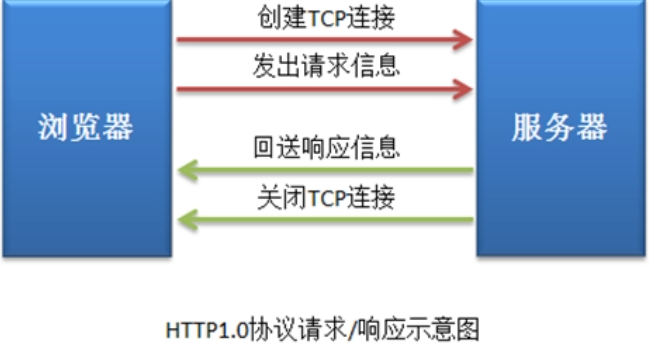
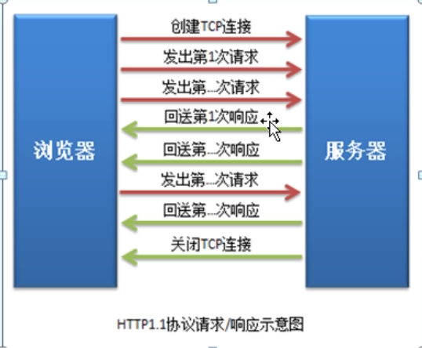

>**客户端如果要向服务器发送请求，首先需要在它们之间创建一个TCP(Transfer Control Protocol,传输控制协议)连接，**
>**而当客户端与服务端的通信结束之后，TCP连接将被关闭，这个连接就是基于HTTP协议的**  
>**从"计算机网络通信"细节上来说，TCP连接的建立需要经历"三次握手"，而TCP连接的关闭则需要经过"四次挥手"，此学习笔**
>**记只是从简单原理上进行分析，而不进行网络通信细节上的详解**  
>**在通讯中真正使用的HTTP协议，共有两个版本，HTTP1.0和HTTP1.1，目前绝大多数使用的都是HTTP1.1**
    
---

 ### HTTP1.0版本
    
HTTP1.0规定，客户端若要向服务端发出请求，首先必须在它们之间建立一个TCP(Transfer Control Protocol,传输控
制协议)连接，而当客户端收到服务端发出的响应后，服务端将关闭TCP连接，只有等待上一次的请求所对应的响应被客户端收
到后，客户端才可发出第二次请求，HTTP1.0中的连接属于非持久连接，且服务器不跟踪任何一次请求与响应
    

    
客户端和服务端每次建立和关闭连接都是一个比较费时的过程，会严重影响客户端和服务端的性能

---
    
 ### HTTP1.1版本
    
HTTP1.1版本是目前浏览器默认采用的HTTP协议版本，是一种持久连接，在一个TCP连接上可以传送多个HTTP请求和响应，
减少了建立和关闭连接的延迟和消耗，一个包含有许多CSS，JS和图片等资源的页面，其所发出的多个请求和响应可以在一
个连接中传输，但每个单独的页面文件的请求和响应仍需要使用各自的连接
    
HTTP1.1还允许用户不用等待上一次的请求结果返回，就可以发出下一次请求，但服务器端必须按照收到的客户端请求的先后
顺序依次回送响应结果，以保证客户端能够区分出每次请求的响应内容，这样也显著减少了整个下载过程所需要的时间
    
HTTP1.0在客户端收到服务端发送来的响应之后，TCP连接马上关闭，而HTTP1.1在客户端发送创建TCP连接的请求首先计算
出本次连接浏览所要发出的请求数量，即一次手工请求加上其所携带的所有自动请求数量，当浏览器发出的所有请求全部发
送完毕后，客户端回自动发送一个关闭TCP连接的请求，这个请求在HttpWatch中是看不到的
    
为了防止浏览器主动将TCP连接关闭，在每个请求中都携带了一个参数Connection，用于告诉服务器是否关闭连接，在
HttpWatch可以看到的这些请求中，其Connectoion参数值均为Keep-Alive保持连接，只有客户端发送了关闭TCP连接
的请求后，服务器才会将TCP连接关闭
    

    
当然，除了改进HTTP1.0的性能问题外，HTTP1.1还通过增加更多的请求头和响应头来改进和扩充HTTP1.0的功能
    
例如，由于HTTP1.0不支持Host请求头属性，WEB浏览器无法使用主机域名来明确表示要访问服务器上的哪个WEB站点，这样
就无法使用WEB服务器在同一个IP地址和端口号上配置多个虚拟WEB站点，在HTTP1.1中增加了Host请求头字段后，WEB浏览
器就可以使用主机域名来明确表示要访问服务器上的哪个WEB站点，这才实现了在一台WEB服务器上可以在同一个IP地址和端
口号上使用不同的主机名来创建多个虚拟WEB站点
    
HTTP1.1的持续连接，也需要增加新的请求头来实现，例如，Connection请求头的值为Keep-Alive时，客户端通知服务器
返回本次响应之后仍保持连接，Connection请求头的值为Close时，客户端通知服务器关闭连接

---
    
 ### HTTP1.0版本与HTTP1.1版本的对比
    
它们的共同点是，请求与响应是成对出现的，客户端的一次请求一定会对应服务器端的一次响应，它们的区别如下：
    
(1) HTTP1.0
    * HTTP1.0协议中的连接属于非持久连接，一次TCP连接只能进行一次请求与响应
    * 一次请求与响应对应一个TCP连接
    * 客户端只有在接收到服务器对上一次请求的响应后，客户端才可发出第二次请求
    * HTTP1.0不支持对虚拟主机的访问，因为其没有Host属性头，会将用户发出的域名直接通过DNS转换为IP后，发送到
    * 服务端，服务器收到的直接就是个IP而非域名，这样HTTP1.0就不支持对虚拟主机的访问了
    * HTTP1.0协议中在客户端接收到服务端的响应后，马上发送关闭TCP连接的请求，服务端关闭连接
        
(2) HTTP1.1
    * HTTP1.1支持持久连接，在一个TCP连接上可以传送多个请求与响应
    * 一般情况下，一个页面中的请求与响应对应一个TCP连接
    * HTTP1.1还允许客户端不用等待上一次请求结果返回，就可以发出下一次请求
    * HTTP1.1支持对虚拟主机的访问，其在请求头中增加了Host属性，用于记录请求所要访问的虚拟域名，当然，请求中
    * 所带的虚拟域名，肯定会通过DNS转换为IP，然后查到相应的主机，但因为其请求中还携带有Host属性，即要访问的
        域名仍在请求中，这样的话，服务器就可以从请求中解析出请求所要访问的虚拟域名
    * HTTP1.1协议中在客户端收到对最后一次请求的响应后，马上发送关闭TCP连接请求，服务端关闭连接
        