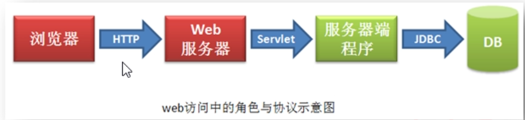

### 三协议四角色

    
所谓协议，即是规范，是通信双方事先的约定

Web访问的整个过程中，从大的方面讲，具有四个角色，而他们之间的通信依赖的是三个协议
        
HTTP协议要求，通信双方，即浏览器与服务器双方，都需要按照指定的格式发出请求与相应，对方按照协议，即事先的约定，
对对方发来的信息进行解析
        
Servlet协议要求，若程序员要开发完成某一具体业务的服务端程序，则必须实现Servlet接口，使用ServletAPI进行数据
传递
        
JDBC协议要求，服务端程序若要连接并操作数据库，则需要按照JDBC协议中规定的方式（接口方式）获取DB连接，进行SQL
的执行，进行结果的获取，而JDBC协议（接口方式）的实现，均由数据库厂商完成，放于数据库厂商提供的数据库驱动jar
包中了，所以我们连接不同的数据库，就需要导入不同的数据库驱动jar包，就是这个原因
        
