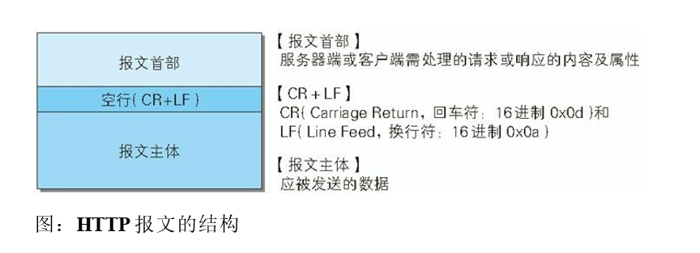
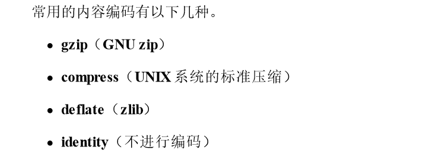
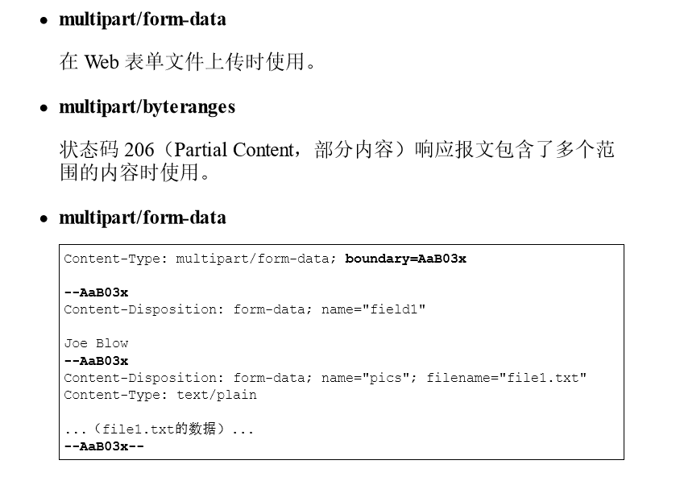
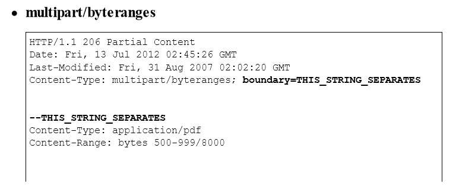
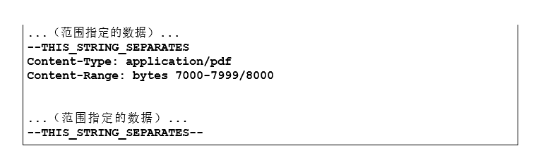
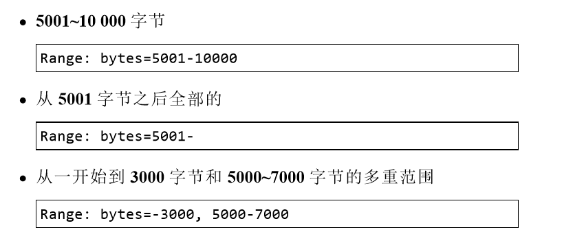

 ## HTTP报文
    
用于HTTP协议交互的信息称为HTTP报文，请求端（客户端）的HTTP报文叫做请求报文，响应端（服务器端）的HTTP
报文叫做响应报文。HTTP报文本身是由多行（用CR+LF作换行符）数据构成的字符串文本。HTTP报文大致可分为报文
首部和报文主体这两块。两者由最初出现的空行（CR+LF）来划分。通常，并不一定要有报文主体
    
   

---

 ## 编码提升传输速率
    
HTTP在传输数据时可以按照数据原貌直接进行传输，但也可以在传输过程中通过编码来提升传输效率。通过在传输时
编码，能有效的处理大量的访问请求。但是，编码的操作需要计算机来完成，因此会消耗更多的CPU等资源
  #### 报文主体和实体主体的差异
* 报文（message）
是HTTP通信中的基本单位，由8位组字节流组成，通过HTTP通信传输
    
* 实体（entity）
作为请求或响应的有效载荷数据（补充项）被传输，其内容由实体首部和实体主体组成
    
HTTP报文的主体用于传输请求或响应的实体主体，通常，报文主体等于实体主体，只有当传输中进行编码操作的时候，
实体主体的内容发生变化，才导致它和报文主体产生差异
  #### 压缩传输的内容编码
向待发送邮件内增加附件时，为了使邮件容量变小，我们会先用ZIP压缩文件后再添加附件发送，HTTP协议中有一种被
称为内容编码的功能也能进行类似的操作。内容编码指明应用在实体内容上的编码格式，并保持实体信息原样压缩。内
容编码后的实体由客户端接收并负责编码
    
   
  #### 分割发送的分块传输编码
在HTTP通信过程中，请求的编码实体资源尚未全部传输完成之前，浏览器无法显示请求页面。在传输大容量数据时，通
过把数据分割成多块，能够让浏览器逐步显示页面。这种把实体主体分割的功能称为分块传输编码
    
分块传输编码会将实体主体分成多个部分（块）。每一块都用十六进制来标记块的大小，而实体主体的最后一块会使用
"0（CR+LF）"来标记。使用分块传输编码的实体主体由接收的客户端负责编码，恢复到编码前的实体主体。HTTP/1.1中
存在一种传输编码的机制，它可以在通信时按某种编码方式传输，但只作用定义于分块传输编码中

---

 ## 发送多种数据的多部分对象集合
    
发送邮件时，我们可以在邮件里写入文字并添加多份附件。这是因为采用了MIME（多用途因特网邮件机制），它允许
邮件处理文本、图片、视频等多个不同类型的数据。例如，图片等二进制数据以ASCII码字符串编码的方式指明，就是
利用MIME来描述标记数据类型。而在MIME扩展中会使用一种称为多部分对象集合的方法，来容纳多份不同类型的数据
    
相应地，HTTP协议也采纳了多部分对象集合，发送的一份报文主体内可含有多类型实体，通常是在图片或文本文件上
传时使用
    
多部分对象集合包含的对象如下
   
   
   
   
在HTTP报文中使用多部分对象集合时，需要在首部字段里加上Content-type

---

 ## 获取部分内容的范围请求
    
以前网络速度较慢的时候，如果下载过程中遇到网络中断的情况，那就必须重新开始。为了解决上述问题，需要一种
可恢复的机制，所谓恢复是指能从之前下载中断出恢复下载。要实现该功能需要指定下载的实体范围，像这样，指定
范围发送的请求叫做范围请求
    
指定范围请求时，会用到首部字段Range来指定资源的byte范围
    
byte范围的指定形式如下
    
   
   
针对范围请求，响应会返回状态码为206 Partial Content的响应报文。另外，对于多重范围的范围请求，响应会在首部
字段Content-type标明multipart/byteranges后返回响应报文。如果服务器端无法响应范围请求，则会返回状态码
200 OK和完整的实体内容

---

 ## 内容协商返回最合适的内容
    
同一个Web网站有可能存在着多份相同内容的页面，比如中文版和英文版的页面，他们内容上虽然相同，但使用的
语言却不同。当浏览器的默认语言为英文或中文，访问相同URI的Web页面时，则会显示对应的英文版或中文版的页
面这样的机制称为内容协商
    
内容协商机制是指客户端和服务器端就响应的内容进行交涉，然后提供给客户端最为合适的资源。内容协商会以响应
资源的语言、字符集、编码方式等作为判断的基准。包含在请求报文首部的某些字段就是判断的基准
* Accept
* Accept-Charset
* Accpet-Encoding
* Accpet-Language
* Content-Language
    
内容协商技术有以下3种类型：
    
服务器驱动协商（Server-driven Negotiation）
由服务器端进行内容协商，以请求的首部字段为参考，在服务器端自动处理。但对用户来说，以浏览器发送的消息作
为判断的依据，并不一定能删选出最优内容
    
客户端驱动协商（Agent-driven Negotiation）
有客户端进行内容协商的方式，用户从浏览器显示的可选项列表中手动选择。还可以利用JS脚本在Web页面自动进行
上述选择。比如按OS的类型或浏览器类型，自动切换成PC版页面或手机版页面
    
透明协商（Transparent Negotiation）
是服务器驱动和客户端驱动的结合体，是由服务器端和客户端各自进行内容协商的一种方法