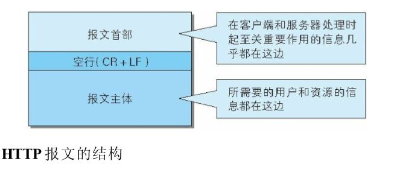
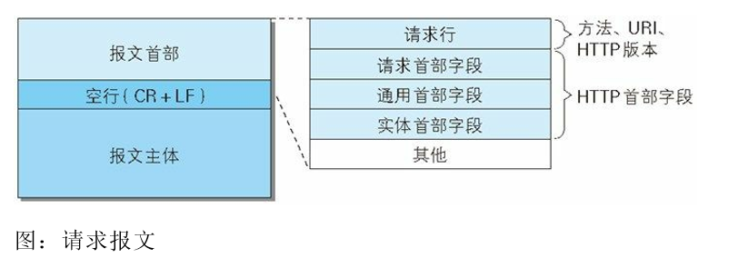
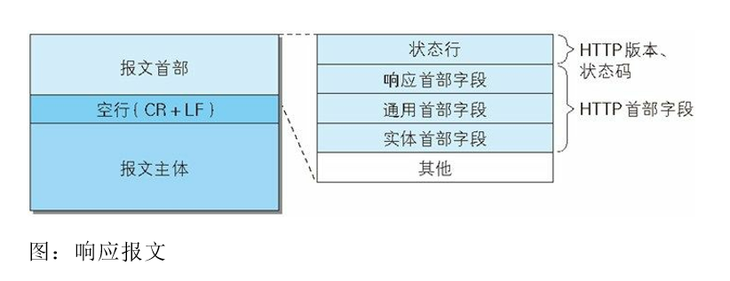
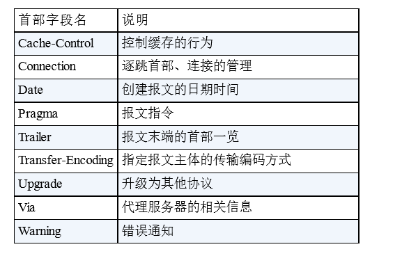
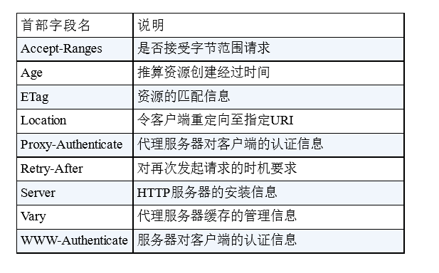
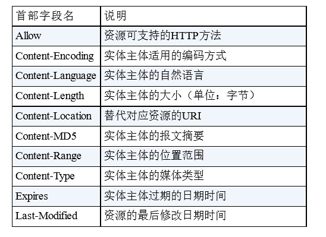
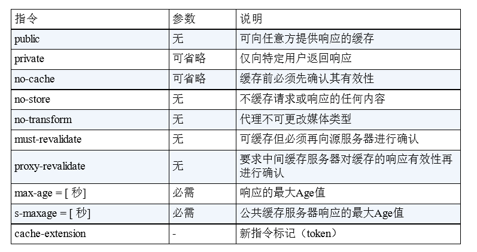
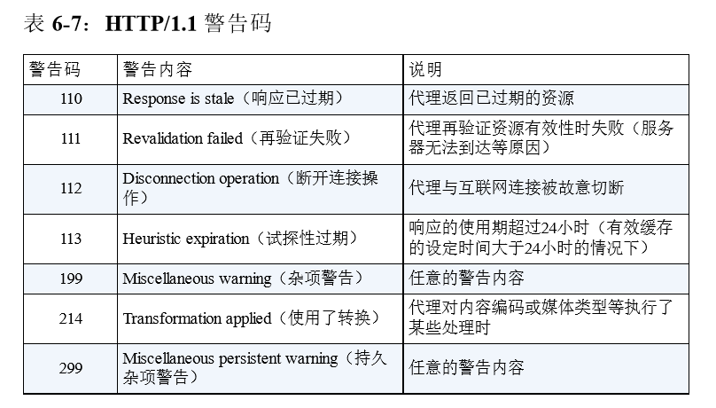
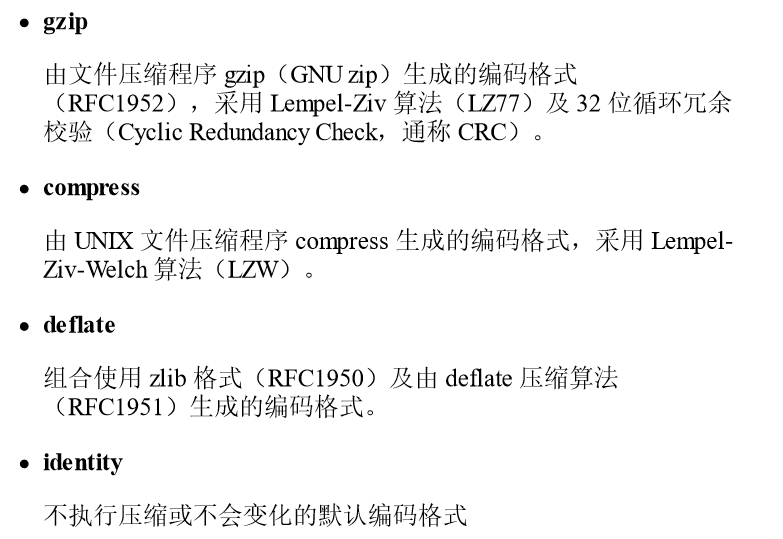
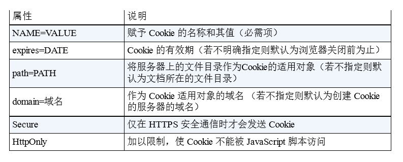

## HTTP报文首部
   
   
   
 
---

 ## HTTP首部字段
  #### HTTP首部字段传递重要信息
HTTP首部字段是构成HTTP报文的要素之一。在客户端与服务器之间以HTTP协议进行通信的过程中，无论是请求还是
响应都会使用首部字段，它能起到传递额外重要信息的作用。使用首部字段是为了给浏览器和服务器提供报文主体大
小、所使用的语言、认证信息等内容。
    
  #### HTTP首部字段结构
HTTP首部字段是由首部字段名和字段值构成的，中间用":"分隔
首部字段名 ：字段值
比如，在HTTP报文首部中以Content-Type这个字段来表示报文主体的对象类型
Content-Type ：text/html
另外，字段值对应单个HTTP首部字段可以有多个值，比如
Keep-Alive ：timeout=15，max=100
    
  #### 4种HTTP首部字段类型
HTTP首部字段根据实际用途分为以下4种类型
    
通用首部字段（General Header Fields）
请求报文和响应双方都会使用的首部
    
请求首部字段（Request Header Fields）
从客户端向服务器端发送请求报文时使用的字段，补充了请求的附加内容、客户端信息、响应内容相关优先级等信息
    
响应首部字段（Response Header Fields）
从服务器端向客户端发送响应报文时使用的字段，补充了响应的附加内容，也会要求客户端附加额外的信息内容
    
实体首部字段（Entity Header Fields）
针对请求报文和响应报文的实体部分使用的首部，补充了资源内容更新时间等与实体内容有关的信息
    
  #### HTTP/1.1首部字段一览
**通用首部字段**

**请求首部字段**

**响应首部字段**

**实体首部字段**

   
  #### 非HTTP/1.1首部字段
在HTTP通信协议种使用到的首部字段，不限与RFC种定义的47种首部字段。还有Cookie、Set-Cookie和
Content-DIsposition等其他RFC种定义的字段，它们的使用频率也很高。这些非正式的首部字段统一归纳在RFC4229
HTTP Header Fields Registration中
    
  #### End-to-end首部和Hop-by-hop首部
HTTP首部字段将定义成缓存代理和非缓存代理的行为，分成2种类型
    
端对端首部（End-to-end Header）
分在此类别中的首部会转发给请求/响应对应的最终接收目标，且必须保存在由缓存生成的响应中，另外规定它必须被
转发
    
逐跳首部（Hop-by-hop Header）
分在此类别中的首部只对单次转发有效，会因通过缓存或代理而不再转发。HTTP/1.1和之后的版本中，如果需要使用
Hop-by-hop首部，需提供Connection首部字段
    
HTTP/1.1除下列8个逐跳首部字段外，其他的都是端对端首部
* Connection
* Keep-Alive
* Proxy-Authenticate
* Proxy-Authorization
* Trailer
* TE
* Transfer-Encoding
* Upgrade

---

 ## HTTP/1.1通用首部字段
  #### Cache-Control
通过指定首部字段Cache-Control的指令，就能操作缓存的工作机制。指令的参数是可选的，多个指令之间通过","f分
隔，首部字段Cache-Control可用于请求及响应时
    
**缓存请求指令**

   
    
**缓存响应指令**

   
    
Cache-Control：public/private
当指定使用public指令时，则明确表明其他用户也可利用缓存；当指令private指令后响应只以特定的用户作为对象，这
与public指令的行为相反。缓存服务器会对该特定用户提供资源缓存服务，对于其他用户发送过来的请求，代理服务器则不会返回缓存
    
Cache-Control：no-cache/no-cache=Location
使用no-cache指令的目的是为了防止从缓存中返回过期的资源。客户端发送的请求中如果包含no-cache指令，则表示
客户端将不会接收缓存过的响应；如果服务器返回的响应中包含no-cache指令，那么缓存服务器不能对资源进行缓存
    
Cache-Control：no-store
当使用no-store指令时，暗示请求（和对应的响应）或响应中包含机密信息。因此，该指令规定缓存不能在本地存储请
求或响应的任一部分，即不缓存。no-cache并不是不缓存，而是不缓存过期资源，no-store才是真正的不缓存
    
Cache-Control：s-maxage=604880（单位：秒）
s-maxage与max-age指令的功能相同，它们的不同点是s-maxage指令只适用于供多位用户使用的缓存代理服务器，也
就是说，对于向同一用户重复返回响应的服务器来说，这个指令没有任何作用。另外，当使用s-maxage指令后，则直
接忽略对Expires首部字段及max-age指令的处理
    
Cache-Control：max-age=604880（单位：秒）
当客户端发送的请求中包含max-age指令时，如果判定缓存资源的缓存时间数值比指定时间的数值小，那么客户端就接
收缓存的资源。另外，当指定的max-age值为0，那么缓存服务器通常需要将请求转发给源服务器。当服务器返回的响
应中包含max-age指令时，缓存服务器将不再对资源的有效性做验证处理，而max-age的值代表资源保存为缓存的最长
时间
    
Cache-Control：min-fresh=60（单位：秒）
min-fresh指令要求缓存服务器返回至少还未过指定时间的缓存资源。比如，当指定min-fresh为60秒后，过了60秒的资
源都无法作为响应返回了
    
Cache-Control：max-stale=3600（单位：秒）
使用max-stale可指示缓存资源，即使过期也照常接收。如果指令未指定参数值，那么无论经过多久，客户端都会接收响
应；如果指令中制定了具体数值，那么即使过期，只要仍处于max-stale指定的时间内，仍可照常接收
    
Cache-Control：only-if-cached
使用only-if-cached指令表示客户端仅在缓存服务器本地缓存目标资源的情况下才会要求其返回，换言之，该指令要求缓
存服务器不重新加载响应，也不会再次确认资源的有效性。若发生请求缓存服务器的本地缓存无响应，则返回状态码
504 Gateway Timeout
    
Cache-Control：must-revalidate
使用must-revalidate指令，代理会向源服务器再次验证即将返回的响应缓存目前是否有效。若代理无法联通源服务器再
次获取有效资源的话，缓存必须给客户端一条504状态码。另外，使用must-revalidate指令会忽略请求的max-stale指令
    
Cache-Control：proxy-revalidate
proxy-revalidate指令要求所有的缓存服务器在接收到客户端带有该指令的请求返回响应之前，必须再次验证缓存的有效
性
    
Cache-Control：no-transform
使用no-transfer指令规定无论是在请求还是响应中，缓存都不能改变实体主体的媒体类型，这样可防止缓存或代理进行
图片压缩等操作
    
  #### Connection
Connection首部字段具备如下两个作用：
* 控制不再转发给代理的首部字段（Connection：不再转发的首部字段名）
    在客户端发送请求和服务器返回响应内，使用Connection首部字段，可控制不再转发给代理的首部字段
    （即Hop-by-hop）首部
        
* 管理持久连接
    HTTP/1.1版本的默认连接都是持久连接，为此，客户端会在持久连接上连续发送请求。当服务器想明确断开连接
    时，则指定Connection首部字段的值为close。HTTP/1.1之前的版本默认都是非持久连接，为此，如果想在旧版本
    的HTTP协议上维持持久连接，则需要指定Connection首部字段的值为Keep-Alive
        
#### Date
首部字段Date表明创建HTTP报文的日期和时间，HTTP/1.1协议使用在RFC1123中规定的日期和时间格式
    
  #### Pragma
Pragma是HTTP/1.1之前版本的历史遗留字段，仅作为HTTP/1.0的向后兼容而定义。该首部字段属于通用首部字段，
但只用在客户端发送的请求中。客户端会要求所有的中间服务器不返回缓存的资源
    
  #### Trailer
首部字段Trailer会事先说明在报文主体后记录了那些首部字段
    
  #### Transfer-Encoding
首部字段Transfer-Encoding规定了传输报文时主体采用的编码格式
    
  #### Upgrade
首部字段Upgrade用于检测HTTP协议及其他协议是否可使用更高的版本进行通信，其参数值可以用来指定一个完全
不同的通信协议
    
  #### Via
使用首部字段Via是为了追踪客户端与服务器之间的请求和响应报文的传输路径
    
  #### Warning
   

---

 ## 请求首部字段
  #### Accept
Accept首部字段可通知服务器，用户代理能够处理的媒体类型及媒体类型的相对优先级，可使用type/subtype这种
形式，一次指定多种媒体类型
    
  #### Accept-Charset
Accept-Charset首部字段可用来通知服务器用户代理支持的字符集及字符集的相对优先顺序。另外，可一次性指定
多种字符集，与首部字段Accept相同的事可用权值q来表示相对优先级。该首部字段应用于内容协商机制的服务器
驱动协商
    
  #### Accept-Encoding
Accept-Encoding首部字段用来告知服务器用户代理支持的内容编码及内容编码的优先顺序，可一次性指定多种内容
编码
    
   
   
  #### Accept-Language
首部字段 Accept-Language 用来告知服务器用户代理能够处理的自然 语言集（指中文或英文等），以及自然语言集
的相对优先级。可一次 指定多种自然语言集。和 Accept 首部字段一样，按权重值 q 来表示相对优先级。
    
  #### Authorization
首部字段 Authorization 是用来告知服务器，用户代理的认证信息（证书值）。通常，想要通过服务器认证的用户代
理会在接收到返回的 401 状态码响应后，把首部字段 Authorization 加入请求中。共用缓存 在接收到含有
Authorization 首部字段的请求时的操作处理会略有差 异。
     
  #### Except
客户端使用首部字段 Expect 来告知服务器，期望出现的某种特定行 为。因服务器无法理解客户端的期望作出回应而
发生错误时，会返回 状态码 417 Expectation Failed。 
    
  #### From
首部字段 From 用来告知服务器使用用户代理的用户的电子邮件地 址。通常，其使用目的就是为了显示搜索引擎等用
户代理的负责人的 电子邮件联系方式。使用代理时，应尽可能包含 From 首部字段（但 可能会因代理不同，将电子邮
件地址记录在 User-Agent 首部字段内）
    
  #### Host
首部字段 Host 会告知服务器，请求的资源所处的互联网主机名和端 口号。Host 首部字段在 HTTP/1.1 规范内是唯
一一个必须被包含在请 求内的首部字段。
    
  #### If-Match
形如 If-xxx 这种样式的请求首部字段，都可称为条件请求。服务器接 收到附带条件的请求后，只有判断指定条件为真
时，才会执行请求。

  #### If-Modified-Since
首部字段 If-Modified-Since，属附带条件之一，它会告知服务器若 IfModified-Since 字段值早于资源的更新时间，
则希望能处理该请求。 而在指定 If-Modified-Since 字段值的日期时间之后，如果请求的资源 都没有过更新，则返回
状态码 304 Not Modified 的响应。
    
  #### If-None-Match
首部字段 If-None-Match 属于附带条件之一。它和首部字段 If-Match 作用相反。用于指定 If-None-Match 字段值
的实体标记（ETag）值与 请求资源的 ETag 不一致时，它就告知服务器处理该请求 
    
  #### If-Range
首部字段 If-Range 属于附带条件之一。它告知服务器若指定的 IfRange 字段值（ETag 值或者时间）和请求资源的
ETag 值或时间相一 致时，则作为范围请求处理。反之，则返回全体资源。

  #### If-Unmodified-Since
首部字段 If-Unmodified-Since 和首部字段 If-Modified-Since 的作用相 反。它的作用的是告知服务器，指定的请
求资源只有在字段值内指定 的日期时间之后，未发生更新的情况下，才能处理请求。如果在指定 日期时间后发生了
更新，则以状态码 412 Precondition Failed作为响应返回
    
  #### Max-Forwards
通过 TRACE 方法或 OPTIONS 方法，发送包含首部字段 MaxForwards 的请求时，该字段以十进制整数形式指定
可经过的服务器最 大数目。服务器在往下一个服务器转发请求之前，Max-Forwards 的 值减 1 后重新赋值。当服
务器接收到 Max-Forwards 值为 0 的请求 时，则不再进行转发，而是直接返回响应
    
  #### Range
对于只需获取部分资源的范围请求，包含首部字段 Range 即可告知服 务器资源的指定范围
    
  #### Referer
首部字段 Referer 会告知服务器请求的原始资源的 URI
    
  #### TE
首部字段 TE 会告知服务器客户端能够处理响应的传输编码方式及相 对优先级。它和首部字段 Accept-Encoding 的
功能很相像，但是用于传输编码
    
  #### User-Agent
首部字段 User-Agent 会将创建请求的浏览器和用户代理名称等信息传 达给服务器

---   
    
 ## 响应首部字段
  #### Accept-Ranges
首部字段 Accept-Ranges 是用来告知客户端服务器是否能处理范围请 求，以指定获取服务器端某个部分的资源
    
  #### Age
首部字段 Age 能告知客户端，源服务器在多久前创建了响应。字段值 的单位为秒
    
  #### ETag
首部字段 ETag 能告知客户端实体标识。它是一种可将资源以字符串 形式做唯一性标识的方式。服务器会为每份
资源分配对应的 ETag值
    
  #### Location
使用首部字段 Location 可以将响应接收方引导至某个与请求 URI 位置不同的资源
    
  #### Proxy-Authenticate
首部字段 Proxy-Authenticate 会把由代理服务器所要求的认证信息发送给客户端
    
  #### Retry-After
首部字段 Retry-After 告知客户端应该在多久之后再次发送请求。主要 配合状态码 503 Service Unavailable 响
应，或 3xx Redirect 响应一起使用
    
  #### Server
首部字段 Server 告知客户端当前服务器上安装的 HTTP服务器应用程 序的信息。不单单会标出服务器上的软件应
用名称，还有可能包括版 本号和安装时启用的可选项
    
  #### 6.5.8Vary
首部字段 Vary 可对缓存进行控制。源服务器会向代理服务器传达关 于本地缓存使用方法的命令
    
  #### 6.5.9WWW-Authenticate
首部字段 WWW-Authenticate 用于 HTTP 访问认证。它会告知客户端 适用于访问请求 URI 所指定资源的认证方
    案（Basic 或是 Digest）和 带参数提示的质询（challenge）。状态码 401 Unauthorized 响应中， 肯定带有首部
字段 WWW-Authenticate

---

 ## 实体首部字段
  #### Allow
首部字段 Allow 用于通知客户端能够支持 Request-URI 指定资源的所 有 HTTP 方法。当服务器接收到不支持的 HTTP
方法时，会以状态码 405 Method Not Allowed 作为响应返回。与此同时，还会把所有能支 持的 HTTP 方法写入首部字
段Allow 后返回
     
  #### Content-Encoding
首部字段 Content-Encoding 会告知客户端服务器对实体的主体部分选 用的内容编码方式。内容编码是指在不丢失实体信
息的前提下所进行 的压缩
    
  #### Content-Language
首部字段 Content-Language 会告知客户端，实体主体使用的自然语言 
    
  #### Content-Length
首部字段 Content-Length 表明了实体主体部分的大小（单位是字 节）
    
  #### Content-Location
首部字段 Content-Location 给出与报文主体部分相对应的 URI。和首 部字段 Location 不同，Content-Location
表示的是报文主体返回资源对 应的 URI
    
  #### Content-MD5
首部字段 Content-MD5 是一串由 MD5 算法生成的值，其目的在于检 查报文主体在传输过程中是否保持完整，以及确认
传输到达
    
  #### Content-Range
针对范围请求，返回响应时使用的首部字段 Content-Range，能告知客 户端作为响应返回的实体的哪个部分符合范围请
求。字段值以字节为 单位，表示当前发送部分及整个实体大小
    
  #### Content-Type
首部字段 Content-Type 说明了实体主体内对象的媒体类型。和首部字 段 Accept 一样，字段值用 type/subtype 形
式赋值
    
  #### Expires
首部字段 Expires 会将资源失效的日期告知客户端
    
  #### Last-Modified
首部字段 Last-Modified 指明资源最终修改的时间

---

 ## 为Cookie服务的首部字段
  #### Set-Cookie
  
  
  #### Cookie
首部字段 Cookie 会告知服务器，当客户端想获得 HTTP 状态管理支 持时，就会在请求中包含从服务器接收到的Cookie。
接收到多个 Cookie 时，同样可以以多个 Cookie 形式发送