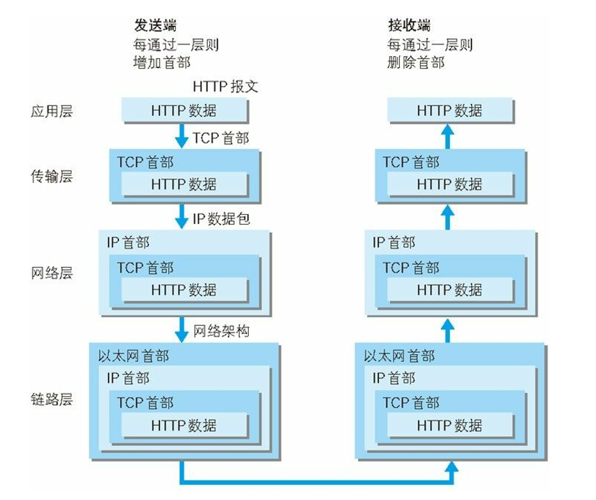
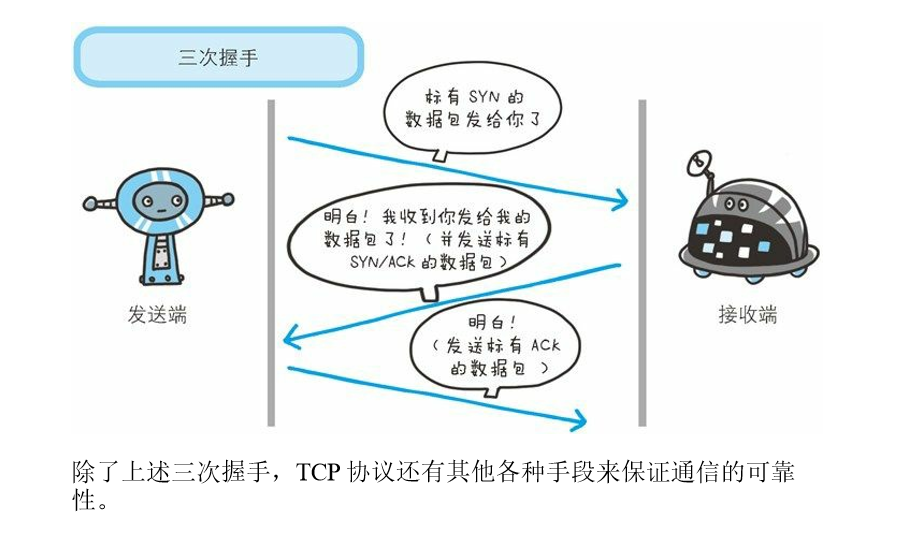

## 使用HTTP访问网络
    
当我们在浏览器地址栏输入URL后，Web浏览器根据地址栏中指定的URL从Web服务器端获取文件资源(resource)等信息,
从而显示出Web页面，像这种通过发送请求获取服务器资源的Web浏览器，都可称为客户端(client)
    
Web使用一种名为HTTP(HyperText Transfer Protocol，超文本传输协议)的协议作为规范完成从客户端到服务器端等一
系列运作流程，而协议是指规则的约定，可以说，Web是建立在HTTP协议上通信的
    
---

 ## HTTP的诞生
  #### 为知识共享而规划Web
    
Web最初设想的基本理念是：借助多文档之间相互关联形成的超文本(HyperText)，形成可相互参阅的WWW(World Wide
Web，万维网)。现在已经提出了3项WWW构建技术，分别是：把SGML(Standard Generalized Markup Language，标准
通用标记语言)作为页面的文本标记语言的HTML(HyperText Markup Language，超文本标记语言)；作为文档协议的
HTTP，指定文档所在地址的URL(Uniform Resource Locator，统一资源标识符)
    
  #### 驻足不前的HTTP
    
HTTP正式作为标准公布是在1996年5月，版本被命名为HTTP/1.0，至今仍广泛应用在服务器端，HTTP/1.1在1997年1月发
布，是目前主流的HTTP版本，可见HTTP协议一直以来几乎没有更新，虽所新一代HTTP/2.0正在制定中，但要达到较高的
使用覆盖率，仍需假以时日

---
 
 ## 网络基础TCP/IP
  #### TCP/IP协议族
    
计算机与网络设备要相互通信，双方就必须基于相同的方法。比如如何探测到通信目标、由哪一边先发起通信、使用哪种
语言进行通信怎样结束通信等规则都要进行事先约定。不同的硬件、操作系统之间的通信，所有的这一切都需要一种规则，
而我们就把这种规则称为协议(protocol)。
    
像这样把互联网相关联的协议集合起来总称为TCP/IP。也有说法认为，TCP/IP是指TCP和IP这两种协议，还有一种说法认
为，TCP/IP是指在IP协议的通信过程中，使用到的协议族的总称
    
  #### TCP/IP的分层管理
    
TCP/IP协议族里最重要的一点就是分层，TCP/IP协议族按层次分为以下4层：应用层、传输层、网络层和数据链路层。
TCP/IP协议族各层的作用如下：
    
**应用层**
应用层决定了向用户提供应用服务时通信的活动
TCP/IP协议族内预存了各类通用的应用服务。比如FTP(File Transfer Protocol，文件传输协议)和DNS(Domain 
Name System，域名系统就是其中两类)
HTTP协议也属于该层
    
**传输层**
传输层对上层应用层，提供处于网络连接中的两台计算机之间的数据传输
在传输层有两个性质不同的协议：TCP(Transmission Control Protocol，传输控制协议)和UDP(User Data 
Protocol，用户数据报协议)
    
**网络层(又称网络互联层)**
网络层用来处理在网络上流动的数据包，数据包是网络传输的最小数据单位，该层规定了通过怎样的路径(所谓的传输路
线)到达对方计算机，并把数据包传送给对方
与对方计算机之间通过多台计算机或网络设备进行传输时，网络层所起的作用就是在众多传输线路中选择一条
    
**链路层(又名数据链路层，网络接口层)**
用来处理连接网络的应用部分。包括控制操作系统、硬件的设备驱动、NIC(Network Interface Card，网络适配器，即显
卡)，及光纤等物理可见部分(还包括连接器等一切传输媒介)。硬件上的范畴均在链路层的作用范围之内
    
  #### TCP/IP通信传输流
   
    
使用HTTP举例，首先作为发送端的客户端在应用层(HTTP协议)发出一个想看某个Web页面的HTTP请求。接着，为了传输
方便，在传输层(TCP协议)把从应用层收到的数据(HTTP请求报文)进行分割，并在各个报文上打上标记序号及端口号后转
发给网络层。在网络层(IP协议)，增加作为通信目的地的MAC地址后转发给链路层。这样一来，发往网络的通信请求就准
备齐全了。接收端的服务器在链路层接收到数据，按序往上层发送，一直到应用层，才算真正接收到有客户端发来的请求
    
   
   
发送端在层与层之间传输数据时，每经过一层时必定会打上一个该层所属的首部信息，反之，接收端在层与层之间传输数
据时，每经过一层时会把对应的首部消掉。这种把数据包装起来的做法叫做封装(encapsulate) 

---

 ## 与HTTP关系密切的协议：IP、TCP和DNS
  #### 负责传输的IP协议
    
按层次分，IP协议(Internet Protocol)网际协议位于网络层，Internet Protocols这个名字听起来可能有点夸张，但
事实如此，因为几乎所有使用网络的协议都会用到IP协议。IP协议的作用是把各种数据包传送给对方，而要保证确实传送
到对方那里，则需要满足各类条件其中最重要的两个条件是IP地址和MAC地址(Media Access Control Address)。IP地
址指明了节点被分配到的地址，MAC地址是网卡所属的固定地址。IP地址可以和MAC地址进行配对，IP地址可变换，但MAC
地址基本上不会更改址
    
使用ARP协议借助MAC地址进行通信
IP间的通信依赖MAC地址。在网络上，通信双方在同一局域网(LAN)内的情况是很少的，通常是经过多台计算机和网络设
备才能连接到对方。而在进行中转时，会利用下一中转站的MAC地址来搜索下一个中专目标。这时，会利用ARP协议(
Address Resolution Protocol)。ARP是一种用以解析地址的协议，根据通信方的IP地址可以反查出对应的MAC地址
没有人能全面掌握互联网中的传输情况
    
  #### 确保可靠性的TCP协议
    
按层次分，TCP协议位于传输层，提供可靠的字节流服务。所谓的字节流服务是指，为了方便传输，将大块数据分割成以
报文段为单位的数据包进行管理。而可靠的传输服务是指，能够把数据准确可靠的传输给对方。
    
为了准确无误的将数据送达目标处，TCP协议采用了三次握手策略。用TCP协议把数据包发送出去之后，TCP不会对传送
后的情况置之不理，它一定回向对方确认是否成功送达。握手过程中使用了TCP标志(flag)--SVN(synchronize)和ACK
(acknowledgement)。发送端首先发送一个带有SVN标志的数据包给对方，接收端收到后，回传一个带有SVN/ACK标志的
数据包以示传达确认信息，最后，发送端再回传一个带有ACK标志的数据包，代表"握手"结束。若在"握手"过程中某个阶段
莫名中断，TCP协议会再次以相同的顺序发送相同的数据包
    
   
   
---
 
 ## 负责域名解析的DNS服务
    
DNS(Domain Name System)服务是和HTTP一样位于应用层的协议，它是提供域名到IP地址之间的解析服务。用户通常
使用主机名或域名来访问对方的计算机，而不是通过IP地址来访问。因为相比于IP地址的纯数字，域名更符合人类的记
忆习惯。为了解决上述问题，DNS服务应运而生。DNS协议提供通过域名查找IP地址，或逆向从IP地址反查域名的服务