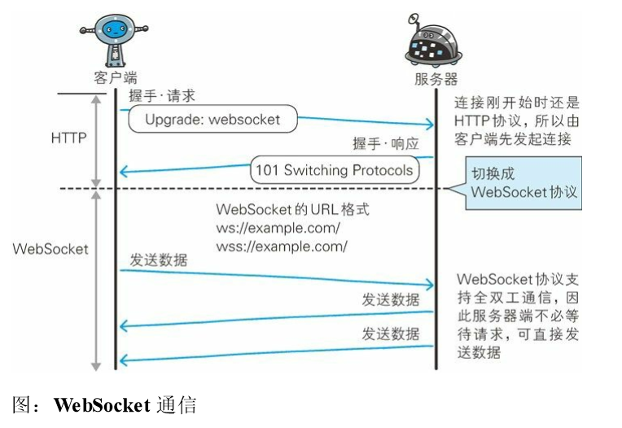
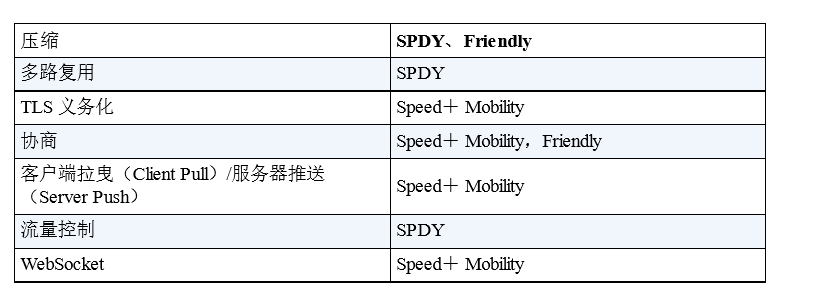

 ## 基于HTTP的协议
多样化的Web网站追求的功能可通过Web应用和脚本程序实现，即使这些功能已经满足需求，在性能上却未必最
优，这是因为HTTP协议上的限制以及自身性能有限。HTTP功能上的不足可通过创建一套全新的协议来弥补，可
是目前基于HTTP的Web浏览器的使用环境已经遍布全球，因此无法完全抛弃HTTP。有一些新协议的规则是基于
HTTP的，并在此基础上添 加了新的功能

---

 ## 消除HTTP瓶颈的SPDY
  #### HTTP的瓶颈
使用HTTP协议探知服务器上是否有内容更新，就必须频繁地从客户端到服务器端进行确认。如果服务器上没有内
容更新，那么就会产生徒劳的通信。若想在现有Web实现所需的功能，以下这些HTTP标准就会成为瓶颈
* 一条连接上只可发送一个请求
* 请求只能从客户端开始，客户端不可以接收除响应外d的指令
* 请求/响应首部未经压缩就发送，首部信息越多延迟越大
* 发送冗长的首部，每次互相发送相同的首部造成的浪费较多
* 可任意选择数据压缩方式，非强制压缩发送
    
AJAX的解决方法  
利用AJAX实时的从服务器获取内容，可能导致大量请求产生，另外，AJAX仍为解决HTTP协议本身存在的问题
    
Comet的解决方法  
通常，服务器端接收到请求，在处理完毕后会立即返回响应。但为了实现推送功能，Comet会先将响应置于挂起
状态，当服务器端内有内容更新时，再返回该响应。因此，服务器端一旦有内容更新，既可以立即反馈给客户端。
内容上虽然可以做到实时更新，但为了保留响应，一次连接的持续时间也变长了。期间，为了维持连接会消耗更
多的资源，另外，Comet也仍未解决HTTP协议本身存在的问题
    
SPDY的目标  
陆续出现的AJAX和Comet等提高易用性的技术，一定程度上使HTTP得到了改善，但HTTP协议本身的限制也令人
有些束手无策。为了进行根本性的改善，需要有一些协议层面上的改动。处于持续开发状态中的SPDY协议，正
是为了在协议级别消除HTTP所遭遇的瓶颈
    
  #### SPDY的设计与目的
SPDY没有完全改写HTTP协议，而是在TCP/IP的应用层与传输层之间通过新加会话层的方式运作。同时，考虑
到安全性问题，SPDY规定通信中使用SSL。SPDY以会话层的形式加入，控制对数据的流动，但还是采用HTTP
建立通信连接因此，可照常使用HTTP的GET、POST等方法、Cookie以及HTTP报文等
    
   
   
使用SPDY以后，HTTP协议额外获得以下新功能：
* 多路复用流  
通过单一的TCP连接，可以无限制处理多个HTTP请求。所有请求的处理都在一条TCP连接上完成，因此TCP的
处理效率得到了提高
* 赋予请求优先级  
SPDY不仅可以无限制的并发处理请求，还可以给请求逐个分配优先级的顺序。这样主要是为了在发送多个请求
时，解决因带宽低而导致的响应慢的问题
* 压缩HTTP首部  
压缩HTTP请求的响应和首部，这样通信产生的数据包的数量和发送的字节数就更少了
* 推送功能  
支持服务器主动向客户端推送数据的功能
* 服务器提示功能  
服务器可以主动提示客户端请求所需的资源
     
#### SPDY消除Web瓶颈了吗
该技术导入实际Web网站的进展不佳，因为SPDY基本上只是将单个域名（IP地址）的通信多路复用，所以当一
个Web网站使用多个域名下的资源，改善效果就会受限。并且SPDY虽然的确可有效消除HTTP瓶颈，但很多Web
网站存在的问题并非仅仅是HTTP瓶颈导致

---

## 使用浏览器进行双全工通信的WebSocket
#### WebSocket协议
一旦Web服务器与客户端之间建立起WebSocket协议的通信连接，之后所有的通信都依赖这个专用协议进行。
通信过程中可互相发送JSON、XML、HTML或图片等任意格式的数据。由于是建立在HTTP基础上的协议，因
此连接的发起端仍是客户端而一旦确立了WebSocket通信连接，不论是服务器还是客户端，任意一方都可以直
接向对方发送报文
    
WebSocket协议的主要特点
* 推送功能  
支持服务器向客户端推送数据的推送功能
* 减少通信量  
只要建立起WebSocket连接，就希望一直保持连接状态
     
   

---

 ## 期盼已久的HTTP2.0
  
