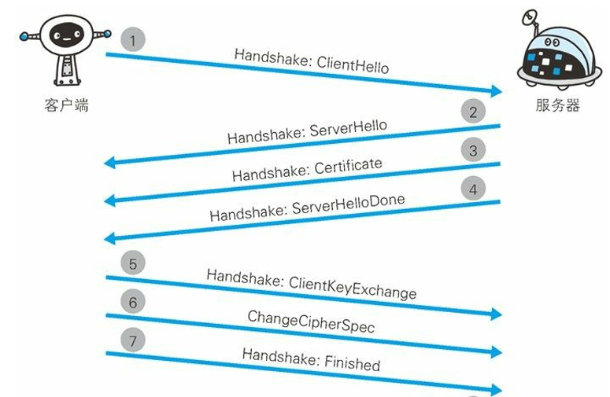
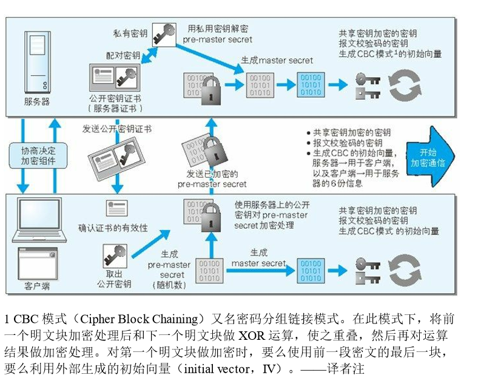

 ## HTTP的缺点
    
HTTP主要有以下不足，例举说明：
* 通信使用明文（不加密），内容可能会被窃听
* 不验证通信方的身份，因此可能会遭遇伪装
* 无法验证报文的完整性，所以有可能已遭篡改
 
  #### 使用通信明文可能会被窃听
    
* TCP/IP是可能会被窃听的网络
    所谓互联网，是由能联通到全世界的网络组成的。无论世界哪个角落的服务器在和客户端通信时，在此通信线路上的某
    些网络设备、光缆、计算机等都不可能是个人的私有物，所以不排除某个环节中会遭到恶意窥视行为
* 加密处理防止被窃听

（1）通信加密  
HTTP协议中没有加密机制，但可以通过和SSL（安全套接层）或TLS（安全层传输协议）的组合使用，加密HTTP的通
信内容。用SSL建立安全通信线路之后，就可以在这条线路上进行HTTP通信了。与SSL组合使用的HTTP被称为HTTPS
超文本传输安全协议）或HTTPoverSSL  
（2）内容加密  
对HTTP协议传输的内容本身进行加密，可以做到有效的加密，前提是要求客户端和服务器同时具备加密解密机制。主
要应用在Web服务中，有一点必须引起注意，由于该方式不同于SSL或TLS将整个通信线路加密处理，所以内容仍有被
篡改的风险
        
  #### 不验证通信方的身份就可能遭遇伪装
* 任何人都可发起请求
 
（1）无法确定请求发送至目标的Web服务器是否按真实意图返回响应的Web服务器，有可能是已伪装的Web服务器  
（2）无法确定响应返回到的客户端是否是按真实意图接收响应的那个客户端，有可能是已伪装的客户端  
（3）无法确定正在通信的对方是否具备访问权限，因为某些Web服务器上保存着重要信息，只能发给特定用户  
（4）无法确定请求来自何方，出自谁手  
（5）即使是无意义的请求也会照单全收，无法阻止海量请求下的DoS攻击（拒绝服务攻击）  
* 查明对方的证书
    SSL不仅提供加密处理，还可以使用证书用于确定方。证书由值得信任的第三方机构颁发，用于证明服务器和客户端是
    实际存在的，另外，伪造证书从技术角度来说是异常困难的一件 事。所以只要能够确认通信方（服务器或客户端）持
    有的证书， 即可判断通信方的真实意图。另外，客户端拥有证书即可完成个人身份的确认，也可用于对Web网站的认
    证环节
        
  #### 无法证明报文完整性，可能已遭篡改
* 接收到的内容可能有误
    由于HTTP协议无法证明通信报文的完整性，因此，在请求或响应送出之后直到对方接收之前，即使请求或响应的内容
    遭到篡改，也没有办法获悉。像这样，请求或响应在传输途中，遭攻击者拦截并篡改内容的攻击叫中间人攻击
* 如何防止篡改
    虽然有使用HTTP协议确定报文完整性的方法，但事实上并不便捷、可靠。其中常用的是MD5和SHA-1等散列值校验的
    方法，以及用来确认文件的数字签名方式。为了有效防止这些弊端，有必要使用HTTPS。SSL提供认证，加密处理及
    摘要功能，仅靠HTTP确定完整性是十分困难的，因此通过和其他协议组合使用来实现这个目标

---

 ## HTTP+加密+认证+完整性保护=HTTPS
  #### HTTP加上加密处理和认证以及完整性保护后即是HTTPS
为了解决上述问题，需要在HTTP上在加上加密处理和认证等机制。我们把添加了加密及认证机制的HTTP称为HTTPS。
实际开发中，经常会在Web的登录页面和购物结算页面等使用HTTPS通信。使用HTTPS通信时，不再用http://，而是改
用https://。另外，当浏览器访问HTTPS通信有效的Web网站时，浏览器的地址栏内会出现一个带锁的标记。对HTTPS
的显示方式会因浏览器的不同而有所改变
    
  #### HTTPS是身披SSL外壳的HTTP
HTTPS并非是应用层的一种新协议，只是HTTP通信部分接口用SSL和TLS协议代替而已。通常，HTTP直接与TCP通信，
当使用SSL时，则演变成先和SSL通信，再由SSL与TCP通信。简言之，HTTPS其实就是身披了SSL这层外壳的HTTP协
议。SSL是独立于HTTP的协议，所以不光是HTTP协议，其他运行在应用层的SMTP和Telnet等协议均可配合SSL使用，
可以说SSL是当今世界上应用最为广泛的网络安全技术
    
  #### 相互交换密钥的公开密钥加密技术
SSL采用一种叫做公开密钥加密的加密处理方式，近代的加密方式中加密算法是公开的，而密钥却是保密的，通过这种
方式得以保证加密方法的安全性。加密和解密都会用到密钥，没有密钥就无法对密码解密，反过来说，任何人持有密钥
就能够解密了。如果密钥被攻击者获得，那么加密也就失去了意义  
* 共享密钥加密的困境
    加密和解密同用一个密钥的方式称为共享密钥加密，也叫做对称密钥加密。以共享密钥加密的方式，如何确保对方获
    得密钥，如何确保密钥不被盗取，如果能将密钥安全送到，那报文也会安全送到了，这些都是共享密钥加密的局限性
* 使用两把密钥的公开密钥加密
    公开密钥加密使用一对非对称的密钥，一把叫私有密钥，一把叫公开密钥。使用公开密钥加密方式，发送秘文的一方
    使用对方的公开密钥进行加密处理，对方收到加密信息之后，再使用自己的私有密钥进行解密。利用这种方式，不需
    要发送用来解密的私有密钥，也不用担心密钥被攻击者窃听而盗走
* HTTPS采用混合加密机制
    HTTPS采用共享密钥加密和公开密钥加密两者并用的混合加密机制。若密钥能够实现安全交换，那么会考虑仅使用公
    开密钥加密来通信。 但是公开密钥加密和共享密钥加密相比，其处理速度要慢。所以应充分利用两者的优势，将多种
    方法组合起来进行通信。在交换密钥环节使用公开密钥加密方式，之后的建立通信交换报文阶段使用共享密钥加密方
    式
        
  #### 证明公开密钥正确性的证书
公开密钥的局限性在于，无法证明公开密钥就是货真价实的公开密钥。为了解决这个问题，可以使用由数字证书认证
机构和其相关机关办法的公开密钥证书。数字证书认证机构处于客户端与服务器双方都可信赖的第三方机构的立场上。
首先，服务器的运营人员向数字证书认证机构提出公开密钥的申请，数字证书认证机构在判明提出申请者的身份之后，
会对已申请的公开密钥做数字签名，然后分配这个已签名的公开密钥，并将该公开密钥放入公钥证书后绑定在一起。
服务器会将这份由数字证书认证机构颁发的公钥证书发送给客户端，接到证书的客户端可使用数字证书认证机构的公开
密钥，对那张证书 上的数字签名进行验证，一旦验证通过，客户端便可明确两件事： 一，认证服务器的公开密钥的是
真实有效的数字证书认证机构。二， 服务器的公开密钥是值得信赖的。此处认证机关的公开密钥必须安全地转交给客
户端。使用通信方式 时，如何安全转交是一件很困难的事，因此，多数浏览器开发商发布版本时，会事先在内部植入
常用认证机关的公开密钥
    
* 可证明组织真实性的EV SSL证书
    证书的一个作用是用来证明作为通信一方的服务器是否规范，另外一个作用是可确认对方服务器背后运营的企业是否
    真实存在。拥有该特性的证书就是EV SSL证书。EV SSL证书是基于国际标准的认证指导方针颁发的证书。其严格规
    定了对运营组织是否真实的确认方针，因此，通过认证的网站具有更高的认可度。持有EV SSL证书的Web网站浏览
    器地址栏处背景色是绿色的，且地址栏左侧显示了SSL证书中记录的组织名称及颁发认证机构的名称
  #### HTTPS的安全通信机制
**HTTPS通信步骤**
   
   
   
   
步骤1：客户端通过发送ClientHello报文开始SSL通信，报文中包含客户端支持的SSL的指定版本、加密组件列表
步骤2：服务器可进行SSL通信时，会以ServerHello报文作为应答，和客户端一样，在报文中包含SSL版本以及加密组
        件
步骤3：之后服务器发送Certificate报文，报文中包含公开密钥证书
步骤4：最后服务器发送ServerHello Done报文通知客户端，最初阶段的SSL握手协商部分结束
步骤5：SSL第一次握手结束之后，客户端以Client Key Exchange报文作为回应，报文中包含通信加密中使用的一种被
        称为 Pre-master secret 的随机密码串。该报文已用步骤 3 中的公开密钥进行加密
步骤6：接着客户端继续发送 Change Cipher Spec 报文。该报文会提示服务器，在此报文之后的通信会采用 
        Pre-master secret 密钥加密
步骤7：客户端发送 Finished 报文。该报文包含连接至今全部报文的 整体校验值。这次握手协商是否能够成功，要以
        服务器是否能够正确 解密该报文作为判定标准
步骤8：服务器同样发送 Change Cipher Spec 报文
步骤9：服务器同样发送 Finished 报文
步骤10：服务器和客户端的 Finished 报文交换完毕之后，SSL 连接就算建立完成。当然，通信会受到 SSL 的保护。
        从此处开始进行应用层协议的通信，即发送 HTTP 请求
步骤11：应用层协议通信，即发送 HTTP 响应
步骤12：最后由客户端断开连接。断开连接时，发送 close_notify报文
    
在以上流程中，应用层发送数据时会附加一种叫做 MAC（Message Authentication Code）的报文摘要。MAC 能够查
知报文是否遭到篡 改，从而保护报文的完整性
    
   
   
HTTPS相比于HTTP协议，除了增加了SSL通信，加大了通信量，还需要进行大量的加密解密过程，需要消耗服务器
和客户端的硬件资源，因此速度会慢很多，HTTPS会比HTTP慢2到100倍。所以，如果是非敏感信息通信则使用HTTP
协议，只有在包含个人信息等敏感数据时，才会使用HTTPS协议
