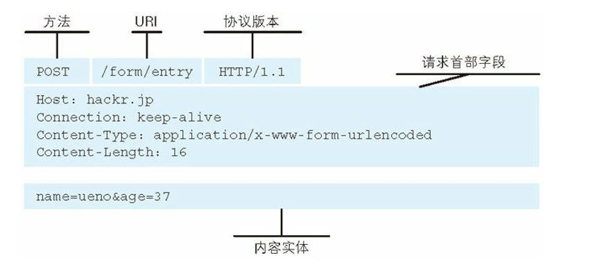
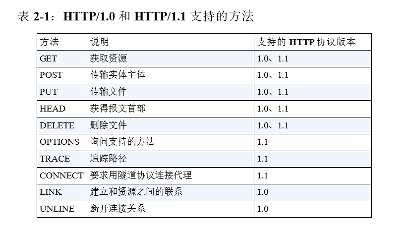
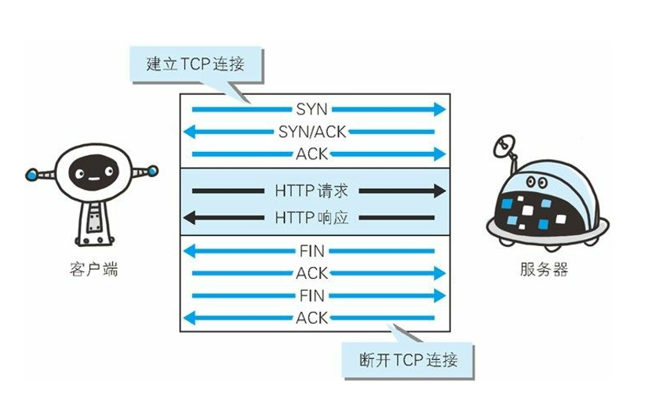

 ## HTTP协议用户客户端和服务端之间的通信
    
HTTP协议和TCP/IP协议族内的其他众多协议相同，用于客户端和服务器之间的通信。请求访问文本或图像等资源的一端
称为客户端，而提供资源响应的一段称为服务器端。应用HTTP协议时，必定是一端担任客户端角色，一端担任服务器端
角色
    
---

 ## 通过请求和响应的交换达成通信
    
HTTP协议规定，请求从客户端发出，最后服务器端响应该请求并返回
    
请求报文是由请求方法、请求URI、协议版本、可选的请求首部字段和内容实体构成的
   
   
响应报文是由基本上是由协议版本、状态码、用以解释状态码的原因短语、可选的响应首部字段以及实体主体构成
   

---

 ## HTTP是不保存状态的协议
    
HTTP是一种不保存状态，即无状态(stateless)协议。HTTP协议自身不对请求和响应之间的通信状态进行保存，便于更快
的处理大量事务，确保协议的可伸缩性。HTTP/1.1虽然是无状态协议，但为了实现期望的保持状态功能，于是引入了
Cookie技术
    
---

 ## 告知服务器意图的HTTP方法
    
**GET：获取资源**
GET方法用来访问已被URI识别的资源。指定的资源经服务器端解析后返回响应内容。也就是说，如果请求的资源是文本，
那就保持原样返回；如果是像CGI(通用网关接口)那样的程序，则返回经过执行后的输出结果
    
**POST：传输实体主体**
虽然GET方法也可以传输实体的主体，但一般不用GET方法进行传输，而用POST方法
    
**PUT：传输文件**
PUT方法用来传输文件，就像FTP协议的文件上传一样，要求在请求报文的主体中包含文件内容然后保存到请求URI指定的
位置。但鉴于HTTP/1.1的PUT方法自身不带验证机制，任何人都可以上传文件，存在安全性问题，因为一般网站不使用此
方法。若配合Web应用程序的验证机制，或架构设计采用REST(表征状态转移)标准的同类Web网站，就可能使用PUT方法
    
**HEAD：获得报文首部**
HEAD方法和GET方法一样，只是不返回报文主体部分。用于确认URI的有效性和资源更新的日期时间等
    
**DELETE：删除文件**
DELETE方法用来删除文件，与PUT方法相反，但与PUT方法相同的是DELETE同样不带验证机制，因此只有配合Web应用
程序的验证机制，或架构设计采用REST(表征状态转移)标准的同类Web网站才会开放使用DELETE方法
    
**OPTIONS：询问支持的方法**
OPTIONS方法用来查询针对请求URI指定的资源支持的方法
    
**TRACE：追踪路径**
TRACE 方法是让 Web 服务器端将之前的请求通信环回给客户端的方法。客户端通过 TRACE 方法可以查询发送出去的请求
是怎样被加工修改 / 篡改的。这是因为，请求想要连接到源目标服务器可能会通过代理中转，TRACE 方法就是用来确认连
接过程中发生的一系列操作。但是，TRACE 方法本来就不怎么常用，再加上它容易引发 XST（Cross-Site Tracing，跨
站追踪）攻击，通常就更不会用到了。
 
**CONNECT：要求用隧道协议连接代理**
CONNECT 方法要求在与代理服务器通信时建立隧道，实现用隧道协议进行 TCP 通信。主要使用 SSL（Secure 
Sockets Layer，安全套接层）和 TLS（Transport Layer Security，传输层安全）协议把通信内容加密后经网络隧
道传输 
    
---
    
 ## 使用方法下达命令
    
向请求URI指定的资源发送请求报文时，采用称为方法的命令。方法的作用在于，可以指定请求的资源按期望产生某种行为
    
下表列出了HTTP/1.1和HTTP/1.0支持的方法。另外，方法名区分大小写，注意要用大写字母
   

---

 ## 持久连接节省通信量
    
HTTP协议的初始版本中，每进行一次HTTP通信就要断开一次TCP连接
   
  #### 持久连接
    
为了解决上述TCP连接问题，HTTP/1.1和一部分HTTP/1.0想出了持久连接的办法。持久连接的特点是，只要任意一端没有
明确提出断开连接则保持TCP连接状态。持久连接在于减少了TCP连接的重复建立和断开所造成的额外开销，减轻了服务
器端的负载。另外，减少开销的那部分时间，使HTTP的请求和响应能够更早的结束，这样Web页面的显示速度也就相应的
提高了。在HTTP/1.1中，所有的连接默认都是持久连接，但在HTTP/1.0内并未标准化。虽然有一部分服务器通过非标准的
手段实现了持久连接，但服务器端不一定能够支持持久连接。毫无疑问，除了服务器端，客户端也需要支持持久连接
    
   
  #### 管线化
    
持久连接使得多数氢气以管线化方式发送成为可能，从前发送请求需等待并收到响应，才能发送下一个请求。管线化技术出
现后，不用等待响应即可发送下一个请求。这样就能做到同时并行发送多个请求，而不需要一个接一个的等待响应了

---

 ## 使用Cookie的状态管理
    
HTTP是无状态协议，它不对之前发生过的请求和响应的状态进行管理，也就是说，无法根据之前的状态进行本次的请
求处理。不可否认，无状态协议也有它的优点。由于不必保存状态，自然可减少服务器的CPU及内存资源的消耗。从
侧面来说，正是因为HTTP协议本身是非常简单的，所以才会被应用在各种场景里。
    
保留无状态协议这个特征的同时又要解决相应的矛盾问题，于是引入了Cookie技术。Cookie技术通过在请求和响应中写
入Cookie信息来保存客户端的状态。Cookie会根据服务器端发送的响应报文内的一个叫做Set-Cookie的首部字段信息，
通知客户端保存Cookie。当下次客户端再往该服务器发送请求时，客户端会自动在请求报文中加入Cookie值再发送出去。
服务器端发现客户端发送过来的Cookie后，会去检查究竟从哪个客户端发送来的请求。然后对比服务器上的记录，最后
得到之前的状态信息
