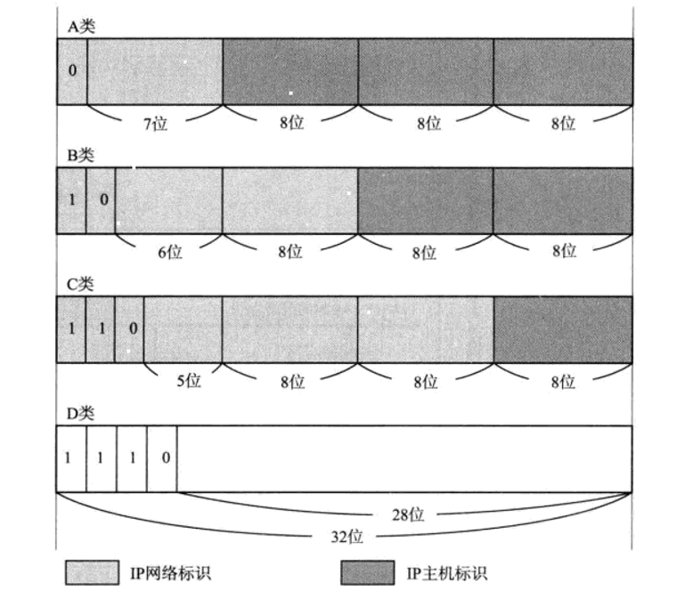
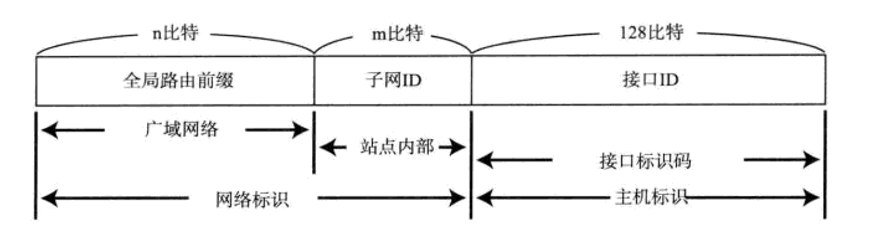
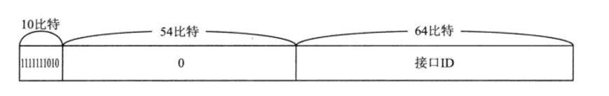
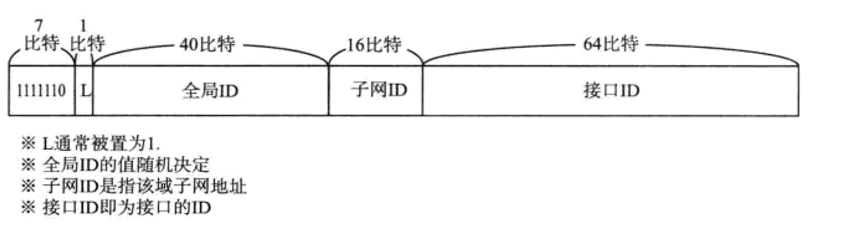

## IP即网际协议
**IP相当于OSI参考模型的第三层**  
网络层的主要作用是"实现终端节点之间的通信"，这种终端节点之间的通信也叫做"点对点通信"。网络层的下一层--数
据链路层的主要作用是在互连同一种数据链路的节点之间进行包传递。而一旦跨越多种数据链路，就需要借助网络层。网
络层可以跨越不同的数据链路，即使是在不同的数据链路上也能够实现两端节点之间的数据包传输

---

## IP基础知识
**IP地址属于网络层地址**  
在计算机通信中，为了识别通信对端，必须要有一个类似于地址的识别码进行标识。作为网络层的IP，也有这种地址信
息。一般叫做IP地址，IP地址用于在"连接到网络中的所有主机中识别出进行通信的目标地址"，因此，在TCP/IP通信
中所有主机或路由器都必须设置自己的IP。不论一台主机与哪种数据链路进行连接，其IP地址的形式都保持不变。另
外，再网桥或交换集线器等物理层或数据链路层数据包转发设备中，不需要设置IP地址。因为这些设备只负责将IP包转
化为0、1比特流转发或对数据链路帧的数据部分进行转发，而不需要应对IP协议

**路由控制**  
路由控制是指将分组数据发送到最终目标地址的功能。即使网络非常复杂，也可以通过路由控制确定到达目标地址的通
路。一旦这个路由控制的通路出现异常，分组数据极有可能"迷失"，无法到达目标地址。因此，一个数据包能够成功的
到达最终目标地址，全靠路由控制  
"Hop"译为中文叫跳，它是指网络中的一个区间。IP包正是在网络中的一个区间被转发，因此IP路由也叫做多跳路由。
在每个区间内决定着包在下一跳转发的路径  
多跳路由是指路由器或主机在转发IP数据包时只指定下一个路由器或主机，而不是将最终目标地址为止的所有通路全都
指定出来。因为每一个区间（跳）在转发IP数据包时会分别指定下一跳的操作，直至包到达最终的目标地址

**路由控制表**  
为了将数据发给目标主机，所有主机都维护着一张路由控制表。该表记录IP数据在下一步应该发往哪个路由，IP包将根
据这个路由表在各个数据链路上进行传输

**数据链路的抽象化**  
IP是实现多个数据链路之间通信的协议，数据链路根据种类的不同各有特点。对这些不同数据链路的相异特性进行抽象
化也是IP的重要作用之一。数据链路的地址可以被抽象化为IP地址。因此，对IP的上一层来说，不论底层数据链路使用
以太网还是无线LAN亦或是PPP，都将被一视同仁
不同数据链路有个最大的区别，就是他们各自的最大传输单位不同。为了解决这个问题，IP进行分片处理。顾名思义，
所谓分片处理是指，将较大的IP包分成多个较小的IP包。分片的包到了对端目标地址以后会再被组合起来传给上一层

**IP属于面向无连接型**  
主要有两点原因：一是为了简化，一是为了提速。面向连接比面向无连接处理相对复杂，甚至管理每个连接本身就是一
个相对繁杂的事情。此外，每次通信之前都要事先建立连接，又会降低处理速度。需要有连接时，可以委托上一层提供
此项服务。因此，IP为了实现简单化与高速化采用面向无连接的方式

---

## IP地址的基础知识
**IP地址的定义**  
IP地址（IPv4地址）由32位正整数来表示，TCP/IP通信要求将这样的IP地址分配给每一个参与通信的主机。IP地址在
计算机内部以二进制的方式被处理。然而，由于人类社会并不习惯采用二进制方式，需要采用一种特殊的标记饭是方式，
那就是将32位的IP地址以每8位为一组，分成4组，每组以"."隔开，再将其转为10进制数

**IP地址由网络和主机两部分标识组成**  
网络标识在数据链路的每个段配置不同的值，网络标识必须保证相互连接的每个段的地址不重复，而相同段内相连的主机
必须有相同的网络地址。IP地址的主机标识则不允许在同一个网内重复出现。由此，可以通过设置网络地址和主机地址，
在相互连接的整个网络中保证每台主机的IP地址都不会相互重叠，即IP地址具有了唯一性

#### IP地址的分类

        
**关于IP主机地址分配的注意事项**    
在分配IP地址时关于主机标识有一点注意。即要用比特位表示主机地址时，不可以全部为0或全部为1。因为全部为0在表
示对应的网络地址不可获知的情况下才使用，而全部为1的地址通常为广播地址
        
**广播地址**  
广播地址用于在同一个链路中相互连接的主机之间发送数据包。将IP地址中的主机地址部分全部设置为1，就成为了广播
地址。广播分为本地广播和直接广播两种。在本网络内的广播叫做本地广播，在不同网络直接的广播叫直接广播

**IP多播**  
多播用于将包发送给特定组内的所有主机，由于其使用IP协议，因此也不存在可靠传输。多播使用D类地址，因此，如果
首位开始到第4位是"1110"，就可以认为是多播地址。此外，对于多播，所有的主机（路由器以外的主机和终端主机）
必须属于224.0.0.1的段，所有的路由器必须属于224.0.0.2的段
        
**子网和子网掩码**  
现在，一个IP地址的网络标识和主机标识已不再受限于该地址的类别，而是由一个叫做"子网掩码"的识别码通过子网网
络地址细分出比A类、B类、C类更细小粒度的网络。这种方式实际上就是将原来A类、B类、C类等分类中的主机地址部分
用作子网地址，可以将原网络分为多个物理网络的一种机制。自从引入了子网以后，一个IP地址就有了两种识别码，一
是IP地址本身，另一个是表示网络部的子网掩码

---

## 路由控制
发送数据包时所使用的地址是网络层的地址，即IP地址。然而仅有IP地址还不足以实现将数据包发送到对端目标地址，在数
据发送过程中还需知类似于"指明路由器或主机"的信息，以便真正发往目标地址。保存这种信息的就是路由控制表。实现IP通
信的路由器和主机都必须持有一张这样的表，它们也正是在这个表格的基础上才得以进行数据包发送的  

该路由控制表的形成方式有两种：一种是管理员手动设置，另一种是路由器与其它路由器相互交换信息时自动刷新。前者也
叫静态路由控制，而后者叫做动态路由控制。为了让动态路由及时刷新路由表，在网络上互连的路由器之间必须设置好路由协
议，保证正常读取路由控制信息  

IP协议始终认为路由表是正确的，然而，IP本身并没有定义制作路由控制表的协议。即IP没有制作路由控制表的机制，该
表是由一个叫做"路由协议"的协议制作而成的  

#### IP地址与路由控制
    
路由控制表中记录着网络地址与下一步应该发送至路由器的地址。在发送IP包时，首先要确定IP包首部中的目标地址，再从路
由控制表中找到与该地址具有相同网络地址的记录，根据该记录将IP包转发给下一个相应的路由器。如果路由控制表中存在多
条相同网络地址的记录，就选择相同位数最多的那一条

* 默认路由  
如果一张路由表中包含所有网络及其子网的信息，那将造成无端的浪费。这时，默认路由是不错的选择。默认路由是指路
由表中任何一个地址都能与之匹配的记录
* 主机路由  
"IP地址/32"也被称为主机路由，它的意思是整个IP地址的所有位都将参与路由。进行主机路由，意味着要基于主机上
网卡配置的IP地址本身，而不是基于该地址的网络部分地址进行路由。主机路由多用于不希望通过网络地址路由的情况

---

## IP分割处理与再构成处理
**数据链路不同，MTU则相异**  
每种数据链路的MTU之所以不同，因为每种数据链路的使用目的不同，使用目的不同，可承载的MTU也就不同

**IP报文的分片与重组**  
任何一台主机都有必要对IP分片进行相应的处理，分片往往在网络上遇到比较大的报文无法一下子发送出去时才会进行
处理。进行分片之后的IP数据报在被重组的时候，只能由目标主机进行。路由器虽然做分片但不会进行重组

**路径MTU发现**  
所谓路径MTU是指从发送端主机到接收端主机之间不需要分片时最大MTU的大小。即路径中存在的所有数据链路中最小的
MTU，而路径MTU发现从发送主机按照路径MTU的大小将数据报分片后再进行发送。进行路径MTU发现，就可以避免在中途
的路由器上进行分片处理，也可以在TCP中发送更大的包。现在，很多操作系统都已经实现了路径MTU发现的功能

---

## IPv6
**IPv6的必要性**  
IPv6是为了根本解决IPv4地址耗尽的问题而被标准化的网际协议。IPv4地址长度为32byte，而IPv6地址长度则为原来
的4倍，128byte。从IPv4切换到IPv6及其耗时，需要将网络中的所有主机和路由器的IP地址进行重新设置。当互联网
广泛普及后，替换所有IP地址会是更为艰巨的任务

---

**IPv6的特点**  
* IP地址的扩大与路由控制表的聚合。IP地址依然适应服务网分层构造，分配与其地址结构相适应的IP地址，尽可能避
免路由表膨大
* 性能提升。包首部长度采用固定的值（40字节），不再采用首部校验码，简化首部结构，减轻路由器负荷，路由器不
再做分片处理
* 支持即插即用功能。即使没有DHCP服务器也可以实现自动分配IP地址
* 采用认证与加密功能。应对伪造IP地址的网络安全功能以及防止线路窃听的功能
* 多播、MobileIP成为扩展功能
  
**IPv6中IP地址的标记方法**  
IPv6的IP地址长度为128位，足以为人们所能想象到的所有主机和路由器分配地址。如果将IPv6的地址像IPv4的地址一
样用10进制数据表示的话，是16个数字的序列（IPv4是4个数字的序列）。由于用16个数字序列表示显得麻烦，因此，
将IPv6和IPv4在标记方法上进行区分。一般人们将128byte IP地址以每16byte为一组，每组用":"隔开并进行标记。
而且如果出现连续的0时还可以将这些0省略，并用"::"隔开。但是，一个IP地址中只允许出现一次两个连续的冒号

**IPv6地址结构**  
* IPv6类似IPv4，也是通过IP地址的前几位标识IP地址的种类  
* 在互联网通信中，使用一种全局的单播地址。它是互联网中唯一的一个IP地址，不需要正式分配IP地址
* 限制型网络，即那些不与互联网直接接入的私有网络，可以使用唯一本地地址。该地址根据一定的算法生成随机数并融合
到地址当中，可以像IPv4的私有地址一样自由使用
* 在不使用路由器或者在同一个以太网网段内进行通信时，可以使用链路本地单播地址
* 而在构建允许多种类型IP地址的网络时，再同一个链路上也可以使用全局单播地址以及唯一本地地址进行通信
* 在IPv6的环境下，可以同时将这些IP地址全都配置在同一个NIC上，按需灵活使用
           

**全局单播地址**  
全局单播地址是指世界上唯一的一个地址，它是互联网通信以及各个域内部通信中最为常见的一个IPv6地址。全局单播
地址前64byte为网络标识，后64byte为主机标识。通常，接口ID中保存64byte版的MAC地址的值，不过由于MAC地址
属于设备固有的信息，有时不希望让对端知道，这时的接口ID可设置为一个与MAC地址没有关系的"临时地址"。这种临时
地址通常随机产生，并会定期更新。因此，从IPv6地址查看设备信息变得没那么简单，究竟会是哪种信息，全由操作系
统的具体装置决定

**链路本地单播地址**  
链路本地单播地址是指在同一个数据链路内唯一的地址，它用于不经过路由器，在同一个链路内的通信，通常接口ID保存
64byte版的MAC地址

**唯一本地地址**  
唯一本地地址是不进行互联网通信时所使用的地址

