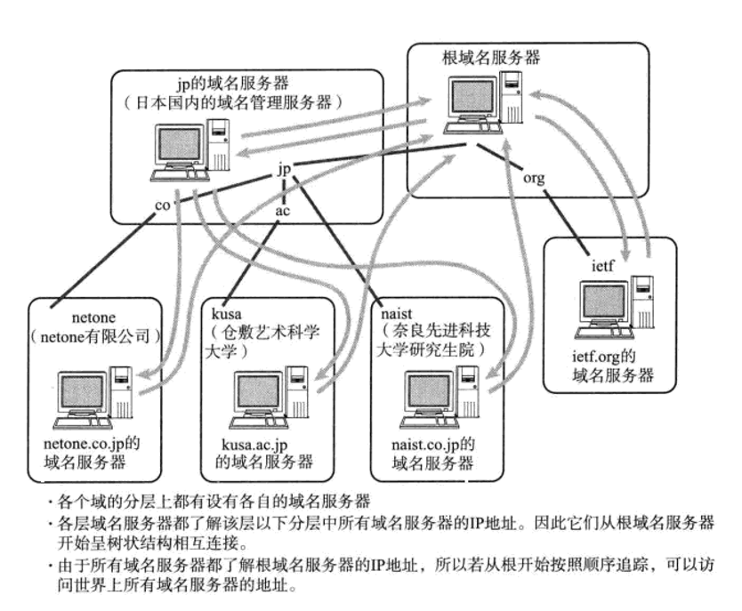
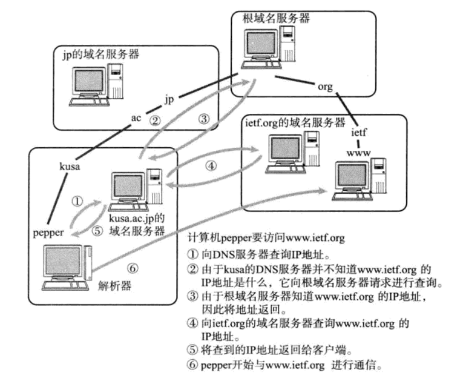
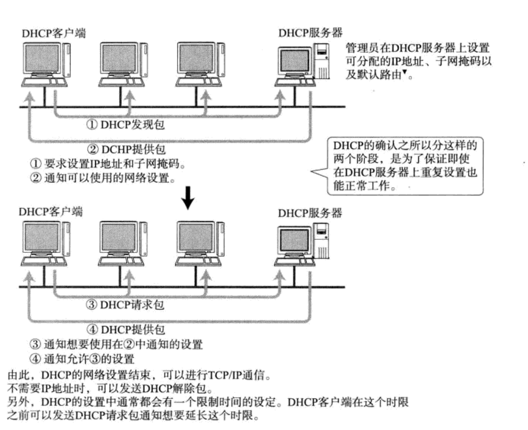

## DNS
我们平常在访问某个网站的时候不使用IP地址，而是用一串由罗马字和点号组成的字符串。而一般用户在使用TCP/IP通信时
也不使用IP地址，能够这样做是因为了有了DNS功能的支持。DNS可以将那串字符串自动转换成具体的IP地址。这种DNS不仅
适用于IPv4，也适用于IPv6

**DNS的产生**  
DNS是一个可以有效管理主机名和IP地址间对应关系的系统，在这个系统中主机的管理机构可以对数据进行变更和设
定。也就是说，它可以维护一个用来表示组织内部主机名和IP地址之间对应关系的数据库

在应用中，当用户输入主机名（域名）时，DNS会自动检索那个注册了主机名和IP地址的数据库，并迅速定位对应的
IP地址。而且，如果主机名和IP地址需要进行变更时，也只需要在组织机构内部进行处理即可，没必要再向其它的机构
申请或报告

**域名服务器**  
域名服务器是指管理域名的主机和相应的软件，它可以管理所在分层的域的相关信息，其所管理的分层那叫做ZONE，如
图所示，每层都设有一个域名服务器

**解析器**  
进行DNS查询的主机和软件叫做DNS解析器，用户所使用的工作站和个人电脑都属于解析器，一个解析器至少要注册一个
以上域名服务器的IP地址。通常，它至少包括组织内部的域名服务器的IP地址

#### DNS查询

---

## ARP
ARP是一种解决地址问题的协议。以目标IP地址为线索，用来定位下一个应该接收数据分包的网络设备对应的MAC地址。如果
目标主机不在同一个链路上时，可以通过ARP查找下一跳路由器的MAC地址。不过ARP只适用于IPv4，不能用于IPv6，IPv6
中可以用ICMPv6替代ARP发送邻居探索消息

**ARP工作机制**  
从一个IP地址发送ARP请求包以了解其MAC地址，目标地址将自己的MAC地址填入其中的ARP响应包返回到IP地址。由
此，可以通过ARP从IP地址获得MAC地址，实现链路内的IP通信

为避免造成不必要的网络流量，通常做法是把获取到的MAC地址缓存一段时间。即把第一次通过ARP获取到的MAC地址
作为IP对MAC的映射关系记忆到一个ARP缓存表中，下一次再向这个IP地址发送数据报时不需再重新发送ARP请求，而是
直接使用这个缓存表当中的MAC地址进行数据报的发送。每执行一次ARP，其对应的缓存内容会被清除，不过在清楚之前
都可以不需要执行ARP就可以获取想要的MAC地址。这样，在一定程度上也防止了ARP包在网络上被大量广播的可能性
          
MAC地址的缓存是有一定期限的，超过这个期限，缓存的内容将被清除。这使得MAC地址与IP地址对应关系即使发生了
变化，也依然能够将数据包正确的发送给目标地址

**RARP**  
RARP是将ARP反过来，从MAC地址定位IP地址的一种协议。例如将打印机服务器等小型嵌入式设备接入到网络时就经常
会用到

**代理ARP**  
通常ARP包会被路由器隔离，但是采用代理ARP的路由器可以将ARP请求转发给邻近的网段，由此，两个以上网段的节点
之间可以像在同一个网段内一样进行通信

---

## ICMP
ICMP的主要功能包括，确认IP包是否成功送达目标地址，通知在发送过程当中IP包被废弃的具体原因，改善网络设置等。有
了这些功能以后，就可以获得网络是否正常、设置是否有误以及设备有何异常等信息，从而便于进行网络上的问题诊断。ICMP
的消息大致可以分为两类：一类是通知出错原因的错误消息，另一类是用于诊断的查询消息

**主要的ICMP消息**  
* ICMP目标不可达消息（类型3）：IP路由器无法将IP数据包发送给目标地址时，会给发送端主机返回一个目标不可达
的ICMP消息，并在这个消息中显示不可达的具体原因
* ICMP重定向消息（类型5）：如果路由器发现发送端主机使用了次优的路径发送数据，那么它会返回一个ICMP重定向
的消息给这个主机，在这个消息中包含了最合适的路由信息和源数据
* ICMP超时消息（类型11）：IP包中有一个字段叫TTL，它的值随着没经过一次路由器就会减1，直到减到0时该IP包
会被丢弃。此时，IP路由器将会发送一个ICMP超时的消息给发送端主机，并通知该包已被丢弃
* ICMP回送消息（类型0、8）：用于进行通信的主机或路由器之间，判断所发送的数据包是否已经成功到达对端的一种
消息

---

## DHCP
为了实现自动设置IP地址、统一管理IP地址分配，就产生了DHCP协议。有了DHCP，计算机只要连接到网络，就可以进行
TCP/IP通信。也就是说，DHCP让即插即用变得可能，而DHCP不仅在IPv4中，在IPv6中也同样适用

#### DHCP获取IP的流程

