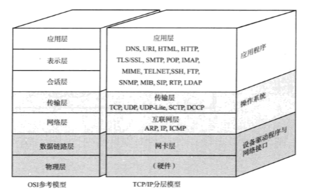
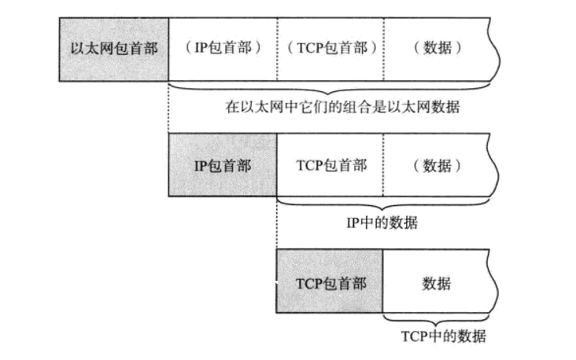

## TCP/IP的标准化
**TCP/IP的含义**  
多数情况下，TCP/IP指的是利用IP进行通信时所必须用到的协议群的统称。具体来说，IP或ICMP、TCP或UDP、
TELNET或FTP、以及HTTP都属于TCP/IP的协议。它们与TCP或IP的关系紧密，是互联网必不可少的组成部分。
TCP/IP一词泛指这些协议，有时，也称TCP/IP为网际协议族
    
**TCP/IP标准化精髓**  
TCP/IP的协议标准化过程与其它的标准化过程有所不同，具有两大特点：一是具有开发性，二是具有实用性。开放性是
因为制定TCP/IP协议的IETF本身就是一个允许任何人加入讨论的组织；实用性是因为在TCP/IP的标准化过程中，指定
某一协议的规范本身已不再那么重要，首要任务是实现真正能实现通信的技术

---

## 互联网基础知识
**互联网的结构**  
互联网中的每个网络都是由骨干网和末端网组成的。每个网络之间通过NOC相连。如果网络的运营商不同，它的连接方式
和使用方法也会不同。连接这种异构网络需要IX的支持，总之，互联网就是众多异构的网络通过IX互连的一个巨型网络
        
## TCP/IP协议分层模型
#### TCP/IP与OSI参考模型

   
**硬件（物理层）**  
TCP/IP的最底层是负责数据传输的硬件，这种硬件就相当于以太网或电话线路等物理层设备。只要人们在物理层面的传输
媒介不同，网络的带宽、可靠性、安全性、延迟等都会有所不同，而在这方面又没有一个既定的指标。总之，TCP/IP是在
网络互联的设备之间能够通信的前提下才被提出的协议
        
**网络接口层（数据链路层）**  
互联网层使用IP协议，它相当于OSI模型中的第3层网络层，IP协议基于IP地址转发分包数据。TCP/IP分层中的互联网
层与传输层的功能通常由操作系统提供，尤其是路由器，它必须实现通过互联网层转发分组数据包的功能。此外，连接互
联网的所有主机跟路由器都必须实现IP的功能，其它连接互联网的网络设备就没必要一定实现TCP或IP的功能

* IP  
IP是跨越网络传送数据包，使整个互联网都能收到数据的协议。IP协议使数据能够发送到地球的另一端，这期间它
使用IP地址作为主机的标识。IP还隐含着数据链路层的功能，通过IP，相互通信的主机之间不论经过怎样的底层数
据链路都能实现通信。虽然IP也是分组交换的一种协议，但它不具有重发机制，即使分组数据包未能到达对端主机
也不会重发，因此，属于非可靠性传输协议
* ICMP  
IP数据包在发送途中一旦发生异常导致无法到达对端目标地址时，需要给发送端发送一个发生异常的通知。ICMP就
是为这一功能设定的，它有时也被用来诊断网络的健康状况
* ARP  
从分组数据包的IP地址中解析出物理地址（MAC地址）的一种协议
            
**传输层**
传输层最主要的功能就是让应用程序之间实现通信。计算机内部，通常同一时间允许多个程序。为此，必须分清是哪些程
序与哪些程序在进行通信，识别这些应用程序的是端口号
* TCP  
TCP是一种面向有连接的传输层协议，它可以保证两端通信主机之间的通信可达。TCP能够正确处理在传输过程中丢
包、传输顺序乱掉等异常情况，此外，TCP还能够有效利用带宽，缓解网络拥堵。然而，为了建立和断开连接，有时
它需要至少7次的发包收包，导致网络流量的浪费。此外，为了提高网络的利用率，TCP协议中定义了各种各样复杂
的规范，因此不利于视频会议等场合使用
* UDP  
UDP有别于TCP，它是一种面向无连接的传输层协议。UDP不会关注对端是否真的收到了传送过去的数据，如果需要
检查对端是否收到了分组数据包，或者对端是否连接到网络，则需要在应用程序中实现。UDP常用于分组数据较少、
广播通信以及视频通信等多媒体领域
            
**应用层（会话层以上的分层）**  
TCP/IP应用的架构绝大多数属于客户端/服务端模型。提供服务的程序叫服务端，接受服务的程序叫客户端。在这种通信
模式中，提供服务的程序会预先被部署到主机上，等待接收任何时刻客户可能发送的请求。客户端可以随时发送请求给服
务端，有时服务端可能会有处理异常、超出负载等情况，这时客户端可以在等待片刻后重发一次请求
* WWW  
浏览器与服务端之间通信所用的协议是HTTP，所传输数据的主要格式是HTML。WWW中的HTTP属于OSI应用层的协议，
而HTTP属于表示层的协议
* 电子邮件  
发送电子 邮件时用到的协议叫SMTP。最初，人们只能发送文本格式的电子邮件。然而现在，电子邮件的格式由
MIME协议扩展之后，就可以发送图像、声音等各种各样的信息，甚至可以修改邮件文字的大小、颜色。这里提到的
MIME属于OSI参考模型的第6层--表示层
* 文件传输（FTP）  
文件传时是指将保存在其它计算机硬盘上的文件转移到本地的硬盘上，或将本地硬盘的文件传送到其它机器硬盘上
的意思。该过程使用到的协议叫FTP。FTP很早就已经投入使用，传输过程中可以选择用二进制方式还是文本方式。
在FTP中进行文件传输时会建立两个TCP连接，分别是发出传输请求时要用到的控制连接合实际传输数据时要用到的
传输连接
* 远程登录（TELNET和SSH）  
远程登录是指登录到远程的计算机上，使那台计算机上的程序得以运行的一种功能。TCP/IP网络中远程登录常使用
TELNET和SSH两种协议
* 网络管理（SNMP）  
在TCP/IP中进行网络管理时，采用SNMP协议。使用SNMP管理的主机、网桥、路由器等称作SNMP代理，而进行管
理的那一段叫做管理器。SNMP正是这个Manager和Agent所要用到的协议。在SNMP的代理端，保存着网络接口的
信息、数据通信量、异常数据量以及设备温度等信息。这些信息可以通过MIB访问。因此，在TCP/IP的网络管理
中，SNMP属于应用协议，MIB属于表示层协议
            
## TCP/IP分层模型和通信示例
#### 数据包首部
