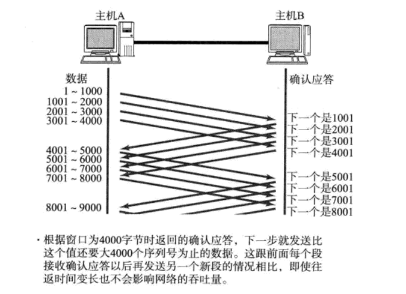
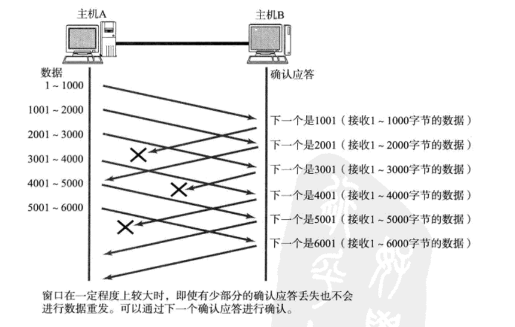
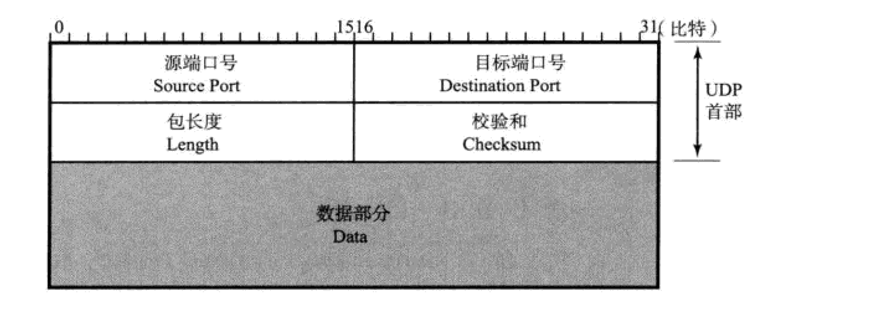
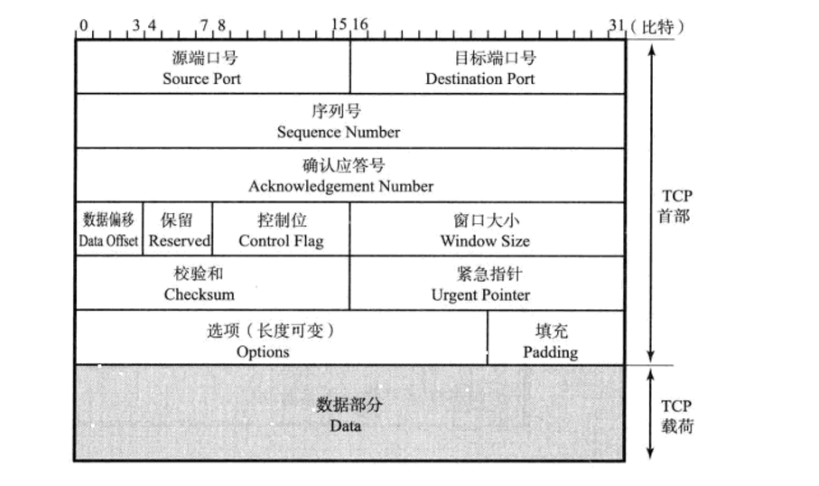

## 传输层的作用
**两种传输层协议 TCP和UDP**
* TCP：TCP是面向连接的、可靠的流协议。流就是指不间断的数据结构，当应用程序采用TCP发送消息时，虽然可以保证
发送的顺序，但还是犹如没有任何间隔的数据流发送给接收端
* UDP：UDP是不具有可靠性的数据报协议。细微的处理它会交给上层应用去完成。在UDP的情况下，虽然可以确保发送消
息的大小，却不能保证消息一定会到达，因此，应用有时会根据自己的需要进行重发处理

**TCP和UDP区分**  
TCP用于在传输层有必要实现可靠传输的情况，由于它是面向有连接并具备顺序控制、重发1控制等机制的，所以它可以
为应用提供可靠传输。而在另一方面，UDP主要用于那些对告诉传输和实时性有较高要求的通信或广播通信。因此，TCP
和UDP应该根据应用的目的按需使用

---

## UDP
UDP不提供复杂的控制机制，利用IP提供面向无连接的通信服务。并且他是将应用程序发来的数据在收到的那一刻，立即按照
原样发送到网络上的一种机制。即使是出现网络拥堵的情况下，UDP也无法进行流量控制等避免网络拥塞的行为。此外，传输
途中即使出现丢包，UDP也不负责重发，甚至出现当包的到达顺序乱掉时也没有纠正的功能。如果需要这些细节控制，那么不
得不交由采用UDP的应用程序去处理
    
由于UDP面向无连接，他可以随时发送数据。再加上UDP本身的处理既简单又高效，因此经常用于以下几个方面：
* 包总量较少的通信（DNS、SNMP等）
* 视频、音频等多媒体通信（即时通信）
* 限定于LAN等特定网络中的通信
* 广播通信（广播、多播）

---

## TCP
TCP与UDP的区别相当大，它充分实现了数据传输时各种控制功能，可以进行丢包时的重发控制，还可以对次序乱掉的分包进
行顺序控制。而这些在UDP中都没有。此外，TCP作为一种面向有连接的协议，只有在确认通信对端存在时才会发送数据，从
而可以控制通信流量的浪费

**通过序列号与确认应答提高可靠性**  
在TCP中，当发送端的数据到达接收主机时，接收端主机会返回一个已收到消息的通知，这个消息叫做确认应答。TCP通
过确认应答实现可靠的数据传输当发送端将数据发出之后会等待对端的确认应答。如果有确认应答，说明数据已成功到达
对端。反之，则数据丢失的可能性很大。在一定时间内没有收到确认应答（无论是应答丢失还是网络延迟），发送端就可
以认为数据已经丢失，并进行重发。由此，即使产生了丢包，仍能保证数据能够到达对端，实现可靠传输

**重发超时如何确定**  
重发超时是指在重发数据之前，等待确认应答到来的那个特定时间间隔，如果超过了这个时间仍未收到确认应答，发
送端将进行数据重发。TCP要求不论处在何种网络环境下都要提供高性能通信，并且无论网络拥堵情况发生何种变化，都
必须保持这一特性，为此，它在每次发包时都会计算往返时间及偏差，将这个往返时间和偏差相加重发超时的时间，就
是比这个综合稍大一点的值。
          
数据重发之后若还收不到确认应答，则进行再次发生，此时，等待确认应答的时间将会以2倍、4倍的指数函数延长。
此外，数据也不会被无限、反复的重发。达到一定的重发次数后，如果仍没收到任何确认应答返回，就会判断为网络或
对端主机发生了异常，强制关闭连接，并且通知应用通信异常强行终止

**TCP以段为单位发送数据**  
建立TCP连接时也可以确定发送数据包的长度，称之为"最大消息长度"（MSS），最理想的情况是，MSS正好是IP中不会
被分片处理的最大数据长度。MSS是在三次握手的时候，在两端主机之间计算得出。两端主机在发出连接连接的请求时，
会在TCP首部中写入MSS选项，告诉对方自己的接口能够适应的MSS的大小，然后在两者之间选择一个较小的值投入使用

#### 利用窗口控制提高速度

#### 窗口控制与重发控制

**流控制**  
TCP提供了一种机制可以让发送端根据接收端的实际接收能力控制发送的数据量，这就是所谓的流控制。它的具体操作
是，接收端主机向发送端主机通知自己可以接收数据的大小，于是发送端会发送不超过这个限度的数据，该大小限度就
被称作窗口大小。TCP首部中，专门有一个字段用来通知窗口大小，接收主机将自己可以接收的缓冲区大小放入这个字
段中通知给发送端，这个字段值越大，说明网络的吞吐量越高。不过，接收端的这个缓冲区一旦面临数据溢出时，窗口
大小的值也会随之被设置为更小的值通知给发送端，从而控制数据发送量

**拥塞控制**  
为防止请求端一开始就发送大量数据造成网络拥堵甚至瘫痪，因此在通信开始会通过一个叫做慢启动得出的数值，对发
送量进行控制。首先，为了在发送端调节所要发送的数据的量，定义了一个叫做"拥塞窗口"的概念。于是在慢启动时，
将这个拥塞窗口的大小设置为1个MSS发送数据，之后每收到一次确认应答，拥塞窗口的值就加1.在发送数据包时，将拥
塞窗口的大小与接收端主机通知的窗口大小作比较，然后按照它们当中较小的那个值，发送比其还要小的数据量。如果
重发采用超时机制，那么拥塞窗口的初始值可以设置为1以后再进行慢启动修正。不过，随着包的每次往返，拥塞窗口的
值也会指数增长，拥堵状况激增也可能会造成网络拥堵。为防止这个状况的发生，引入了慢启动阈值的概念，只要拥塞
窗口的值超过这个阈值，在每收到一次确认应答时，只允许按以下比例放大窗口：
（1个数据段字节数 * 1个数据段字节数）/ 拥塞窗口（字节） 

---

## UDP首部的格式

* 源端口号：发送端端口号
* 目标端口号：接收端端口号
* 包长度：保存了UDP首部的长度跟数据的长度之和
* 校验和：为了提供可靠的UDP首部和数据而设计的

---

## TCP首部的格式

* 源端口号：发送端端口号
* 目标端口号：接收端端口号
* 序列号：发送数据的位置，每发送一次数据，就累加一次该数据字节数的大小
* 确认应答号：指下一次应该收到的数据的序列号，实际上，它是指已收到确认应答号减一为止的值
* 数据偏移：表示TCP所传输的数据部分应该从TCP包的哪个位开始计算，也可以看作TCP首部的长度
* 保留：为以后扩展使用
* 控制位：长度为8位，表示8个控制标志
* 窗口大小：用于通知从相同TCP首部的确认应答号所指位置开始能够接收的数据大小
* 校验和：与UDP相似，但是不能关闭
* 紧急指针：只有在URG控制位为1时才有效，表示本报文中紧急数据的指针
* 选项：用于提高TCP传输性能

