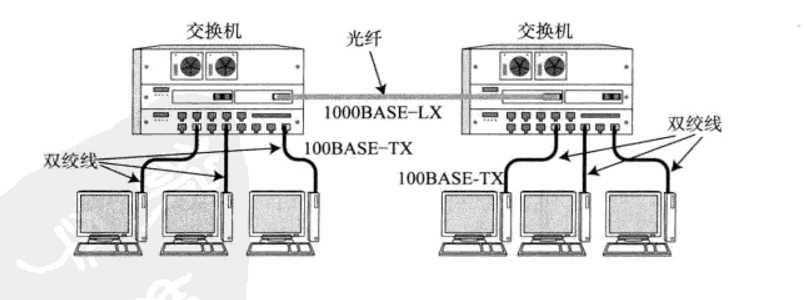
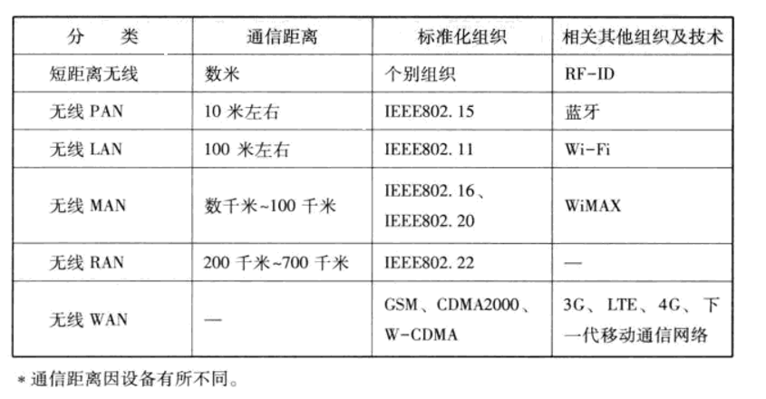

## 数据链路的作用
数据链路层的协议定义了通过通信媒介互连的设备之间的连接规范。实际上，各个设备之间在传输数据时，数据链路层和
物理层都是必不可少的。众所周知，计算机以二进制0、1来表示信息，然而实际的通信媒介之间处理的确实电压的高低、
光的闪灭以及电波的强弱等信号。把这些信号与二进制的0、1进行转换正是物理层的责任。数据链路层处理的数据也不是
单纯的0、1序列，该层把它们集合为一个叫做"帧"的块，然后再进行传输
    
**数据链路的段**  
数据链路的段是指一个被分割的网络，然后根据使用者不同，其含义也不尽相同。例如，引入中继器将两条网线组成一
个网络这种情况下有两条数据链路：  
从网络层的概念看，它是一个网络（逻辑上），即，从网络层的立场出发，这两条网线组成一个段
从物理层的概念看，两条网线分别是两个物体（物理上），即，从物理层的观点出发，一条网线是一个段
            
**网络拓扑**  
网络的连接和构成的形态称为网络拓扑。网络拓扑包括总线型、环型、星型、网状型等。拓扑一次不仅用于直观可见的
配线方式上，也用于逻辑上网络的组成结构。两者可能会不一致
        
---

## 数据链路相关技术
**MAC地址**  
MAC地址用于识别数据链路中互连的节点。以太网或FDDI中，根据IEEE802.3的规范使用MAC地址。其它诸如无线
LAN、蓝牙等设备中也是用相同规格的MAC地址。MAC地址长48比特，在使用网卡（NIC）的情况下，MAC地址一般会
被烧入到ROM中。因此，任何一个网卡的MAC地址都是唯一的，在全世界都不会有重复

   
**共享介质型网络**  
共享介质型网络指由多个设备共享一个通信介质的一种网络，最早的以太网和FDDI就是介质共享型网络。在这种方式
下，设备之间使用同一个载波信道进行发送和接收。为此，基本上使用双半工通信方式，并有必要对介质进行访问控
制。共享介质型网络中有两种介质访问控制方式，一种是争用方式，一种是令牌传递方式
        
* 争用方式  
争用方式是指争夺获取数据传输的能力，也叫CSMA（载波监听多路访问）。这种方法通常令网络中的各个站采用先
到先得的方式占用信道发送数据，如果多个站同时发送帧，则会产生冲突现象。也因此会导致网络拥堵和性能下降

        
* 令牌传递方式  
令牌传递方式是沿着令牌环发送一种叫做"令牌"的特殊报文，是控制传输的一种方式。只有获得令牌的站才能发送
数据。这种方式有两个特点：一是不会有冲突，二是每个站都有通过平等循环获得令牌的机会。因此，即使网络拥
堵也不会导致性能下降。当然，在这种方式中，一个站在没有收到令牌前不能发送数据帧，因此在网络不太拥堵的
情况下数据链路的利用率也就达不到100%。因此，衍生了多种令牌传递的技术

   
**非共享介质网络**  
非共享介质网络是指不共享介质，是对介质采取专用的一种传输控制方式。在这种方式下，网络中的每个站直连交换机，
由交换机负责转发数据帧。此方式下，发送端与接收端不共享通信介质。因此很多情况下采用全双工通信方式。不仅ATM
采用这种传输控制方式，最近它也成为了以太网的主流方式。通过以太网交换机构建网络，从而使计算机和交换机端口
之间形成一对一的连接，即可实现全双工通信。在这种一对一连接全双工通信的方式下不会发生冲突，因此不需要
CSMA/CD的机制就可以实现更高效的通信。该方式还可以根据交换机的高级特性构建虚拟局域网、进行流量控制等。当
然，这种方式也有一个致命的弱点，那就是一旦交换机发生故障，与之相连的所有计算机之间都将无法通信

   
**半双工和全双工通信**  
半双工是指只发送或只接收的通信方式。它类似于无线电收发器，若两端同时说话，是听不见对方说的话的。而全双工不
同，它允许在同一时间既发送数据又接收数据。类似于电话，接打双方可以同时说话
        
**根据MAC地址转发**  
在使用同轴电缆的以太网等介质共享网络中，同一时间只能有一台主机收发数据。当连网的主机数量增加时，通信性
能会明显下降。若将集线器或集中器等设备以星型连接，就出现了一款新的网络设备--交换集线器，这是一种将非介质共
享型网络中所使用的交换机用在以太网中的技术，交换集线器也叫做以太网交换机

以太网交换机就是持有多个端口的网桥。他们根据数据链路层中每个帧的目标MAC地址，决定从哪个网络接口发送数
据。这时所参考的、用以记录发送接口的表就叫做转发表

这种转发表的内容不需要使用者在每个终端或交换机上手动设置，而是可以自动生成。数据链路层的每个通过点在接
到包时，会从中将源MAC地址以及曾经接收该地址发送的数据包的接口作为对应关系记录到转发表中。以某个MAC地址作为
源地址的包由某一接口接收，实质上可以理解为该MAC地址就是该接口的目标。因此也可以说，以该MAC地址作为目标地址
的包，经由该接口送出即可。这一过程也叫做自学过程
            
由于MAC地址没有层次性，转发表中的入口个数与整个数据链路中所有网络设备的数量有关。当设备数量增加时，转
发表也会随之变大，检索转发表所用的时间也就越来越长。当连接多个终端时，有必要将网络分为多个数据链路，采用类
似于网络层的IP地址一样对地址进行分层管理

   
**交换机转发方式**  
交换机转发方式有两种，一种叫存储转发，另一种叫直通转发
* 存储转发  
存储转发方式检查以太网数据帧末尾的FCS位后再进行转发。因此，可以避免发送由于冲突而被破坏的帧或噪声导致
的错误帧
* 直通转发方式
直通转发方式不需要将整个帧全部接收下来以后再进行转发，只需要得知目标地址即可开始转发。因此，它具有延迟
较短的优势，但同时也不可避免地有发送错误帧地可能性
            
**环路检测技术**  
为解决网络中的环路问题，具体有生成树和源路由两种方式  
* 生成树方式  
该方法由IEEE802.1D定义，每个网桥必须在每1~10秒内相互交换BPDU包，从而判断哪些端口使用哪些不使用。一
旦发生故障，则自动切换通信线路，利用那些没有被使用的端口继续进行传输。生成树法其实与计算机和路由器的
功能没有关系，但是只要有生成树的功能就足以消除环路。IEEE802.1D中所定义的生成树方式有一个弊端，就是在
发生故障切换网络时需要几十秒的时间。为了解决这个用时过长的问题，在IEEE802.1W中定义了一个叫RSTP的方
法，该方法能将发生问题时的恢复时间缩短到几秒以内
* 源路由法  
源路由法最早由IBM提出，以解决令牌环网络的问题。该方式可以判断发送数据的源地址是通过哪个网桥实现传输的，
并将帧写入RIF。网桥则根据这个RIF信息发送帧给目标地址。因此，即使网桥中出现了环路，数据帧也不会被反复
转发，可成功地发送到目标地址。在这种机制中发送端本身必须具备源路由的功能

---

## 以太网
在众多数据链路中最为著名、使用最为广泛的莫过于以太网。它的规范简单，易于NIC（网卡）及驱动程序的实现。因此，在
LAN普及初期，以太网网卡相对于其它网卡，价格也比较低廉，这同时也促进了以太网自身的普及。现在，以太网已成为最具
兼容和未来发展性的一种数据链路
    
**以太网连接形式**  
在以太网普及之初，一般采用多台终端使用同一根同轴电缆的共享介质型连接方式。而现在，随着互连设备的处理能力以
及传输速度的提高，一般都采用终端与交换机之间独占电缆的方式实现以太网通信

   
#### 以太网的分类

   
---

## 无线通信
#### 无线通信的种类

