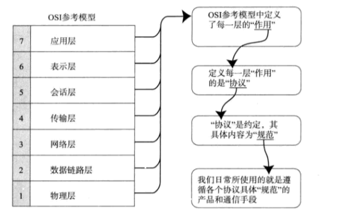
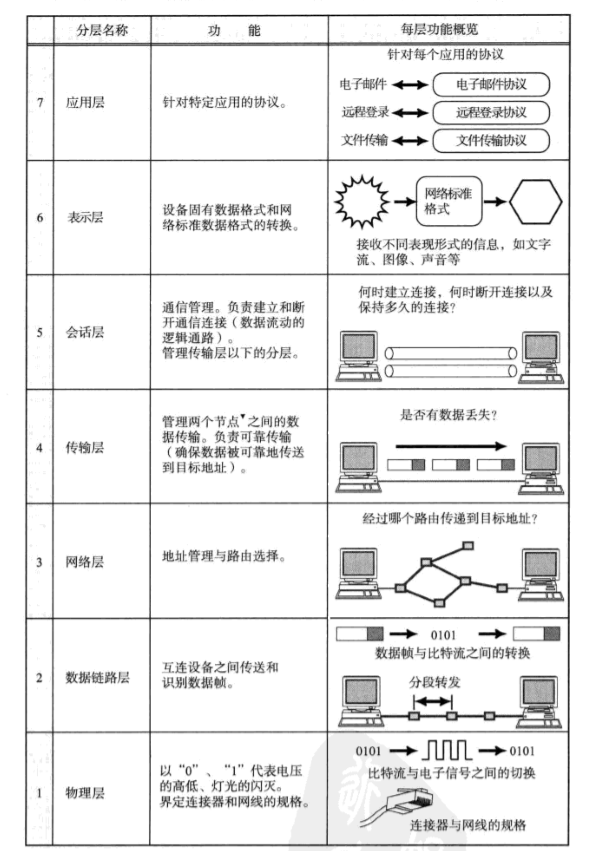
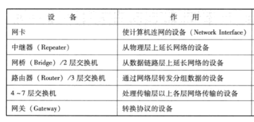

## 计算机网络出现的背景
计算机网络，根据其规模可分为WAN（广域网）和LAN（局域网）

---  

## 计算机网络发展的7个阶段
* 第一阶段 批处理  
所谓批处理，是指事先将用户程序和数据装入卡带或磁盘，并由计算机按照一定的顺序进行处理，使用户所要执行的这些
程序和数据能够一并批量得到处理的方式。批处理时代的计算机主要用于大规模计算或处理，因为那时的计算机尚不是一
个普通人能够使用的工具

* 第二阶段 分时系统  
它是指多个终端同一个系统连接，允许多个用户使用一台计算机的系统。由于分时系统的独占性，使得装备一套用户可直
接操作的计算机环境比以前简单，分时系统中每个终端与计算机之间使用通信线路连接形成一个星形结构，正是从这一时
期开始，网络与计算机的关系开始浮出水面，小型机随即产生，办公场所与工厂也逐渐引入计算机

* 第三阶段 计算机之间的通信  
计算机间的通信技术（计算机与计算机之间实现通信线路连接），人们能够很轻松的即时读取另一台计算机中的数据，从
而极大地缩短了传送数据的时间。计算机间的通信提高了计算机的可用性。这一阶段计算机更侧重于满足使用者的需求，
且操作比以往更加人性化

* 第四阶段 计算机网络的产生  
计算机的发展与普及使人们对网络不再陌生，其中窗口系统的发明，更是拉近了人们与网络的距离，使用户体会到网络的
便捷之处

* 第五阶段 互联网的普及  
个人电脑在诞生之初可以说主要是一种单机模式的工具，而现在则被更广泛地应用于互联网的访问，且无论相距多远，世
界各地的人们只要接入互联网，就能通过个人电脑实现即时沟通和交流

* 第六阶段 以互联网技术为中心的时代  
互联网的普及和发展着实对通信领域产生了巨大的影响

* 第七阶段 从"单纯建立连接"到"安全建立连接"  
在互联网初期，人们更关注单纯的连接性，以不收任何限制的建立互联网连接为最终目的。而现在，人们不再满足于"单
纯建立连接"，而是更为追求"安全建立连接"的目的

---

## 协议
#### 随处可见的协议

   
**协议的必要性**  
简单来说，协议就是计算机与计算机之间通过网络实现通信时事先达成的一种"约定"，这种"约定"使那些由不同厂商的
设备、不同的CPU以及不同的操作系统组成的计算机之间，只要遵循相同的协议就能够通信。反之，如果使用的协议不
同，就无法进行通信
        
**协议如同人与人的对话**  
协议如同人们平常说话所用的语言，虽然语言是人类才具有的特性，但是计算机与计算机之间通过网络进行通信时，也可
以认为是依据类似于人类"语言"完成了通信
        
**分组交换协议**  
分组交换是指将大数据分割成一个个叫做包的较小单位进行传输的方法，这里所说的包，就如同我们平时在邮局里见到的
邮包，分组交换就是将大数据分割成一个个这样的邮报交给对方。通信协议中，通常会规定报文首部应写入哪些信息、应
该如何处理这些信息，相互通信的每一台计算机则依据协议构造报文首部、读取报文内容等。为了双方能正确通信，分组
的发送方和接收方有必要对报文首部和内容保持一致的定义和解释

---

## 协议分层和OSI参考模型
**协议的分层**  
OSI参考模型将通信协议中必要的功能分为了7层，通过这些分层，使那些比较复杂的协议更加简单化。在这一模型中，
每个分层都接收由它下一层所提供的特定服务，并且负责为自己的上一层提供特定的服务。上下层之间进行交互时所遵
循的约定叫做"接口"，同一层之间交互时所遵循的约定就叫做"协议"。分层可以将每个分层独立使用，即使系统中某些
分层发生变化，也不会波及整个系统。此外，通过分层能够细分通信功能，更易于单独实现每个分层的协议，并界定个
个分层的责任和义务，这些都属于分层的优点。而分层的劣势，就在于过分模块化，使处理变得更加沉重以及每个模块
都不得不实现相似的逻辑处理等问题
        
#### OSI参考模型

   
#### OSI参考模型种各个分层的作用

   
* 应用层：为应用程序提供服务并规定应用程序种通信相关的细节
* 表示层：将应用处理的信息转换为适合网络传输的格式，或将来自下一层的数据转化为上一层能够识别处理的数据
* 会话层：负责建立和断开通信连接（数据流动的逻辑通路），以及数据的分割等数据传输相关的管理
* 传输层：起着可靠传输的作用
* 网络层：将数据传输到目标地址
* 数据链路层：负责物理层面上互连的、节点之间的通信传输
* 物理层：负责0、1比特流，电压的高低

---

## 传输方式的分类
**面向有连接型和面向无连接型**
  - 面向有连接型：  
面向有连接型中，在发送数据之前，需要在收发机之间建立一条通信线路。因此在面向有连接的方式下，必须在通
信传输前后，专门进行建立和断开连接的处理。如果与对端之间无法通信，就可以避免发送无谓的数据
  - 面向无连接型：  
面向无连接型则不要求建立和断开连接，发送端可在任何时候自由发送数据，反之，接收端也不知道自己何时会接
收到数据，因此，在面向无连接的情况下，接收端需要时常确认是否接收到了数据
            
**电路交换和分组交换**
  - 电路交换：  
计算机在收发消息的时候会独占整个通信线路，其它计算机只有在这台计算机处理结束后才有机会使用这条线路收
发数据，并且在此过程中，谁也无法预料某台计算机的数据收发从何时开始又在何时结束，如果并发用户数量超过
交换机之间的通信线路数，就意味着通信根本无法实现
  - 分组交换：  
分组交换中只有一条共享线路，通过数据包的方式将不同计算机之间的收发数据发送到不同的目标主机。电路交换
中，计算机之间的数据传输速度不变，但在分组交换中，通信线路的速度可能有所不同。根据网络拥堵的情况，数
据到达目标地址的时间有长有短。另外，路由器的缓存饱和或溢出时，甚至可能发生分组数据丢失、无法发送到对
端的情况
            
**根据接收端数量分类**  
  - 单播：1对1通信
  - 广播：将信号发送给多个非特定的对象
  - 多播：将信号发送给多个特定的对象
  - 任播：在特定的多台主机选出一台作为接收端

---

## 网络的构成要素
#### 搭建网络的主要设备及其作用
   
   
* **通信媒介与数据链路**  
计算机之间通过电缆相互连接。电缆可以分为很多种，包括双胶线电缆、同轴电缆、串行电缆等。根据数据链路的不同选
用的电缆类型也不尽相同。而媒介本身也可分为电波、微波等不同类型的电磁波
        
* **网卡**  
任何一台计算机连接网络时，必须要使用网卡（全称为网络接口卡），网络接口卡（NIC）有时也被叫做网络适配器、网
卡、LAN卡
        
* **中继器**  
中继器是在OSI模型的第1层--物理层面上延长网络的设备，由电缆传过来的电信号或光信号经由中继器的波形调整和放
大再传给另一个电缆。一般情况下，中继器两端连接的是相同的通信媒介，但有的中继器也可以完成不同媒介之间的转
接工作。通过中继器而进行的网络延长，其距离也并非可以无限扩大。有些中继器可以提供多个端口服务，这种中继器
被称作集线中继器或集线器
        
* **网桥/2层交换机**  
网桥是OSI模型的第2层--数据链路层上连接两个网络的设备。它能够识别数据链路层中的数据帧，并将这些数据帧临
时存储于内存，再重新生成信号作为一个全新的帧转发给相连的另一个网段。由于能够存储这些数据，网桥能够连接
10BASE-T与10BASE-TX等传输速率完全不同的数据链路，并且不限制连接网段的个数
数据链路的数据帧中有一个数据位叫FCS，用以校验数据是否正确送达目的地。网桥通过检查这个域中的值，将那些损
坏的数据丢弃，从而避免发送给其它网段。此外，网桥还能通过地址自学机制和过滤功能控制网络流量
有些网桥能够判断是否将数据报文转发给相邻的网段，这种网桥称作自学式网桥。这类网桥会记住曾经通过自己转发
的所有数据帧的MAC地址，并保存到自己的内存表中。由此，可以判断哪个网段中包含持有哪类MAC地址的设备
        
* **路由器/3层交换机**  
路由器是在OSI模型的第3层--网络层面上连接两个网络、并对分组报文进行转发的设备。网桥是根据物理地址（MAC地 
址）进行处理，而路由器/3层交换机则是根据IP地址进行处理的。由此，TCP/IP中网络层的地址就成为了IP地址。路
由器可以连接不同的数据链路，还有分担网络负荷的作用，甚至有些路由器具备一定的网络安全功能
        
* **4~7层交换机**  
4~7层交换机负责处理OSI模型中从传输层至应用层的数据。如果用TCP/IP分层模型来表示，4~7层交换机就是以TCP等
协议的传输层及其上面的应用层为基础，分析收发数据，并对其进行特定的处理。常用的有负载均衡、带宽控制等
        
* **网关**  
网关是OSI参考模型中负责将从传输层到应用层的数据进行转换和转发的设备。它与4~7层交换机一样都是处理传输层
及以上的数据，但是网关不仅转发数据，还能对数据进行转换它通常会使用一个表示层或应用层网关，在两个不能直接
进行通信的协议之间进行翻译，最终实现两者之间的通信
一个非常典型的例子就是互联网邮件与手机邮件之间的转换服务。此外，在使用WWW时，为了控制网络流量以及出于安
全的考虑，有时会使用代理服务器。这种代理服务器也是网关的一种，称为应用网关。有了代理服务器，客户端与服务器
无需在网络层上进行直接通信，而是从传输层到应用层对数据和访问进行各种控制和处理。防火墙就是一款通过网关通
信，针对不同应用提高安全性的产品