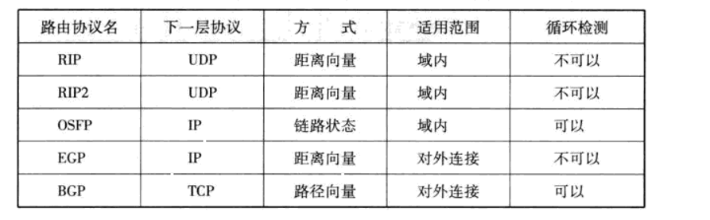

## 路由控制的定义
**IP地址与路由控制**  
互联网是由路由器连接的网络组合而成，为了让数据包正确的到达目标主机，路由器必须在途中进行正确的转发，这种向
"正确的方向"转发数据所进行的处理就叫做路由控制或路由。路由器根据路由控制表转发数据包，它根据所收到的数据包
中目标主机的IP地址与路由控制表的比较得出下一个应该接收的路由

**静态路由与动态路由**  
静态路由是指事先设置好路由器和主机中并将路由信息固定的一种方法。动态路由是指让路由协议在运行过程中自动地设
置路由控制信息的一种方法。不论是静态路由还是静态路由，不要指使用它们其中的一种，可以将它们组合起来使用

**动态路由的基础**  
动态路由会给相邻路由器发送自己已知的网络连接信息，而这些信息又像接力一样一次传递给其它路由器，直至整个网络
都了解时，路由控制表也就制作完成了，而此时就可以正确地转发IP数据包了

## 路由算法
**距离向量算法**  
距离向量算法是指根据距离（代价）和方向决定目标网络或目标主机位置的一种方法。路由器之间可以互换目标网络的方
向及其距离的相关信息，并以这些信息为基础制作路由控制表

**链路状态算法**  
链路状态算法是路由器在了解网络整体连接状态的基础上生成路由控制表的一种方法，该方法中，每个路由器必须保持同
样的信息才能进行正确的路由选择

#### 主要路由协议

