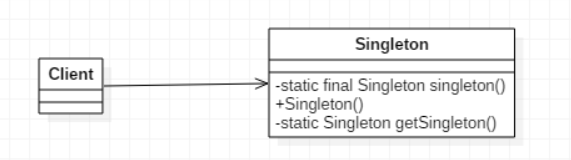

>保证一个类仅有一个实例，并提供一个访问它的全局访问点

## 简单的单例模式
  
其中，Singleton类定义了一个getInstance操作，允许客户端访问它的唯一实例，getInstance是一个静态方法，主要负责创建自己的唯一实例。而对象的声明是private的，其他类无法访问到，只能通过getInstance()方法访问其唯一实例  

&emsp;  
**注意**  
1. 单例类只能有一个实例
2. 单例类必须自己创建自己的唯一实例
3. 单例类必须给所有其他对象提供这一实例

```java
public class Singleton {

    private static Singleton instance;
    
    //限制产生多个对象
    private Singleton() {
    }
    
    //通过方法获取实例对象
    public static Singleton getInstance() {
        if(instance == null) {
            instance = new Singleton();
        }
        
        return instance;
    }
    
}
```

## 单例模式
1. **意图**  
保证一个类仅有一个实例，并提供一个访问它的全局访问点
2. **主要解决**  
一个全局使用的类频繁地创建与销毁
3. **何时使用**  
当您想控制实例数目，节省系统资源的时候
4. **如何解决**  
判断系统是否已经有这个单例，如果有则返回，如果没有则创建
5. **关键代码**  
构造函数是私有的
6. **优点**  
   *   在内存里只有一个实例，减少了内存的开销，尤其是频繁的创建和销毁实例
   *   避免对资源的多重占用
7. **缺点**  
没有接口，不能继承，与单一职责原则冲突，一个类应该只关心内部逻辑，而不关心外面怎么样来实例化
8. **注意事项**  
getInstance()方法中需要使用同步锁synchronized (Singleton.class)防止多线程同时进入造成instance被多次实例化

## 单例模式的几种实现方式
### 懒汉式，线程不安全
**是否lazy初始化：**
是  
**是否多线程安全：**
否  
**实现难度：**
易  
**描述：**
这种方式是最基本的实现方式，这种实现最大的问题就是不支持多线程。因为没有加锁synchronized，所以严格意义上它并不算单例模式
```java
public class Singleton {  
    private static Singleton instance;  
    private Singleton (){}  
  
    public static Singleton getInstance() {  
    if (instance == null) {  
        instance = new Singleton();  
    }  
    return instance;  
    }  
}
```

### 懒汉式，线程安全
**是否lazy初始化：**
是  
**是否多线程安全：**
是  
**实现难度：**
易  
**描述：**
这种方式具备很好的lazy loading，能够在多线程中很好的工作，但是，效率很低，99%情况下不需要同步  
**优点：**
第一次调用才初始化，避免内存浪费  
**缺点：**
必须加锁synchronized才能保证单例，但加锁会影响效率
```java
public class Singleton {  
    private static Singleton instance;  
    private Singleton (){}  
    public static synchronized Singleton getInstance() {  
    if (instance == null) {  
        instance = new Singleton();  
    }  
    return instance;  
    }  
}
```

### 饿汉式，线程安全
**是否lazy初始化：**
否  
**是否多线程安全：**
是  
**实现难度：**
易  
**描述：**
这种方式比较常用，但容易产生垃圾对象  
**优点：**
没有加锁，执行效率会提高  
**缺点：**
加载时就初始化，浪费内存
```java
public class Singleton {  
    private static Singleton instance = new Singleton();  
    private Singleton (){}  
    public static Singleton getInstance() {  
    return instance;  
    }  
}
```

### 双检锁/双重校验锁（DCL，即 double-checked locking）
**JDK版本：**
JDK1.5起  
**是否lazy初始化：**
是  
**是否多线程安全：**
是  
**实现难度：**
较复杂  
**描述：**
这种方式采用双锁机制，安全且在多线程情况下能保持高性能
```java
public class Singleton {  
    private volatile static Singleton singleton;  
    private Singleton (){}  
    public static Singleton getSingleton() {  
    if (singleton == null) {  
        synchronized (Singleton.class) {  
        if (singleton == null) {  
            singleton = new Singleton();  
        }  
        }  
    }  
    return singleton;  
    }  
}
```

### 登记式/静态内部类
**是否lazy初始化：**
是  
**是否多线程安全：**
是  
**实现难度：**
一般  
**描述：**
这种方式只适用于静态域的情况，双检锁方式可在实例域需要延迟初始化时使用
```java
public class Singleton {  
    private static class SingletonHolder {  
    private static final Singleton INSTANCE = new Singleton();  
    }  
    private Singleton (){}  
    public static final Singleton getInstance() {  
    return SingletonHolder.INSTANCE;  
    }  
}
```  

### 枚举
**JDK版本：**
JDK1.5起  
**是否lazy初始化：**
否  
**是否多线程安全：**
是  
**实现难度：**
易  
**描述：**
这种实现方式还没有被广泛采用，但这是实现单例模式的最佳方法。它更简洁，自动支持序列化机制，绝对防止多次实例化
```java
public enum Singleton {  
    INSTANCE;  
    public void whateverMethod() {  
    }  
}
```

### 总结
一般情况下，不建议使用第1种和第2种懒汉方式，建议使用第3种饿汉方式。只有在要明确实现lazy loading效果时，才会使用第5种登记方式。如果涉及到反序列化创建对象时，可以尝试使用第6种枚举方式。如果有其他特殊的需求，可以考虑使用第4种双检锁方式

## 核心要点
1. 单件模式确保程序中一个类最多只有一个实例
2. 单件模式也提供访问这个实例的全局点
3. 在JAVA中实现单件模式需要私有构造器、一个静态方法和一个静态变量
4. 确定在性能和资源上的限制，然后小心地选择适当的方案来实现单件，以解决多线程的问题
5. 如果使用多个类加载器，可能导致单件模式失效而产生多个实例
