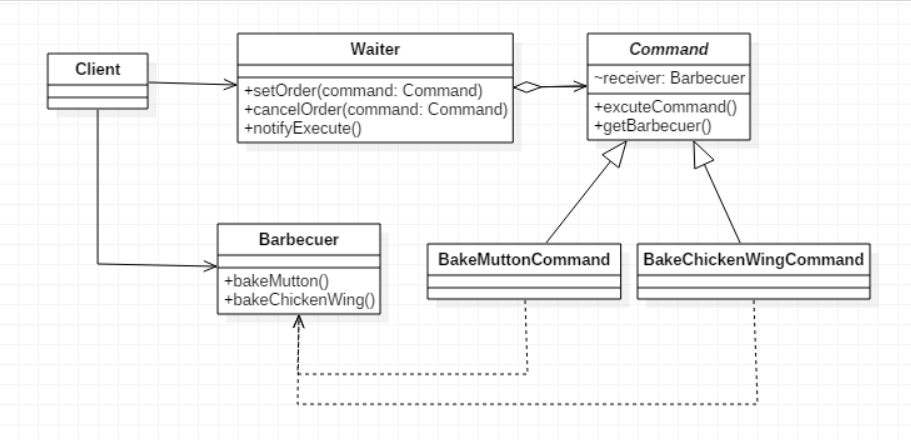

>将“请求”封装成对象，以便使用不同的请求、队列或者日志来参数化其他对象。命令模式也支持可撤销的操作

## 命令模式
1. **意图**  
将一个请求封装成一个对象，从而使您可以用不同的请求对客户进行参数化
2. **主要解决**  
在软件系统中，行为请求者与行为实现者通常是一种紧耦合的关系，但某些场合，比如需要对行为进行记录、撤销或重做、事务等处理时，这种无法抵御变化的紧耦合的设计就不太合适
3. **何时使用**  
在某些场合，比如要对行为进行"记录、撤销/重做、事务"等处理，这种无法抵御变化的紧耦合是不合适的。在这种情况下，如何将"行为请求者"与"行为实现者"解耦？将一组行为抽象为对象，可以实现二者之间的松耦合
4. **如何解决**  
通过调用者调用接受者执行命令，顺序：调用者→接受者→命令
5. **关键代码**  
定义三个角色：
   * received 真正的命令执行对象 
   * Command 
   * invoker 使用命令对象的入口
6. **优点**  
   * 降低了系统耦合度
   * 新的命令可以很容易添加到系统中去
7. **缺点**  
使用命令模式可能会导致某些系统有过多的具体命令类
8. **注意事项**  
系统需要支持命令的撤销(Undo)操作和恢复(Redo)操作，也可以考虑使用命令模式，见命令模式的扩展

## 命令模式的实现
以烧烤店模型为例，使用命令模式编写代码实现  
  
### 调用者角色
服务员类为调用者角色，在其中定义一个订单列表用于存储客户订单信息，通过setOrder()方法设置订单、cancelOrder()方法取消订单、notifyExecute()方法下单
```java
public class Waiter {

    private List<Command> orders = new LinkedList<>();
    
    //设置订单
    public void setOrder(Command command) throws Exception {
        //通过反射获得鸡翅的类
        String s1 = Class.forName("com.adamjwh.gofex.command.BakeChickenWingCommand").toString().substring(6);
        //获取command订单中的类
        String s2 = command.toString().substring(0, command.toString().indexOf("@"));
        
        //这里模拟鸡翅卖完的情况，当订单中有鸡翅时，撤销订单
        if(s1.equals(s2)) {
            System.out.println("【服务员：鸡翅没有了，请点别的烧烤】");
            cancelOrder(command);//撤销订单
        } else {
            orders.add(command);
            System.out.println("添加订单：" + command.getBarbecuer() + "\t时间：" + new Date().toString());
        }
    }
    
    //取消订单
    public void cancelOrder(Command command) {
        orders.remove(command);
        System.out.println("取消订单：" + command.getBarbecuer() + "\t时间：" + new Date().toString());
    }
    
    //通知全部执行
    public void notifyExecute() {
        System.out.println("-----------------------订单-----------------------");
        for(Command command : orders) {
            command.excuteCommand();
        }
    }
}
```

### 命令角色
```java
public abstract class Command {

    protected Barbecuer receiver;
    
    public Command(Barbecuer receiver) {
        this.receiver = receiver;
    }
    
    //执行命令
    abstract public void excuteCommand();
    
    //获取名称
    abstract public String getBarbecuer();
    
}
```

### 接收者角色
这里的接收者角色就是烧烤师傅，提供“烤羊肉串”和“烤鸡翅”的操作
```java
public class Barbecuer {
    
    //烤羊肉
    public void bakeMutton() {
        System.out.println("烤羊肉串");
    }
    
    //烤鸡翅
    public void bakeChickenWing() {
        System.out.println("烤鸡翅");
    }
    
}
```

### 具体命令
这里以烤羊肉串类为例，提供了执行命令的方法。烤鸡翅类同理，此处不再赘述
```java
public class BakeMuttonCommand extends Command {

    private String barbecuer;
    
    public BakeMuttonCommand(Barbecuer receiver) {
        super(receiver);
        barbecuer = "烤羊肉串";
    }

    @Override
    public void excuteCommand() {
        receiver.bakeMutton();
    }
    
    //获取名称
    public String getBarbecuer() {
        return barbecuer;
    }
    
}
```

### 测试代码
开店前准备即初始化烤肉师傅、服务员及命令类，顾客点菜后将菜单信息存入服务员的订单上，假设鸡翅卖完了（参考Waiter类），则将鸡翅项从订单上删除（即“撤销”），然后使用notifyExecute()方法通知烤肉师傅
```java
public class Client {

    public static void main(String[] args) throws Exception {
        //开店前准备
        Barbecuer barbecuer = new Barbecuer();
        Command bakeMuttonCommand1 = new BakeMuttonCommand(barbecuer);
        Command bakeMuttonCommand2 = new BakeMuttonCommand(barbecuer);
        Command bakeChickenWingCommand1 = new BakeChickenWingCommand(barbecuer);
        Waiter waiter = new Waiter();
        
        //开门营业，顾客点菜
        waiter.setOrder(bakeMuttonCommand1);
        waiter.setOrder(bakeMuttonCommand2);
        //这里假设鸡翅卖完了
        waiter.setOrder(bakeChickenWingCommand1);
        
        //点菜完毕，通知厨房
        waiter.notifyExecute();
    }
    
}
```

## 核心要点
1. 命令模式将发出请求的对象和执行请求的对象解耦
2. 在被解耦的两者之间是通过命令对象进行沟通的；命令对象封装了接收者和一个或一组动作
3. 调用者通过调用命令对象的execute()发出请求，这会使得接收者的动作被调用
4. 调用者可以接受命令当做参数，甚至在运行时动态地进行（便于扩展）
5. 命令可以支持撤销，做法是实现一个undo()方法来回到execute()被执行前的状态
6. 宏命令是命令的一种简单的延伸，允许调用多个命令；宏方法也可以支持撤销
7. 实际操作时，很常见使用“聪明”命令对象，也就是直接实现了请求，而不是将工作委托给接收者
8. 命令也可以用来实现队列、日志和事物处理

## 总结
命令模式其实是把一个操作的对象与知道怎么执行一个操作的对象分隔开。至于命令模式使用时机，敏捷开发原则告诉我们，不要为代码添加基于猜测的、实际不需要的功能。如果不清楚一个系统是否需要命令模式，一般就不要着急去实现它，事实上，在需要的时候通过重构实现这个模式并不困难，只有在真正需要如撤销/恢复操作等功能时，把原来的代码重构为命令模式才有意义