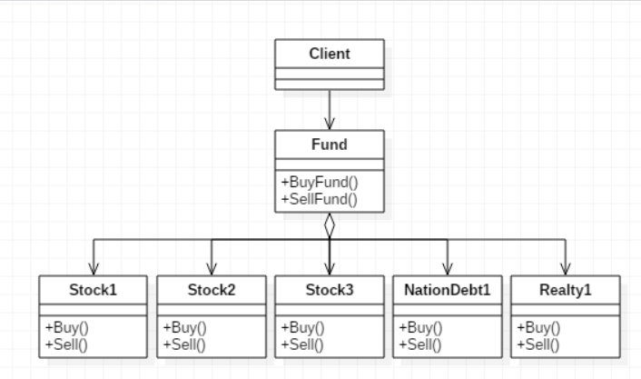

## 设计原则
**【设计原则7】：**最少知识原则：只和你的密友谈话  
最少知识（Least Knowledge）原则告诉我们要减少对象之间的交互，只留下几个“密友”

## 外观模式
1. **意图**  
为子系统中的一组接口提供一个一致的界面，外观模式定义了一个高层接口，这个接口使得这一子系统更加容易使用
2. **主要解决**  
降低访问复杂系统的内部子系统时的复杂度，简化客户端与之的接口
3. **何时使用**  
   * 客户端不需要知道系统内部的复杂联系，整个系统只需提供一个"接待员"即可
   * 定义系统的入口
4. **如何解决**  
客户端不与系统耦合，外观类与系统耦合
5. **关键代码**  
在客户端和复杂系统之间再加一层，这一层将调用顺序、依赖关系等处理好
6. **优点**  
   * 减少系统相互依赖
   * 提高灵活性
   * 提高了安全性
7. **缺点**  
不符合开闭原则，如果要改东西很麻烦，继承重写都不合适
8. **注意事项**  
在层次化结构中，可以使用外观模式定义系统中每一层的入口

## 外观模式的实现
以基金为例  
  
### 基金类（Fund）
基金类，基金经理人通过该类作为中间交互者，可以接受投资者的资金，统一对股票、国债、房地产进行购买和赎回操作
```java
public class Fund {

    Stock1 stock1;
    Stock2 stock2;
    Stock3 stock3;
    NationalDebt1 nationalDebt1;
    Realty1 realty1;
    
    public Fund() {
        stock1 = new Stock1();
        stock2 = new Stock2();
        stock3 = new Stock3();
        nationalDebt1 = new NationalDebt1();
        realty1 = new Realty1();
    }
    
    //购买基金
    public void buyFund() {
        stock1.buy();
        stock2.buy();
        stock3.buy();
        nationalDebt1.buy();
        realty1.buy();
    }
    
    //赎回基金
    public void sellFund() {
        stock1.sell();
        stock2.sell();
        stock3.sell();
        nationalDebt1.sell();
        realty1.sell();
    }
    
}
```

### 股票、国债、房地产类
```java
public class Stock1 {

    //买股票
    public void buy() {
        System.out.println("股票1买入");
    }
    
    //卖股票
    public void sell() {
        System.out.println("股票1卖出");
    }
    
}
```

### Client客户端
用户通过该类对基金进行购买和赎回操作
```java
public class Client {

    public static void main(String[] args) {
        Fund fund = new Fund();
        
        //基金购买
        fund.buyFund();
        System.out.println("-------------");
        //基金赎回
        fund.sellFund();
    }
    
}
```
由此可见，外观模式十分的简单，我们只需在客户端购买和赎回即可，内部的任何操作都不需要我们关注，对于面向对象有一定基础的朋友，即使没有听说过外观模式，也完全有可能在很多时候使用它，因为它完美地体现了依赖倒转原则和迪米特法则的思想，所以是非常常用的模式之一

&emsp;  
我们使用外观模式的情况有很多，比如经典的MVC三层架构，可以考虑在数据访问层和业务逻辑层、业务逻辑层和表示层的层与层之间简历外观Facade，降低耦合。对于复杂难以维护的老系统，直接去修改或扩展都可能产生很多问题，可以分两个小组，一个开发Facade与老系统的交互，另一个只要了解Facade接口，直接开发新系统调用这些接口即可