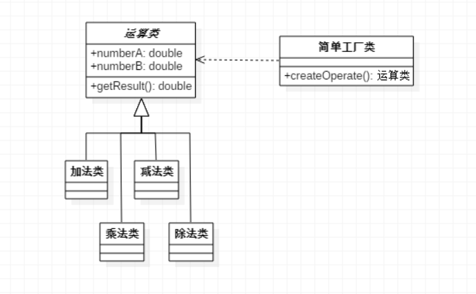

>定义一个用于创建对象的接口，让子类决定实例化哪一个类。工厂方法模式使一个类的实例化延迟到其子类
## 设计原则
【设计原则6】：**要依赖抽象，不要依赖具体类**  
不能让高层组件（由其他低层组件定义其行为的类）依赖底层组件，而且，不管高层组件或底层组件，两者都应该依赖于抽象

## 工厂方法模式
1. **何时使用**  
不同条件下创建不用实例时。方法是让子类实现工厂接口
2. **优点**  
   * 良好的封装性，代码结构清晰。如一个调用者想创建一个对象，只需要知道其名称即可，降低了模块间的耦合
   * 扩展性好。如果想增加一个产品，只需扩展一个工厂类即可
   * 屏蔽产品类。调用者只关心产品的接口
   * 典型的解耦框架
3. **缺点**  
每增加一个产品，就需要增加一个产品工厂的类，增加了系统的复杂度
4. **使用场景**  
   * 需要生成对象的地方
   * 需要灵活的、可扩展的框架时
   * 数据库访问，数据库可能变化时

## 简单工厂模式的实现
简单工厂模式就是用一个单独的类来做创造实例的过程，这个类就是工厂  
以简单计算器的实现为例，这里只给出部分代码用于与工厂方法模式做对比  
  
```java
public class OperationFactory {
    public static Operation createOperate(String operate) {
        Operation oper = null;
        switch(operate) {
            case "+":
                oper = new OperationAdd();
                break;
            case "-":
                oper = new OperationSub();
                break;
            case "*":
                oper = new OperationMul();
                break;
            case "/":
                oper = new OperationDiv();
                break;
        }
        return oper;
    }
}
```

## 工厂方法模式的实现
  
### 运算类
```java
public class Operation {
    
    protected double numberA = 0;
    protected double numberB = 0;
    
    public double getNumberA() {
        return numberA;
    }
    public void setNumberA(double numberA) {
        this.numberA = numberA;
    }
    public double getNumberB() {
        return numberB;
    }
    public void setNumberB(double numberB) {
        this.numberB = numberB;
    }

    public double getResult() {
        double result = 0;
        return result;
    }
}
```

### 工厂接口
```java
public interface IFactory {
   Operation createOperation();
}
```

### 具体运算类
这里以加减乘除四种运算为例，需要四个实现类，都继承运算类
```java
public class OperationAdd extends Operation {

    @Override
    public double getResult() {
        double result = 0;
        result = numberA + numberB;
        
        return result;
    }
    
}
```
其余三个省略

### 运算工厂
有四个运算类，就需要四个运算工厂，都实现了工厂接口
```java
public class AddFactory implements IFactory {
    @Override
    public Operation createOperation() {
        return new OperationAdd();
    }
}
```
其余三个省略

### Client客户端
```java
public class Client {

    public static void main(String[] args) {
        IFactory oFactory = new AddFactory();
//        IFactory oFactory = new SubFactory();
//        IFactory oFactory = new MulFactory();
//        IFactory oFactory = new DivFactory();
        
        Operation operation = oFactory.createOperation();
        
        operation.numberA = 5;
        operation.numberB = 7;
        
        double result = operation.getResult();
        System.out.println(result);
    }
    
}
```
如上述代码，为加法的运算，若需要进行其他运算，只需实现该接口的其他实现类（如注释所示）

## 简单工厂模式与工厂方法模式的区别
如果现在需要增加其他运算，比如取余。简单工厂模式需要在添加case分支条件，修改了原有的类，违背了开闭原则；而工厂方法模式只需再新加个取余类和取余工厂，然后对客户端进行修改即可

&emsp;  
简单工厂模式最大的优点在于工厂类中包含了必要的逻辑判断，根据客户端的选择条件动态实例化相关的类，对与客户端来说，去除了与具体产品的依赖。为了弥补他违背了开闭原则，于是就有了工厂方法模式，根据依赖倒转原则，把工厂类抽象出一个接口，这个接口只有一个方法，就是创建抽象产品的工厂方法

&emsp;  
其实工厂方法模式还存在一个问题，就是客户端需要决定实例化哪一个工厂来实现运算类，也就是说，工厂方法把简单工厂的内部逻辑判断移到了客户端代码来进行。对于这个问题，可以利用反射来解决