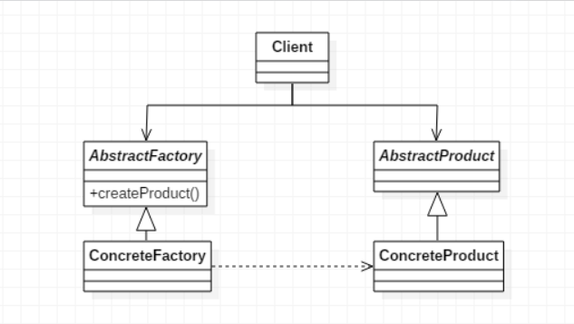
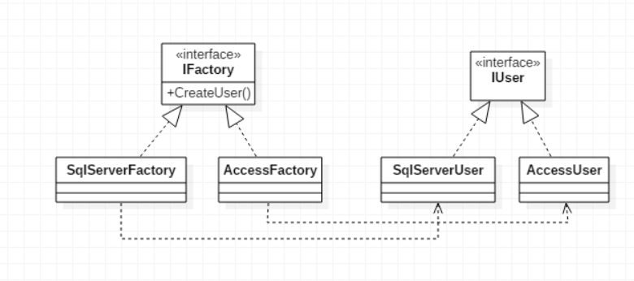
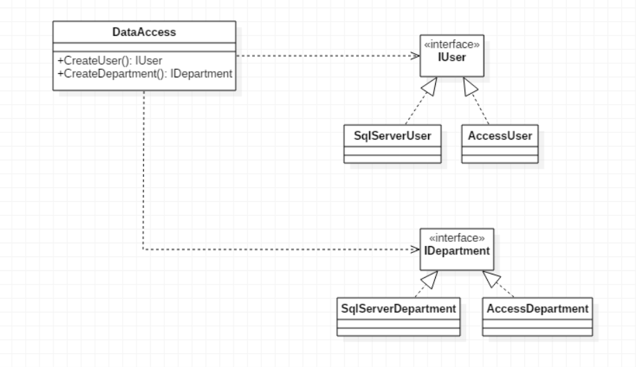

>提供一个创建一系列相关或相互依赖对象的接口，而无需指定它们具体的类

## 抽象工厂模式
  
AbstractFactory是抽象工厂接口，里面包含所有的产品创建的抽象方法；ConcreteFactory则是具体的工厂，创建具有特定实现的产品对象；AbstractProduct是抽象产品，有可能由两种不同的实现；ConcreteProduct则是对于抽象产品的具体分类的实现

&emsp;  
1. **何时使用**  
系统的产品有多于一个的产品族，而系统只消费其中某一族的产品时
2. **优点**  
   * 封装性，易于产品交换。由于具体工厂类在一个应用中只需在初始化的时候出现一次，这就使得改变一个应用的具体工厂变得非常容易，只需改变具体工程即可使用不同的产品配置
   * 创建实例过程与客户端分离
3. **缺点**  
产品族扩展非常困难，改动或增加一个产品需同时改动多个类
4. **使用场景**  
一个对象族（或一组没有任何关系的对象）都有相同的约束

## 工厂方法模式的实现
在看抽象工厂模式之前，我们先用工厂方法模式试一下  
  
### IFactory接口
```java
public interface IFactory {
    IUser createUser();   
    IDepartment createDepartment();
}
```

### IDepartment接口
```java
public interface IDepartment {
    public void insert(Department department);
    public Department getDepartment(int id);
}
```

### 数据库工厂
```java
public class SqlserverFactory implements IFactory {

    @Override
    public IUser createUser() {
        return new SqlserverUser();
    }

    @Override
    public IDepartment createDepartment() {
        return new SqlserverDepartment();
    }

}
```

### IDepartment接口的实现类
```java
public class SqlserverDepartment implements IDepartment {

    @Override
    public void insert(Department department) {
        System.out.println("insert info into department with sqlserver");
    }

    @Override
    public Department getDepartment(int id) {
        System.out.println("get info from department by id with sqlserver");
        return null;
    }

}
```

### Client客户端
```java
public class Client {
    
    public static void main(String[] args) {
        User user = new User();
        Department department = new Department();
        
        IFactory factory = new SqlserverFactory();
//        IFactory factory = new AccessFactory();
        
        IUser iUser = factory.createUser();
        iUser.insert(user);
        iUser.getUser(1);
        
        IDepartment iDepartment = factory.createDepartment();
        iDepartment.insert(department);
        iDepartment.getDepartment(1);
    }

}
```
刚才我们只有一个User类和User操作类的时候，只需要工厂方法模式即可，但现在显然数据库中有许多的表，而SQLServer和Access又是两个不同的分类，解决这种涉及到多个产品系列的问题，就用到了抽象工厂模式

## 利用反射实现数据访问程序
在上述的两种模式中，我们是有多少个数据库就要创建多少个数据库工厂，而我们数据库工厂中的代码基本上是相同的，这时就可以使用简单工厂模式+抽象工厂模式来简化操作，也即将工厂类及工厂接口抛弃，取而代之的是DataAccess类，由于实现设置了db的值（Sqlserver或Access），所以简单工厂的方法都不需要输入参数，这样客户端可以直接生成具体的数据库访问类实例，且没有出现任何一个SQLServer或Access的字样，达到解耦的目的。可以看一下UML图  
  
但此时还有一个问题就是，因为DataAccess中创建实例的过程使用的是switch语句，所以如果此时要增加一个数据库，比如Oracle数据库，就需要修改每个switch的case了，违背了开闭原则。对于这种情况，工厂方法模式里有提到过，就是使用反射机制，或者这里应该更确切的说是依赖注入（DI），spring的IoC中有遇到这个概念

&emsp;  
这里我们可以直接使用反射来利用字符串去实例化对象，这样变量就是可更换的了，换句话说就是将程序由编译时转为运行时，如下：
```java
public class DataAccess {

    private static final String name = "com.adamjwh.gofex.abstract_factory";
    private static final String db = "Access";
    
    public static IUser createUser() throws InstantiationException, IllegalAccessException, ClassNotFoundException {
        String className = name + "." + db + "User";
        return (IUser) Class.forName(className).newInstance();
    }

    public static IDepartment createDepartment() throws InstantiationException, IllegalAccessException, ClassNotFoundException {
        String className = name + "." + db + "Department";
        return (IDepartment) Class.forName(className).newInstance();
    }
    
}
```
这里字符串name为包名，db为要查询的数据库名，我们要更换数据库只需将Access修改成我们需要的数据库名即可，这时只需修改DataAccess类即可，然后我们再在Client中对DataAccess类实例化
```java
DataAccess factory = new DataAccess();
```
当然我们还可以利用配置文件来解决更改DataAccess的问题，此时就连DataAccess类都不用更改了，如下：
```xml
<?xml version="1.0 encoding="utf-8" ?>
<configuration>
    <appSettings>
        <add key="DB" value="Oracle" />
    </appSettings>
</configuration>
```