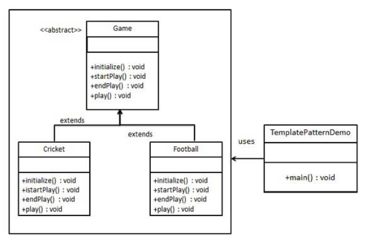

> 在一个方法中定义一个算法的骨架，而将一些步骤延迟到子类中。模板方法使得子类可以在不改变算法结构的情况下，重新定义算法中的某些步骤

## 设计原则
**【设计原则8】：**
好莱坞原则：别调用（打电话给）我们，我们会调用（打电话给）你

&emsp;  
好莱坞原则，可以让我们防止依赖腐败：当高层组件依赖低层组件，而底层组件又依赖高层组件，而高层组件又依赖边侧组件，而边侧组件又依赖低层组件时，依赖腐败就发生了。在这种情况下，没有人可以轻易地搞懂系统是如何设计的

&emsp;  
在好莱坞原则之下，我们允许低层组件将自己挂钩到系统上，但是高层组件会决定什么时候和怎样使用这些低层组件。换句话说：高层组件对待低层组件的方式是"别调用我们，我们会调用你"

## 模板方法模式
1. **意图**  
定义一个操作中的算法的骨架，而将一些步骤延迟到子类中。模板方法使得子类可以不改变一个算法的结构即可重定义该算法的某些特定步骤
2. **主要解决**  
一些方法通用，却在每一个子类都重新写了这一方法
3. **何时使用**  
有一些通用的方法
4. **如何解决**  
将这些通用算法抽象出来
5. **关键代码**  
在抽象类实现，其他步骤在子类实现
6. **优点**  
   * 封装不变部分，扩展可变部分
   * 提取公共代码，便于维护
   * 行为由父类控制，子类实现
7. **缺点**  
每一个不同的实现都需要一个子类来实现，导致类的个数增加，使得系统更加庞大
8. **注意事项**  
为防止恶意操作，一般模板方法都加上final关键词

## 模板方法模式的实现
创建一个定义操作的Game抽象类，其中，模板方法设置为final，这样它就不会被重写。Cricket和Football是扩展了Game的实体类，它们重写了抽象类的方法  
  
### 抽象类
创建一个抽象类，它的模板方法被设置为final
```java
public abstract class Game {
   abstract void initialize();
   abstract void startPlay();
   abstract void endPlay();
 
   //模板
   public final void play(){
 
      //初始化游戏
      initialize();
      //开始游戏
      startPlay();
      //结束游戏
      endPlay();
   }
}
```

### 实体类
```java
public class Cricket extends Game {
 
   @Override
   void endPlay() {
      System.out.println("Cricket Game Finished!");
   }
 
   @Override
   void initialize() {
      System.out.println("Cricket Game Initialized! Start playing.");
   }
 
   @Override
   void startPlay() {
      System.out.println("Cricket Game Started. Enjoy the game!");
   }
}
```
```java
public class Football extends Game {
 
   @Override
   void endPlay() {
      System.out.println("Football Game Finished!");
   }
 
   @Override
   void initialize() {
      System.out.println("Football Game Initialized! Start playing.");
   }
 
   @Override
   void startPlay() {
      System.out.println("Football Game Started. Enjoy the game!");
   }
}
```
### 客户端
```java
public class TemplatePatternDemo {
   public static void main(String[] args) {
 
      Game game = new Cricket();
      game.play();
      System.out.println();
      game = new Football();
      game.play();      
   }
}
```
当我们要完成在某一细节层次一致的一个过程或一系列步骤，但其个别步骤在更详细的层次上的实现可能不同时，我们通常考虑用模板方法模式来处理

## 策略模式、模板方法模式与工厂模式的区别
* 策略：封装可互换的行为，然后使用委托来决定要采用哪一个行为
* 模板：子类决定如何实现算法中的某些步骤
* 工厂：由子类决定实例化哪个具体类
