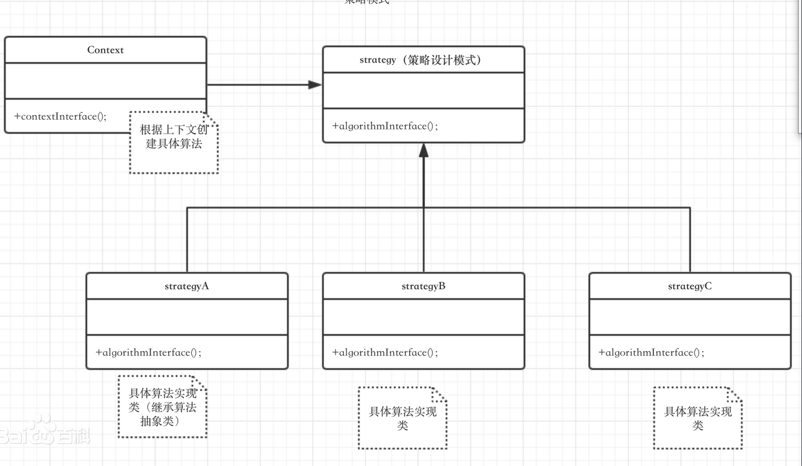
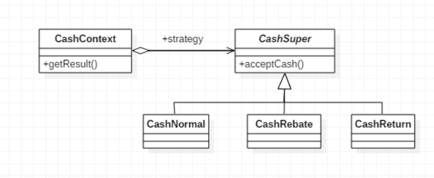
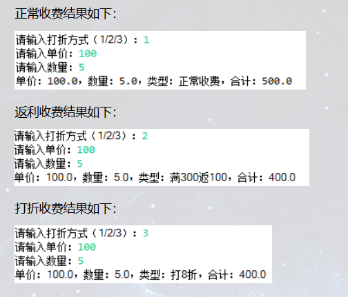

## 设计原则
【设计原则1】：**找出应用中可能需要变化之处，把它们独立出来，不要和那些不需要变化的代码混在一起**  
把会变化的部分取出并封装起来，以便以后可以轻易地改动或扩展此部分，而不影响不需要变化的其他部分

&emsp;  
【设计原则2】：**针对接口编程，而不是针对实现编程**  
针对接口编程真正的意思是：针对超类型（supertype）编程  

&emsp;  
针对实现编程：
```java
Dog dog = new Dog();
dog.bark();
```
针对接口编程
```java
Animal dog = new Dog();
dog.bark();
```
这样可以在运行时才指定具体实现的对象

&emsp;  
【设计原则3】：**多用组合，少用继承**  
利用继承设计子类的行为，是在编译时静态决定的，而且所有的子类都会继承到相同的行为；而利用组合的做法扩展对象的行为，就可以在运行时动态地进行扩展  

使用组合建立系统具有很大的弹性，不仅可将算法族封装成类，更可以"在运行时动态地改变行为"，只要组合的行为对象符合正确的接口标准即可  

类之间的关系可以描述为：IS-A（是一个，组合过来的-|>）、HAS-A（有一个，继承过来的->）和IMPLEMENTS（实现，接口的实现....|>)

## 策略模式
   
1. **何时使用**  
一个系统有许多类，而区分它们的只是他们直接的行为时
2. **方法**  
将这些算法封装成一个一个的类，任意的替换
3. **关键代码**  
实现同一个接口
4. **优点**  
   * 算法可以自己的切换
   * 避免使用多重条件判断（如果不用策略模式我们可能会使用多重条件语句，不利于维护）
   * 扩展性良好，增加一个策略只需实现接口即可
5. **缺点**   
   * 策略类数量会增多，每个策略都是一个类，复用的可能性很小
   * 所有的策略类都需要对外暴露
6. **使用场景**  
   * 多个类只有算法或行为上稍有不同的场景
   * 算法需要自由切换的场景
   * 需要屏蔽算法规则的场景
7. **注意事项**  
如果一个系统的策略多于四个，就需要考虑使用混合模式来解决策略类膨胀的问题

## 策略模式的实现
以商场促销为例使用策略模式实现商场促销算法。UML图如下：  
  
### 上下文类
首先声明一个CashSuper对象，通过构造方法，传入具体的收费策略，getResult()方法的功能为根据收费策略的不同获得计算结果
```java
public class CashContext {
   private CashSuper cashSuper;

   public CashContext(CashSuper cashSuper) {
      this.cashSuper = cashSuper;
   }

   public double getResult(double money) {
      return cashSuper.acceptCash(money);
   }
}
``` 

### 现金收费抽象类
策略类，为抽象类，抽象出收费的方法供子类实现
```java
public abstract class cashSuper {

   public abstract double acceptCash(double money);

}
```

### 正常收费子类
没有任何活动的情况，正常收费，返回原价
```java
public class CashNormal extends CashSuper {

    @Override
    public double acceptCash(double money) {
        return money;
    }

}
```

### 打折收费子类
打折活动，根据折扣返回打折后的价格
```java
public class CashRebate extends CashSuper {
    
    private double moneyRebate = 1;    //折扣
    
    public CashRebate(double moneyRebate) {
        this.moneyRebate = moneyRebate;
    }

    @Override
    public double acceptCash(double money) {
        return money * moneyRebate;
    }

}
```

### 返利收费子类
返利活动，输入返利条件和返利值，比如满300返100，moneyCoditation为300，moneyReturn为100  
result = money - Math.floor(money / moneyConditation) * moneyReturn; 的意思为，如果当前金额大于等于返利条件，则使用当前金额减去返利值
```java
public class CashReturn extends CashSuper {

    private double moneyConditation = 0.0;    //返利条件
    private double moneyReturn = 0.0d;    //返利值
    
    public CashReturn(double moneyConditation, double moneyReturn) {
        this.moneyConditation = moneyConditation;
        this.moneyReturn = moneyReturn;
    }

    @Override
    public double acceptCash(double money) {
        double result = money;
        
        if (money >= moneyConditation) {
            result = money - Math.floor(money / moneyConditation) * moneyReturn;
        }
        
        return result;
    }

}
```

### Client客户端
```java
public class Client {
    
    public static void main(String[] args) {
        CashContext cashContext = null;
        
        Scanner scanner = new Scanner(System.in);
        System.out.print("请输入打折方式（1/2/3）：");
        int in = scanner.nextInt();
        String type = "";
        
        switch (in) {
            case 1:
                cashContext = new CashContext(new CashNormal());
                type += "正常收费";
                break;
                
            case 2:
                cashContext = new CashContext(new CashReturn(300, 100));
                type += "满300返100";
                break;
                
            case 3:
                cashContext = new CashContext(new CashRebate(0.8));
                type += "打8折";
                break;
    
            default:
                System.out.println("请输入1/2/3");
                break;
        }
        
        double totalPrices = 0;
        
        System.out.print("请输入单价：");
        double price = scanner.nextDouble();
        System.out.print("请输入数量：");
        double num = scanner.nextDouble();
        totalPrices = cashContext.getResult(price * num);
        
        System.out.println("单价：" + price + "，数量：" + num + "，类型：" + type + "，合计：" + totalPrices);
        
        scanner.close();
    }

}
```

### 测试结果
  

## 核心要点
1. 知道OO基础，并不足以让你设计出良好的OO系统
2. 良好的OO设计必须具备可复用、可扩充、可维护三个特性
3. 模式可以让我们建造出具有良好OO设计质量的系统
4. 模式被认为是历经验证的OO设计经验
5. 模式不是代码，而是针对设计问题的通用解决方案。你可以把它应用到特定的应用中去
6. 模式不是被发明，而是被发现
7. 大多数的模式和原则，都着眼于软件变化的主题
8. 大多数的模式都允许系统局部改变独立于其他部分
9. 我们常把系统中会变化的部分抽出来封装
10. 默认让开发人员之间有共享语言，能够最大化沟通的价值