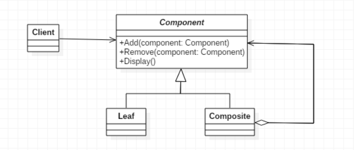
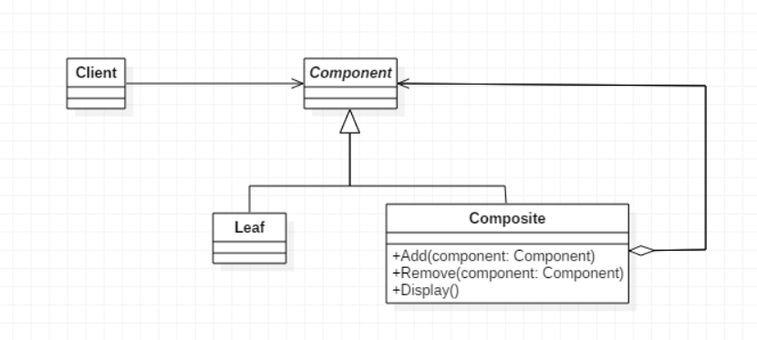

> 允许你将对象组合成树形结构来表现“整体/部分”层次结构。组合能让客户以一致的方式处理个别对象以及对象组合

## 组合模式简介
组合模式让我们能用树形方式创建对象的结构，树里面包含了组合以及个别的对象。使用组合结构，我们能把相同的操作应用在组合和个别对象上；换句话说，在大多数情况下，我们可以忽略对象组合和个别对象之间的差异

&emsp;  
当我们的案例是树形结构或者是部分-整体的关系时，就可以考虑使用组合模式。组合模式有两种不同的实现，分别为透明模式和安全模式

## 组合模式
1. **意图**
将对象组合成树形结构以表示"部分-整体"的层次结构。组合模式使得用户对单个对象和组合对象的使用具有一致性
2. **主要解决**  
它在我们树型结构的问题中，模糊了简单元素和复杂元素的概念，客户程序可以像处理简单元素一样来处理复杂元素，从而使得客户程序与复杂元素的内部结构解耦
3. **何时使用**  
   * 您想表示对象的部分-整体层次结构（树形结构）
   * 您希望用户忽略组合对象与单个对象的不同，用户将统一地使用组合结构中的所有对象
4. **如何解决**  
树枝和叶子实现统一接口，树枝内部组合该接口
5. **关键代码**  
树枝内部组合该接口，并且含有内部属性List，里面放Component
6. **优点**  
   * 高层模块调用简单
   * 节点自由增加
7. **缺点**  
在使用组合模式时，其叶子和树枝的声明都是实现类，而不是接口，违反了依赖倒置原则
8. **注意事项**  
定义时为具体类

## 组合模式之透明模式
透明模式是把组合使用的方法放到抽象类中，不管叶子对象还是树枝对象都有相同的结构，这样做的好处就是叶子节点和树枝节点对于外界没有区别，它们具备完全一致的行为接口。但因为Leaf类本身不具备add()、remove()方法的功能，所以实现它是没有意义的。UML结构图如下：  
  

### Component
```java
public abstract class Component {
    
    protected String name;
    
    public Component(String name) {
        this.name = name;
    }

    //增加一个叶子构件或树枝构件
    public abstract void add(Component component);
    
    //删除一个叶子构件或树枝构件
    public abstract void remove(Component component);
    
    //获取分支下的所有叶子构件和树枝构件
    public abstract void display(int depth);
    
}
```

### Composite
```java
public class Composite extends Component {

    public Composite(String name) {
        super(name);
    }

    //构建容器
    private ArrayList<Component> componentArrayList = new ArrayList<Component>();
    
    @Override
    public void add(Component component) {
        this.componentArrayList.add(component);
    }

    @Override
    public void remove(Component component) {
        this.componentArrayList.remove(component);
    }

    @Override
    public void display(int depth) {
        //输出树形结构
        for(int i=0; i<depth; i++) {
            System.out.print('-');
        }
        System.out.println(name);
        
        //下级遍历
        for (Component component : componentArrayList) {
            component.display(depth + 1);
        }
    }

}
```

### Leaf
```java
public class Leaf extends Component {

    public Leaf(String name) {
        super(name);
    }

    @Override
    public void add(Component component) {
        //空实现，抛出“不支持请求”异常
        throw new UnsupportedOperationException();
    }

    @Override
    public void remove(Component component) {
        //空实现，抛出“不支持请求”异常
        throw new UnsupportedOperationException();
    }

    @Override
    public void display(int depth) {
        //输出树形结构的叶子节点
        for(int i=0; i<depth; i++) {
            System.out.print('-');
        }
        System.out.println(name);
    }

}
```

## 组合模式之安全模式
安全模式是把树枝节点和树叶节点彻底分开，树枝节点单独拥有用来组合的方法，这种方法比较安全。但由于不够透明，所以树叶节点和树枝节点将不具有相同的接口，客户端的调用需要做相应的判断，带来了不便。UML结构图如下：  


### Component
这里相比透明模式就少了add()和romove()抽象方法的声明
```java
public abstract class Component {
    
    protected String name;
    
    public Component(String name) {
        this.name = name;
    }

    //获取分支下的所有叶子构件和树枝构件
    public abstract void display(int depth);
    
}
```

### Composite
这里add()和remove()方法的实现就从继承变为了自己实现
```java
public class Composite extends Component {

    public Composite(String name) {
        super(name);
    }

    //构建容器
    private ArrayList<Component> componentArrayList = new ArrayList<Component>();
    
    //增加一个叶子构件或树枝构件
    public void add(Component component) {
        this.componentArrayList.add(component);
    }

    //删除一个叶子构件或树枝构件
    public void remove(Component component) {
        this.componentArrayList.remove(component);
    }

    @Override
    public void display(int depth) {
        //输出树形结构
        for(int i=0; i<depth; i++) {
            System.out.print('-');
        }
        System.out.println(name);
        
        //下级遍历
        for (Component component : componentArrayList) {
            component.display(depth + 1);
        }
    }

}
```

### Leaf
叶子节点中没有了空实现，比较安全
```java
public class Leaf extends Component {

    public Leaf(String name) {
        super(name);
    }

    @Override
    public void display(int depth) {
        //输出树形结构的叶子节点
        for(int i=0; i<depth; i++) {
            System.out.print('-');
        }
        System.out.println(name);
    }

}
```