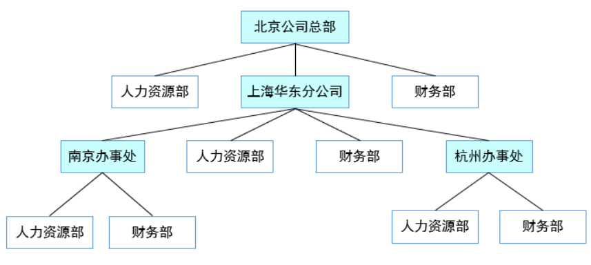

> 允许你将对象组合成树形结构来表现“整体/部分”层次结构。组合能让客户以一致的方式处理个别对象以及对象组合

## 组合模式简介
组合模式让我们能用树形方式创建对象的结构，树里面包含了组合以及个别的对象。使用组合结构，我们能把相同的操作应用在组合和个别对象上；换句话说，在大多数情况下，我们可以忽略对象组合和个别对象之间的差异

&emsp;  
当我们的案例是树形结构或者是部分-整体的关系时，就可以考虑使用组合模式。组合模式有两种不同的实现，分别为透明模式和安全模式

## 组合模式
1. **意图**
将对象组合成树形结构以表示"部分-整体"的层次结构。组合模式使得用户对单个对象和组合对象的使用具有一致性
2. **主要解决**  
它在我们树型结构的问题中，模糊了简单元素和复杂元素的概念，客户程序可以像处理简单元素一样来处理复杂元素，从而使得客户程序与复杂元素的内部结构解耦
3. **何时使用**  
   * 您想表示对象的部分-整体层次结构（树形结构）
   * 您希望用户忽略组合对象与单个对象的不同，用户将统一地使用组合结构中的所有对象
4. **如何解决**  
树枝和叶子实现统一接口，树枝内部组合该接口
5. **关键代码**  
树枝内部组合该接口，并且含有内部属性List，里面放Component
6. **优点**  
   * 高层模块调用简单
   * 节点自由增加
7. **缺点**  
在使用组合模式时，其叶子和树枝的声明都是实现类，而不是接口，违反了依赖倒置原则
8. **注意事项**  
定义时为具体类

## 组合模式之透明模式
透明模式是把组合使用的方法放到抽象类中，不管叶子对象还是树枝对象都有相同的结构，这样做的好处就是叶子节点和树枝节点对于外界没有区别，它们具备完全一致的行为接口。但因为Leaf类本身不具备add()、remove()方法的功能，所以实现它是没有意义的。UML结构图如下：  
  

### Component
```java
public abstract class Component {
    
    protected String name;
    
    public Component(String name) {
        this.name = name;
    }

    //增加一个叶子构件或树枝构件
    public abstract void add(Component component);
    
    //删除一个叶子构件或树枝构件
    public abstract void remove(Component component);
    
    //获取分支下的所有叶子构件和树枝构件
    public abstract void display(int depth);
    
}
```

### Composite
```java
public class Composite extends Component {

    public Composite(String name) {
        super(name);
    }

    //构建容器
    private ArrayList<Component> componentArrayList = new ArrayList<Component>();
    
    @Override
    public void add(Component component) {
        this.componentArrayList.add(component);
    }

    @Override
    public void remove(Component component) {
        this.componentArrayList.remove(component);
    }

    @Override
    public void display(int depth) {
        //输出树形结构
        for(int i=0; i<depth; i++) {
            System.out.print('-');
        }
        System.out.println(name);
        
        //下级遍历
        for (Component component : componentArrayList) {
            component.display(depth + 1);
        }
    }

}
```

### Leaf
```java
public class Leaf extends Component {

    public Leaf(String name) {
        super(name);
    }

    @Override
    public void add(Component component) {
        //空实现，抛出“不支持请求”异常
        throw new UnsupportedOperationException();
    }

    @Override
    public void remove(Component component) {
        //空实现，抛出“不支持请求”异常
        throw new UnsupportedOperationException();
    }

    @Override
    public void display(int depth) {
        //输出树形结构的叶子节点
        for(int i=0; i<depth; i++) {
            System.out.print('-');
        }
        System.out.println(name);
    }

}
```

## 组合模式之安全模式
安全模式是把树枝节点和树叶节点彻底分开，树枝节点单独拥有用来组合的方法，这种方法比较安全。但由于不够透明，所以树叶节点和树枝节点将不具有相同的接口，客户端的调用需要做相应的判断，带来了不便。UML结构图如下：  


### Component
这里相比透明模式就少了add()和romove()抽象方法的声明
```java
public abstract class Component {
    
    protected String name;
    
    public Component(String name) {
        this.name = name;
    }

    //获取分支下的所有叶子构件和树枝构件
    public abstract void display(int depth);
    
}
```

### Composite
这里add()和remove()方法的实现就从继承变为了自己实现
```java
public class Composite extends Component {

    public Composite(String name) {
        super(name);
    }

    //构建容器
    private ArrayList<Component> componentArrayList = new ArrayList<Component>();
    
    //增加一个叶子构件或树枝构件
    public void add(Component component) {
        this.componentArrayList.add(component);
    }

    //删除一个叶子构件或树枝构件
    public void remove(Component component) {
        this.componentArrayList.remove(component);
    }

    @Override
    public void display(int depth) {
        //输出树形结构
        for(int i=0; i<depth; i++) {
            System.out.print('-');
        }
        System.out.println(name);
        
        //下级遍历
        for (Component component : componentArrayList) {
            component.display(depth + 1);
        }
    }

}
```

### Leaf
叶子节点中没有了空实现，比较安全
```java
public class Leaf extends Component {

    public Leaf(String name) {
        super(name);
    }

    @Override
    public void display(int depth) {
        //输出树形结构的叶子节点
        for(int i=0; i<depth; i++) {
            System.out.print('-');
        }
        System.out.println(name);
    }

}
```

## 安全模式与透明模式的区别
两个方法是相同的运行结果，区别在于内部实现不同，一种是叶节点与树枝节点具备一致的行为接口但有空实现的透明模式，另一种是树枝节点单独拥有用来组合的方法但调用不便的安全模式

&emsp;  
为什么说它调用不便呢，因为我们如果通过递归遍历树时，这时需要判断当前节点是叶子节点还是树枝节点，客户端就需要相应的判断

## 组合模式的实现
以公司的层级结构为例  
  
### 具体公司类
此为树枝节点，实现添加、移除、显示和履行职责四种方法
```java
public class ConcreteCompany extends Company {

    private List<Company> companyList = new ArrayList<Company>();
    
    public ConcreteCompany(String name) {
        super(name);
    }

    @Override
    public void add(Company company) {
        this.companyList.add(company);
    }

    @Override
    public void remove(Company company) {
        this.companyList.remove(company);
    }

    @Override
    public void display(int depth) {
        //输出树形结构
        for(int i=0; i<depth; i++) {
            System.out.print('-');
        }
        System.out.println(name);
        
        //下级遍历
        for (Company component : companyList) {
            component.display(depth + 1);
        }
    }

    @Override
    public void lineOfDuty() {
        //职责遍历
        for (Company company : companyList) {
            company.lineOfDuty();
        }
    }

}
```

### 人力资源部
叶子节点，add和remove方法空实现
```java
public class HRDepartment extends Company {

    public HRDepartment(String name) {
        super(name);
    }

    @Override
    public void add(Company company) {
        
    }

    @Override
    public void remove(Company company) {
        
    }

    @Override
    public void display(int depth) {
        //输出树形结构的子节点
        for(int i=0; i<depth; i++) {
            System.out.print('-');
        }
        System.out.println(name);
    }

    @Override
    public void lineOfDuty() {
        System.out.println(name + " : 员工招聘培训管理");
    }
    
}
```

### 财务部
叶子节点，add和remove方法空实现
```java
public class FinanceDepartment extends Company {
    
    public FinanceDepartment(String name) {
        super(name);
    }

    @Override
    public void add(Company company) {
        
    }

    @Override
    public void remove(Company company) {
        
    }

    @Override
    public void display(int depth) {
        //输出树形结构的子节点
        for(int i=0; i<depth; i++) {
            System.out.print('-');
        }
        System.out.println(name);
    }

    @Override
    public void lineOfDuty() {
        System.out.println(name + " : 公司财务收支管理");
    }
    
}
```

### Client客户端
```java
public class Client {

    public static void main(String[] args) {
        //总公司
        ConcreteCompany root = new ConcreteCompany("北京总公司");
        root.add(new HRDepartment("总公司人力资源部"));
        root.add(new FinanceDepartment("总公司财务部"));
        
        //分公司
        ConcreteCompany company = new ConcreteCompany("上海华东分公司");
        company.add(new HRDepartment("华东分公司人力资源部"));
        company.add(new FinanceDepartment("华东分公司财务部"));
        root.add(company);
        
        //办事处
        ConcreteCompany company1 = new ConcreteCompany("南京办事处");
        company1.add(new HRDepartment("南京办事处人力资源部"));
        company1.add(new FinanceDepartment("南京办事处财务部"));
        company.add(company1);
        
        ConcreteCompany company2 = new ConcreteCompany("杭州办事处");
        company2.add(new HRDepartment("杭州办事处人力资源部"));
        company2.add(new FinanceDepartment("杭州办事处财务部"));
        company.add(company2);
        
        System.out.println("结构图：");
        root.display(1);
        
        System.out.println("\n职责：");
        root.lineOfDuty();
    }
    
}
```
基本对象可以被组合成更复杂的组合对象，而这个组合对象又可以被组合，这样不断地递归下去，客户代码中，任何用到基本对象的地方都可以使用组合对象了

&emsp;  
这里用了透明模式，用户不用关心到底是处理一个叶节点还是处理一个组合组件，也就用不着为定义组合而写一些选择判断语句了。简单点说就是组合模式可以让客户一致地使用组合结构和单个对象

### 策略/外观/组合/适配器/迭代器/观察者
* 策略：封装可互换的行为，并使用委托决定使用哪一个
* 组合：客户可以将对象的集合以及个别的对象一视同仁
* 外观：简化一群类的接口
* 适配器：改变一个或多个类的接口
* 迭代器：提供一个方式来遍历集合，而无须暴露集合的实现
* 观察者：当某个状态改变时，允许一群对象能被通知到
