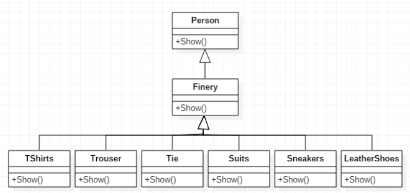

>动态地将责任附加到对象上。若要扩展功能，装饰者提供了比继承更有弹性的替代方案
## 设计原则
【设计原则5】：**类应该对扩展开放，对修改关闭**  
我们的目标是允许类容易扩展，在不修改现有代码的情况下，就可搭配新的行为。这样的设计具有弹性可以应对改变，可以接受新的功能来应对改变的需求

## 装饰器模式
1. **意图**  
动态地给一个对象添加一些额外的职责。就增加功能来说，装饰器模式相比生成子类更为灵活
2. **主要解决**  
一般的，我们为了扩展一个类经常使用继承方式实现，由于继承为类引入静态特征，并且随着扩展功能的增多，子类会很膨胀
3. **何时使用**  
在不想增加很多子类的情况下扩展类
4. **如何解决**  
将具体功能职责划分，同时继承装饰者模式
5. **关键代码**  
   * Component类充当抽象角色，不应该具体实现
   * 修饰类引用和继承Component类，具体扩展类重写父类方法
6. **优点**  
装饰类和被装饰类可以独立发展，不会相互耦合，装饰模式是继承的一个替代模式，装饰模式可以动态扩展一个实现类的功能
7. **缺点**  
多层装饰比较复杂
8. **使用场景**  
   * 扩展一个类的功能
   * 动态增加功能，动态撤销
9. **注意事项**  
可代替继承 

## 装饰器模式的实现
以换装为例
  
### Person类
通过构造方法获取人，再通过show()方法传递出去
```java
public class Person {

    private String name;
    
    public Person() {}
    
    public Person(String name) {
        this.name = name;
    }
    
    public void show() {
        System.out.println(name + "的装扮：");
    }
}
```

### Finery类
