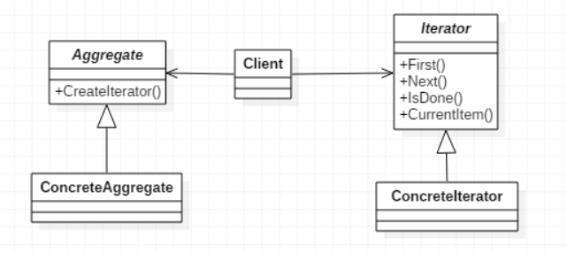

> 提供一种方法顺序访问一个聚合对象中的各个元素，而又不暴露其内部的表示

## 设计原则
**【设计原则9】：**
单一责任原则：一个类应该只有一个引起变化的原因

&emsp;  
类的每个责任都有改变的潜在区域，超过一个责任，就意味着超过一个改变的区域。这个原则告诉我们，尽量让每个类保持单一责任！然而设计的困难点就在于：如何区分设计中的不同责任

&emsp;  
内聚用来衡量一个类或模块紧密地达到单一目的或责任。当一个模块或一个类被设计成只支持一组相关的功能时，我们说它有高内聚；反之，当被设计成支持一组不想关的功能时，我们说它具有低内聚

&emsp;  
迭代器模式让我们能游走于聚合内的每一个元素，而又不暴露其内部的表示。迭代器模式把游走的任务放在迭代器上，而不是聚合上，这样简化了聚合的接口和实现，也让责任各得其所

## 迭代器模式
1. **意图**  
提供一种方法顺序访问一个聚合对象中各个元素, 而又无须暴露该对象的内部表示
2. **主要解决**  
不同的方式来遍历整个整合对象
3. **何时使用**  
遍历一个聚合对象
4. **如何解决**  
在元素之间游走的责任交给迭代器，而不是聚合对象
5. **关键代码**  
定义接口：hasNext, next
6. **优点**  
   * 它支持以不同的方式遍历一个聚合对象
   * 迭代器简化了聚合类
   * 在同一个聚合上可以有多个遍历
   * 在迭代器模式中，增加新的聚合类和迭代器类都很方便，无须修改原有代码
7. **缺点**  
由于迭代器模式将存储数据和遍历数据的职责分离，增加新的聚合类需要对应增加新的迭代器类，类的个数成对增加，这在一定程度上增加了系统的复杂性
8. **注意事项**  
迭代器模式就是分离了集合对象的遍历行为，抽象出一个迭代器类来负责，这样既可以做到不暴露集合的内部结构，又可让外部代码透明地访问集合内部的数据

## 迭代器模式的实现
迭代器这个词在Java中出现过，即Java中使用Iterator迭代器对集合进行遍历，但迭代器模式算是一个没落的模式，基本上没人会单独写一个迭代器，除非是产品性质的开发。迭代器模式（Iterator），提供一种方法顺序访问一个聚合对象中各个元素，而又不暴露该对象的内部表示。UML结构图如下：  
  
### 抽象容器
负责提供接口，比如存在一个类似createIterator()这样的方法，在Java中一般是iterator()方法
```java
public interface Aggregate {
    
    public void add(Object object);
    
    public void remove(Object object);
    
    public Iterator iterator();

}
```

### 抽象迭代器
负责定义访问和遍历元素的接口，基本上有固定的三个方法，即first()获取第一个元素、next()访问下一个元素、hasNext()是否已经遍历到底部
```java
public interface Iterator {
    
    public Object next();    //遍历到下一个元素
    
    public boolean hasNext();    //是否已经遍历到尾部
    
    public boolean remove();    //删除当前指向的元素

}
```

### 具体容器
```java
public class ConcreteAggregate implements Aggregate {
    
    private Vector vector = new Vector();

    @Override
    public void add(Object object) {
        this.vector.add(object);
    }

    public void remove(Object object) {
        this.remove(object);
    }

    @Override
    public Iterator iterator() {
        return new ConcreteIterator(this.vector);
    }
    
}
```

### 具体迭代器
简单的实现就是通过一个游标，在一个容器中上下翻滚，遍历所有它需要查看的元素
```java
public class ConcreteIterator implements Iterator {
    
    private Vector vector = new Vector();
    public int cursor = 0;    //定义当前游标
    
    public ConcreteIterator(Vector vector) {
        this.vector = vector;
    }

    @Override
    public Object next() {
        Object result = null;
        
        if (this.hasNext()) {
            result = this.vector.get(this.cursor ++);
        } else {
            result = null;
        }
        
        return result;
    }

    @Override
    public boolean hasNext() {
        if (this.cursor == this.vector.size()) {
            return false;
        }
        
        return true;
    }

    @Override
    public boolean remove() {
        this.vector.remove(this.cursor);
        
        return true;
    }

}
```

### Client客户端
```java
public class Client {
    
    public static void main(String[] args) {
        Aggregate aggregate = new ConcreteAggregate();
        aggregate.add("abc");
        aggregate.add("aaa");
        aggregate.add("1234");
        
        //遍历
        Iterator iterator = aggregate.iterator();
        while (iterator.hasNext()) {
            System.out.println(iterator.next());
        }
    }

}
```