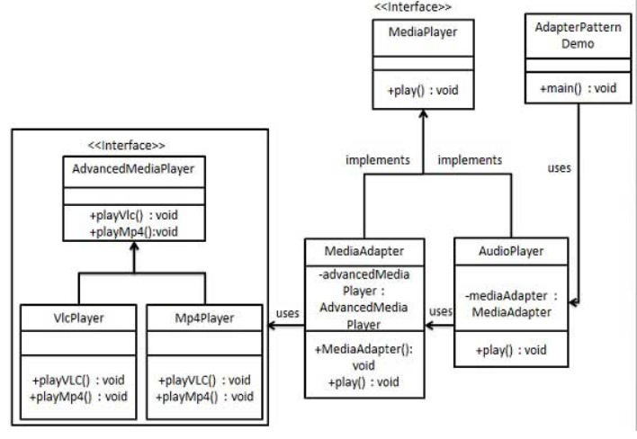

> 将一个类的接口，转换成客户期望的另一个接口。适配器让原本接口不兼容的类可以合作无间
## 适配器模式的分类
### 类适配器
通过继承进行适配（类间继承）  
  
### 对象适配器
通过对象层次的关联关系进行委托（对象的合成关系/关联关系）  
  


## 适配器模式
1. **意图**  
将一个类的接口转换成客户希望的另外一个接口。适配器模式使得原本由于接口不兼容而不能一起工作的那些类可以一起工作
2. **主要解决**  
主要解决在软件系统中，常常要将一些"现存的对象"放到新的环境中，而新环境要求的接口是现对象不能满足的
3. **何时使用**  
   * 系统需要使用现有的类，而此类的接口不符合系统的需要
   * 想要建立一个可以重复使用的类，用于与一些彼此之间没有太大关联的一些类，包括一些可能在将来引进的类一起工作，这些源类不一定有一致的接口
   * 通过接口转换，将一个类插入另一个类系中
4. **如何解决**  
继承或依赖（推荐）
5. **关键代码**  
适配器继承或依赖已有的对象，实现想要的目标接口
6. **优点**  
   * 可以让任何两个没有关联的类一起运行
   * 提高了类的复用
   * 增加了类的透明度
   * 灵活性好
7. **缺点**  
   * 过多地使用适配器，会让系统非常零乱，不易整体进行把握
   * 由于JAVA至多继承一个类，所以至多只能适配一个适配者类，而且目标类必须是抽象类
8. **使用场景**  
有动机地修改一个正常运行的系统的接口，这时应该考虑使用适配器模式
9. **注意事项**  
适配器不是在详细设计时添加的，而是解决正在服役的项目的问题

## 适配器模式的实现
我们有一个MediaPlayer接口和一个实现了MediaPlayer接口的实体类AudioPlayer。默认情况下，AudioPlayer可以播放mp3格式的音频文件。
我们还有另一个接口AdvancedMediaPlayer和实现了AdvancedMediaPlayer接口的实体类。该类可以播放vlc mp4格式的文件

&emsp;  
我们想要让AudioPlayer播放其他格式的音频文件。为了实现这个功能，我们需要创建一个实现了MediaPlayer接口的适配器类MediaAdapter，并使用AdvancedMediaPlayer对象来播放所需的格式
  
### 为媒体播放器和更高级的媒体播放器创建接口
```java
public interface MediaPlayer {
   public void play(String audioType, String fileName);
}
```
```java
public interface AdvancedMediaPlayer { 
   public void playVlc(String fileName);
   public void playMp4(String fileName);
}
```

### 创建实现了AdvancedMediaPlayer接口的实体类
```java
public class VlcPlayer implements AdvancedMediaPlayer{
   @Override
   public void playVlc(String fileName) {
      System.out.println("Playing vlc file. Name: "+ fileName);      
   }
 
   @Override
   public void playMp4(String fileName) {
      //什么也不做
   }
}
```
```java
public class Mp4Player implements AdvancedMediaPlayer{
 
   @Override
   public void playVlc(String fileName) {
      //什么也不做
   }
 
   @Override
   public void playMp4(String fileName) {
      System.out.println("Playing mp4 file. Name: "+ fileName);      
   }
}
```

### 创建实现了MediaPlayer接口的适配器类
```java
public class MediaAdapter implements MediaPlayer {
 
   AdvancedMediaPlayer advancedMusicPlayer;
 
   public MediaAdapter(String audioType){
      if(audioType.equalsIgnoreCase("vlc") ){
         advancedMusicPlayer = new VlcPlayer();       
      } else if (audioType.equalsIgnoreCase("mp4")){
         advancedMusicPlayer = new Mp4Player();
      }  
   }
 
   @Override
   public void play(String audioType, String fileName) {
      if(audioType.equalsIgnoreCase("vlc")){
         advancedMusicPlayer.playVlc(fileName);
      }else if(audioType.equalsIgnoreCase("mp4")){
         advancedMusicPlayer.playMp4(fileName);
      }
   }
}
```

### 创建实现了MediaPlayer接口的实体类
```java
public class AudioPlayer implements MediaPlayer {
   MediaAdapter mediaAdapter; 
 
   @Override
   public void play(String audioType, String fileName) {    
 
      //播放 mp3 音乐文件的内置支持
      if(audioType.equalsIgnoreCase("mp3")){
         System.out.println("Playing mp3 file. Name: "+ fileName);         
      } 
      //mediaAdapter 提供了播放其他文件格式的支持
      else if(audioType.equalsIgnoreCase("vlc") 
         || audioType.equalsIgnoreCase("mp4")){
         mediaAdapter = new MediaAdapter(audioType);
         mediaAdapter.play(audioType, fileName);
      }
      else{
         System.out.println("Invalid media. "+
            audioType + " format not supported");
      }
   }   
}
```

### 使用AudioPlayer来播放不同类型的音频格式
```java
public class AdapterPatternDemo {
   public static void main(String[] args) {
      AudioPlayer audioPlayer = new AudioPlayer();
 
      audioPlayer.play("mp3", "beyond the horizon.mp3");
      audioPlayer.play("mp4", "alone.mp4");
      audioPlayer.play("vlc", "far far away.vlc");
      audioPlayer.play("avi", "mind me.avi");
   }
}
```

## 类适配器和对象适配器的区别
从上面的内容可以看出来，类适配器是类间继承，对象适配器是对象的合成关系，也可以说是类的关联关系，这是两者的根本区别。由于对象适配器是通过类间的关联关系进行耦合的，因此在设计时就可以做到比较灵活，而类适配器就只能通过覆写源角色的方法进行扩展。在实际项目中，对象适配器使用到的场景较多

## 装饰者模式和适配器模式的区别
装饰者模式的工作是扩展包装对象的行为或责任，不会改变被包装对象的接口；而适配器模式是会改变被适配对象的接口的