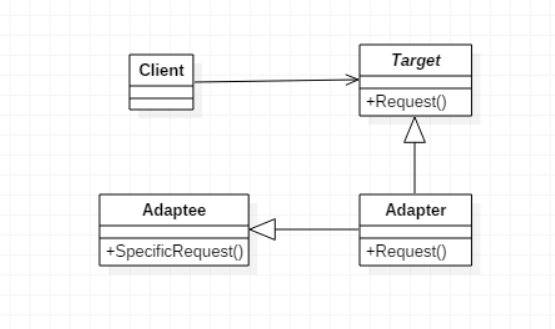
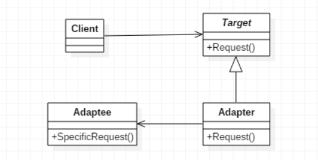

> 将一个类的接口，转换成客户期望的另一个接口。适配器让原本接口不兼容的类可以合作无间
## 适配器模式的分类
### 类适配器
通过继承进行适配（类间继承）  
  
### 对象适配器
通过对象层次的关联关系进行委托（对象的合成关系/关联关系）  
  

## 适配器模式
1. **意图**
将一个类的接口转换成客户希望的另外一个接口。适配器模式使得原本由于接口不兼容而不能一起工作的那些类可以一起工作
2. **主要解决**  
主要解决在软件系统中，常常要将一些"现存的对象"放到新的环境中，而新环境要求的接口是现对象不能满足的
3. **何时使用**  
   * 系统需要使用现有的类，而此类的接口不符合系统的需要
   * 想要建立一个可以重复使用的类，用于与一些彼此之间没有太大关联的一些类，包括一些可能在将来引进的类一起工作，这些源类不一定有一致的接口
   * 通过接口转换，将一个类插入另一个类系中
4. **如何解决**  
继承或依赖（推荐）
5. **关键代码**  
适配器继承或依赖已有的对象，实现想要的目标接口
6. **优点**  
   * 可以让任何两个没有关联的类一起运行
   * 提高了类的复用
   * 增加了类的透明度
   * 灵活性好
7. **缺点**  
   * 过多地使用适配器，会让系统非常零乱，不易整体进行把握
   * 由于JAVA至多继承一个类，所以至多只能适配一个适配者类，而且目标类必须是抽象类
8. **使用场景**  
有动机地修改一个正常运行的系统的接口，这时应该考虑使用适配器模式
9. **注意事项**  
适配器不是在详细设计时添加的，而是解决正在服役的项目的问题