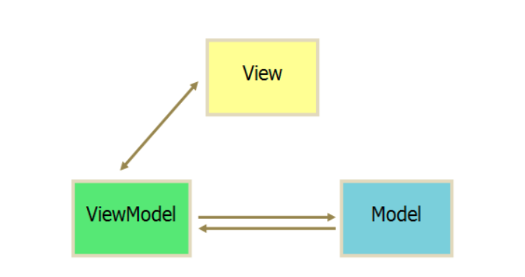
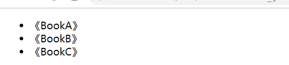

## Vue.js是什么
Vue.js官方文档中是这样介绍它的  
简单小巧的核心，渐进式技术栈，足以应付任何规模的应用  
简单小巧是指Vue.js压缩后大小仅有17KB，所谓渐进式，就是可以一步一步，有阶段的来使用Vue.js，不必一开始就使用所有的东西


使用Vue.js可以使Web开发变得简单，同时也颠覆了传统开发模式。它提供了现代Web开发中常见的高级功能，比如：
* 解耦视图和数据
* 可复用的组件
* 前端路由
* 状态管理
* 虚拟DOM

### MVVM模式
MVVM模式是由经典的软件架构MVC衍生而来的。当View（视图层）发生变化时，会自动更新到ViewModel（视图模型），反之亦然。View和ViewModel之间通过双向绑定（data-binding）建立联系


### Vue.js有什么不同
在传统的JQuery中，比如我们在指定DOM中插入一个元素，并给它添加一个绑定事件
```js
if (showBtn) {
    var btn = $('<button>Click me<button>');
    btn.on('click', function() {
        console.log('Clicked!');
    });
    $('#app').append(btn);
}
```

这段代码不难理解，操作的内容也不复杂，不过这样我们的视图代码和业务逻辑耦合在一起，随着功能不断增加，直接操作DOM会使得代码难以维护。而Vue.js通过MVVM的模式拆分为视图和数据两个部分，因此只需关心数据即可，DOM的事情Vue会来搞定，以上代码通过Vue.js可以改写为：
```html
<body>
    <div id="app">
        <button v-if="showBtn" v-on:click="handleClick">Click me</button>
    </div>
</body>
<script>
    new Vue({
        el:"#app",
        data:{
            showBtn:true
        },
        method:{
            handleClick:function() {
                console.log('Clicked!');
            }
        }
    })
</script>
```

::: tip
暂时还不需要理解上述代码，这只是快速展示Vue.js的写法，在后面的章节会详细的介绍每个参数的用法
:::

## 如何使用Vue.js
Vue.js是一个渐进式的JavaScript框架，根据项目需求，可以选择从不同的维度来使用它。如果只是想体验Vue.js带来的快感，或者开发几个简单的HTML5或小应用，可以直接script加载CDN文件，例如：
```html
<!-- 自动识别最新稳定版本的Vue.js -->
<script src="https://unpkg.com/vue/dist/vue.min.js"></script>
<!-- 指定某个具体版本的Vue.js -->
<script src="https://unpkg.com/vue@2.1.6/dist/vue.min.js"></script>
```

### 代码示例
```html
<!DOCTYPE html>
<html lang="en">
<head>
    <meta charset="UTF-8">
    <title>Vue 示例</title>
</head>
<body>
    <div id="app">
        <ul>
            <li v-for="book in books">{{book.name}}</li>
        </ul>
    </div>
    <script src="https://unpkg.com/vue/dist/vue.min.js"></script>
    <script>
        new Vue({
            el: '#app',
            data: {
                books: [
                    {name : '《BookA》'},
                    {name : '《BookB》'},
                    {name : '《BookC》'}
                ]
            }
        })
    </script>
</body>
</html>
```

