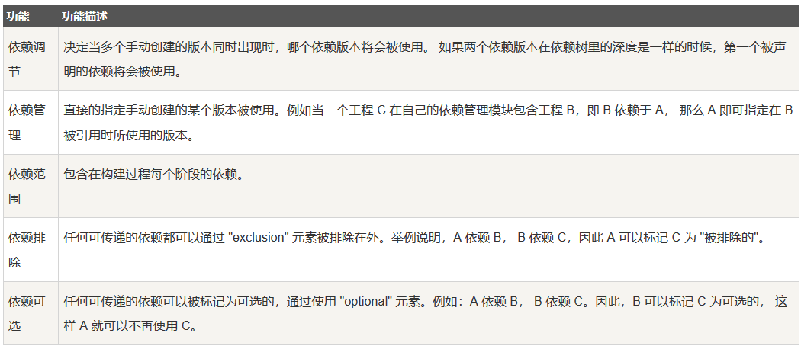
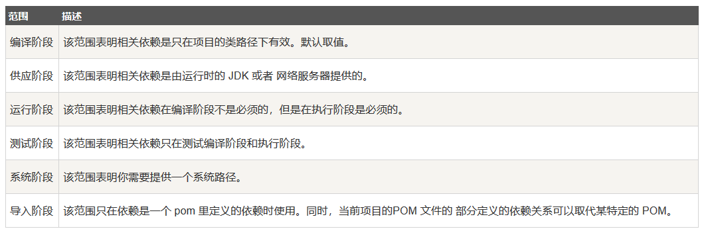

### Maven依赖管理
Maven一个核心的特性就是依赖管理，当我们处理多模块的项目（包含成百上千个模块或子项目），模块间的依赖关系就变得非常复杂，管理也变得很困难。针对此种情形，Maven提供了一种高度控制的方法

**可传递性依赖发现**  
一种相当常见的情况，比如说A依赖于其它库B，如果，另一个项目C想要用A，那么C也需要使用B。Maven可以避免去搜索所有所需库的需求，Maven通过读取项目文件，找出它们项目之间的依赖关系。我们所需要做的至少在每个项目的pom中定义好直接的依赖关系，其它的事情Maven会帮我们搞定。通过可传递性的依赖，所有被包含的库的图形会快速的增长。当有重复库时，可能出现的清醒将会持续的上升，Maven提供一些功能来控制可传递的依赖的程度

**依赖范围**  
传递依赖发现可以通过使用依赖范围来限制

**依赖管理**  
通常情况下，在一个共通的目录下，有一系列的项目。在这种情况下，我们可以创建一个公共依赖的pom文件，该pom包含所有的公共的依赖关系，我们称其为其它子项目pom的父pom