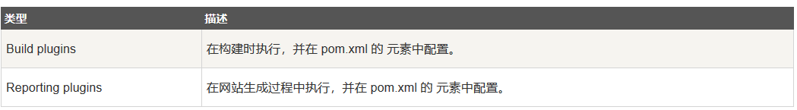

### Maven插件
Maven每个生命周期都包含一系列的阶段，这些阶段就相当于Maven提供的统一的接口，然后这些阶段的实现完全由Maven插件来完成。
我们在输入mvn命令的时候，比如mvn clean，clean对应的就是Clean生命周期中的clean阶段，但clean的具体操作是由maven-clean-plugin来实现的。所以说Maven生命周期的每一个阶段的具体实现都是由Maven插件来完成的

Maven实际上是一个依赖插件执行的框架，每个任务实际上是由插件完成，Maven插件通常被用来：  
&emsp;创建jar文件  
&emsp;创建war文件  
&emsp;编译代码文件  
&emsp;代码单元测试  
&emsp;创建工程文档  
&emsp;创建工程报告  

插件通常提供了一个目标的集合，并且可以用以下语法执行：  
&emsp;<code>mvn [plugin-name]:[goal-name]</code>

### 插件类型

### 常用插件列表

