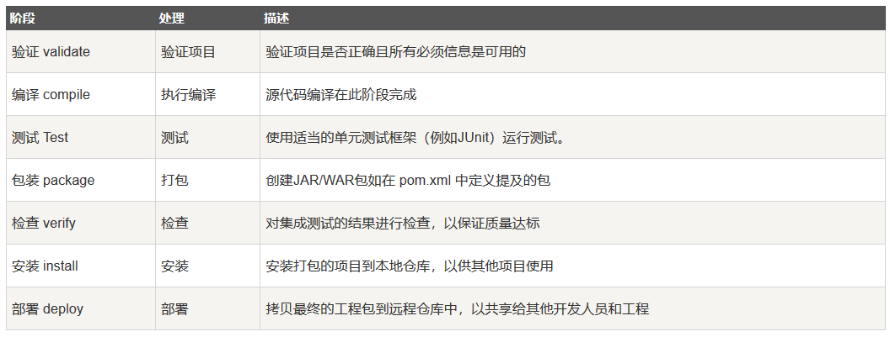

### Maven构建生命周期
Maven构建生命周期定义了一个项目构建跟发布的过程

**一个典型的Maven构建（build）生命周期是由以下几个阶段的序列组成的**

### Maven标准生命周期
Maven有以下三个标准的生命周期：  
&emsp;clean：项目清理的处理  
&emsp;defau（或build）：项目部署的处理  
&emsp;site：项目站点文档创建的处理
    
**clean生命周期**    
当我们执行mvn post-clean命令时，Maven调用clean生命周期，它包含以下阶段：  
&emsp;pre-clean：执行一些需要在clean之前完成的工作  
&emsp;clean：移除所有上一次构建生成的文件  
&emsp;post-clean：执行一些需要在clean之后立即完成的工作  
mvn clean中的clean就是上面的clean，在一个生命周期中，运行某个阶段的时候，它之前的所有阶段都会被运行
    
**default（build）生命周期**  
这是Maven的主要生命周期，被用于构建应用，含有23个阶段  
当一个阶段通过Maven命令调用时，例如mvn compile，只有该阶段之前包括该阶段在内的所有阶段会被执行  
不同的Maven目标将根据打包的类型，被绑定到不同的Maven生命周期

**site生命周期**  
Maven Site插件一般用来创建新的报告文档、部署站点等  
&emsp;pre-site：执行一些需要在生成站点文档之前完成的工作  
&emsp;site：生成项目的站点文档  
&emsp;post-site：执行一些需要在生成站点文档之后完成的工作，并为部署做准备  
&emsp;site-deploy：将生成的站点文档部署到特定的服务器上  
这里经常用到的时site和site-deploy阶段，用以生成和发布Maven站点，这是Maven非常强大的功能，能够自动生成文档和统计数据

