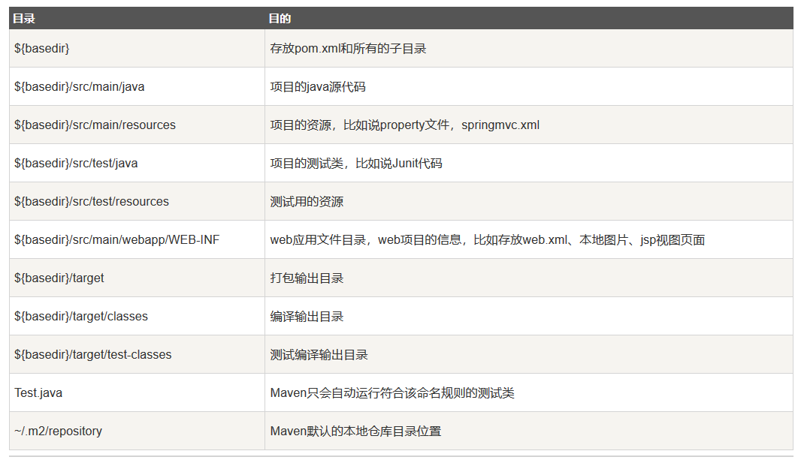

### Maven简介
Maven是apache下一个纯java开发的开源项目，基于项目对象模型概念，Maven利用一个中央信息片段能管理一个项目的构建、报告和文档等步骤。Maven是一个项目管理工具，可以对java项目进行构建、依赖管理
    
**Maven功能**
* 构建
* 文档生成
* 报告
* 依赖
* SCMs
* 发布
* 分发
* 邮件列表

**约定配置**  
Maven提倡使用一个共同的标准目录结构，Maven使用约定优于配置的原则，大家尽可能遵守这样的目录结构

