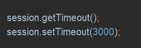

### 会话管理
Shiro提供了完整的企业级会话管理功能，不依赖于底层容器，不管JavaSE还是JavaEE环境，提供了会话管理、会话时间监听、会话存储/持久化、容器无关的集群、失效/过期支持、对Web的透明支持、SSO单点登录的支持等特性。即直接使用Shiro的会话管理可以直接替换如Web容器的会话管理
    
### 会话
Shiro的会话支持不仅可以在JavaSE中使用，也可以在JavaEE中使用，且使用的方式是一样的  

   
登录成功后使用Subject.getSession()即可获取会话，其等价于Subject.getSession(True),即当前如果没有创建Session对象则会创建一个；另外Subject.getSession(False)，如果当前没有创建Session对象则会返回null
    

   
获取当前会话的唯一标识
    

   
获取当前Subject的主机地址，该地址是由HostAuthenticationToken.getHost()提供的
    

    
获取/设置当前Session的过期时间，如果不设置默认的是会话管理器的全局过期时间
    

   
获取会话的启动时间及最后访问时间，如果是JavaSE应用需要自己定期调用session.touch()去更新最后访问时间；如果是Web应用，每次进入ShiroFilter都会自动调用session.touch()来更新最后访问时间
    

   
更新会话最后访问时间及销毁会话，当Subject.logout()时会自动调用stop方法来销毁会话。如果在web中，调用javax.servlet.http.HttpSession. invalidate()也会调用stop方法来销毁会话
    

    
设置/获取/删除会话属性，在整个会话范围内都可以对这些属性进行操作
Shiro提供的会话可以用于JavaEE和JavaSE环境，不依赖于任何底层容器，可以独立使用，是完整的会话模块
    
### 会话管理器
会话管理器管理着应用中所有Subject的会话的创建、维护、删除、失效、验证等工作，是Shiro的核心组件，顶层组件SecurityManager则直接继承了SessionManager，且提供了SessionSecurityManager实现直接把会话管理委托给相应的SessionManager，DefaultSecurityManager及DefaultWebSecurityManager默认SecurityManager都继承了SessionSecurityManager
    
SecurityManager提供了如下接口：
```
Session start(SessionContext sessionContext); // 启动会话
Session getSession(SessionKey sessionKey) throws SessionException; // 根据会话key获取会话
```
另外用于Web环境的WebSessionManager又提供了如下接口;
```
boolean isSevletContainerSessions(); // 是否使用Servlet容器的会话
```
Shiro还提供了ValidatingSessionManager用于验资并过期会话
```
void validateSessions(); // 验证所有会话是否过期     
```
   

   
Shiro提供了3个默认实现:  
* DefaultSessionManager：DefaultSecurityManager使用的默认实现，用于JavaSE环境
* ServletContainerSessionManager：DefaultWebSessionManager使用的默认实现，用于web环境，其直接使用servlet容器的会话
* DefaultWebSessionManager：用于Web环境的实现，可替代ServletContainerSessionManager，自己维护着会话，废弃了servlet容器的会话
        
替换SecurityManager默认的SessionManager可以在ini中配置  

   
web环境下的ini配置  

   
另外可以设置会话的全局过期时间（毫秒为单位），默认为30分钟
```
sessionManager.globalSessionTimeout = 1800000
```
        
默认情况下，globalSessionTimeout将应用给所有Session，可以单独设置每个Session的timeout属性来为每个Session设置其超时时间，另外，如果使用ServletContainerSessionManager进行会话管理，Session的超时依赖于底层Servlet容器的超时时间，可在web.xml中配置会话的超时时间，单位为分钟  

   
在Servlet容器中，默认使用JSESSION Cookie维护会话，且会话默认是跟容器绑定的；在默写情况下可能需要使用自己的会话机制，此时我们可以使用DefaultWebSessionManager来维护会话  


* sessionIdCookie是sessionManager创建会话Cookie的模板
* sessionIdCookie.name：设置Cookie名字，默认为JSESSIONID
* sessionIdCookie.domain：设置Cookie的域名，默认空，即当前访问的域名
* sessionIdCookie.path：设置Cookie的路径，默认空，即存储在域名根下
* sessionIdCookie.maxAge：设置Cookie过期时间，秒为单位，默认-1，即关闭浏览器时Cookie过期
* sessionIdCookie.htppOnly：如果设置为True，则客户端不会暴露客户端脚本代码，使用httpOnly有助于减少某些类型的跨站点脚本攻击
* sessionManager.sessionIdCookieEnabled：是否启用/禁用Session Id Cookie，默认是启用
    
### 会话监听器
会话监听器主要用于监听会话创建、过期及停止事件  

   
如果只想监听某一个事件，可以继承SessionListenerAdapter  

   
在 shiro-web.ini 配置文件中可以进行如下配置设置会话监听器：   


