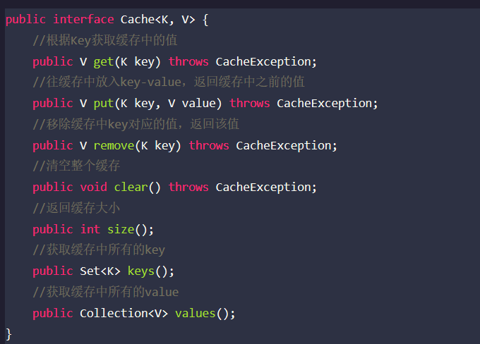
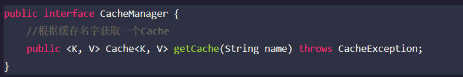
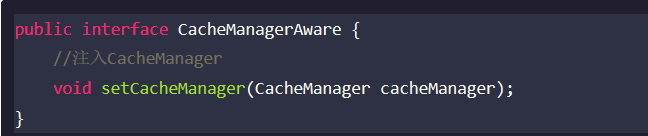
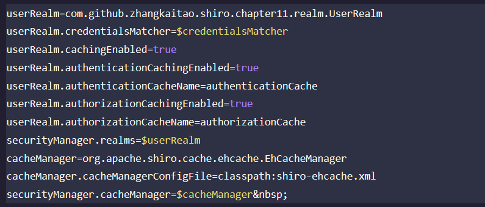
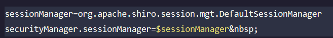
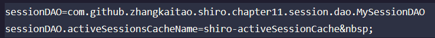

### 缓存机制
Shiro提供了类似于Spring的Cache抽象，即Shiro本身不实现Cache，但是对Cache又实现了抽象，方便更换不同底层的Cache实现
    
**Shiro提供的Cache接口**  

   
**Shiro提供的CacheManager接口**  

**Shiro还提供了CacheManagerAware用于注入CacheManager**  

   
Shiro的内部组件（DefaultSecurityManager）会自动检测相应的对象（如Realm）是否实现了CacheManagerAware并自动注入相应的CacheManager
    
### Realm缓存
Shiro提供了CachingRealm，其实现了CacheManagerAware接口，提供了一些缓存的基础实现；另外 AuthenticatingRealm及AuthorizingRealm 分别提供了对AuthenticationInfo和AuthorizationInfo信息的缓存
    
**ini配置**

   
* userRealm.cacheEnabled：启用缓存，默认False
* userRealm.authenticationCachingEnabled：启用身份验证缓存，即缓存AuthenticationInfo信息，默认False
* cacheManager：缓存管理器，此处使用EhCacheManager，即Ehcache实现，需要导入相应的依赖
     
### Session缓存
当我们设置了SecurityManager的CacheManager时，如  
securityManager.cacheManager = $cacheManager 

当我们设置SessionManager时：  

   
如securityManager实现了SessionSecurityManager，则会自动判断SessionManager是否实现了CacheManagerAware接口，如果实现了则会把CacheManager设置给它。然后SessionManager会判断相应的sessionDAO是否实现了CacheManagerAware，如果实现了会把CacheManager设置给它
    
对于sessionDAO，可通过如下配置设置缓存的名称  

   
activeSessionsCacheName 默认就是 shiro-activeSessionCache
    
