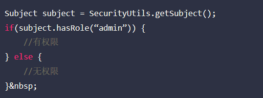
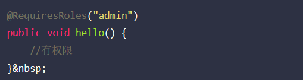
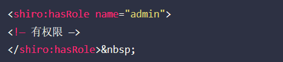
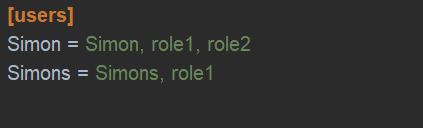
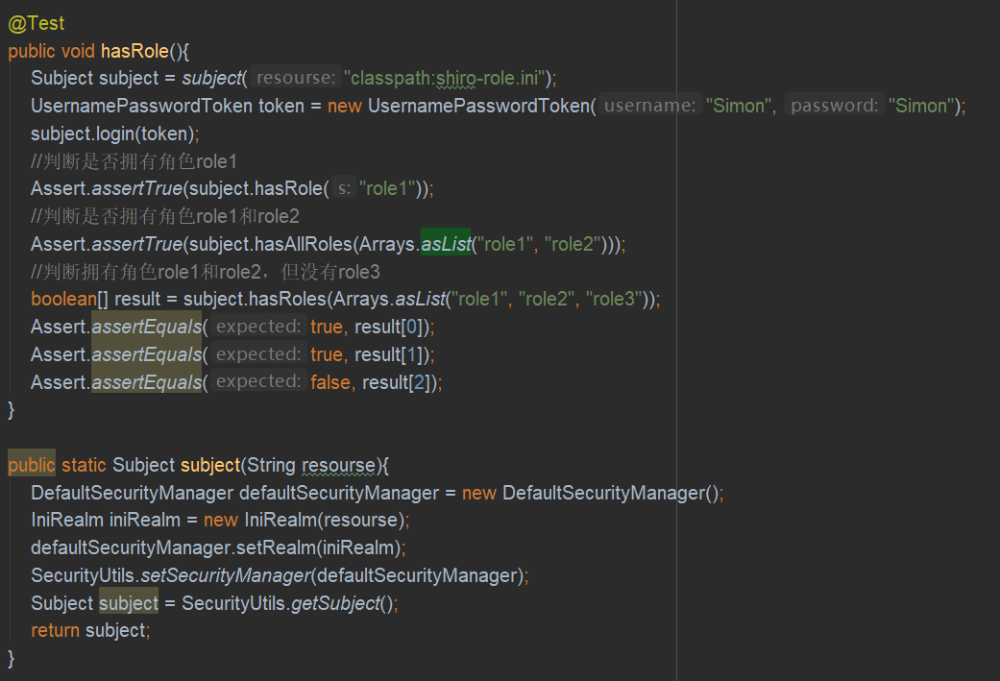
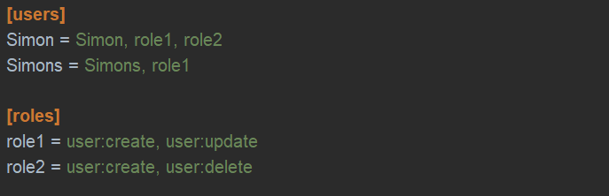
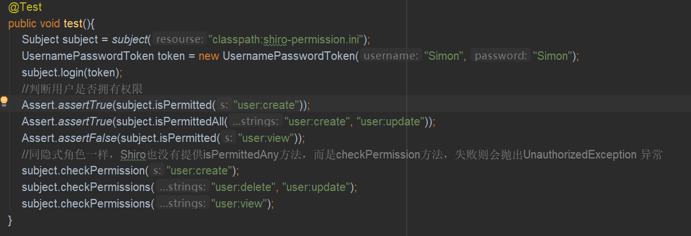
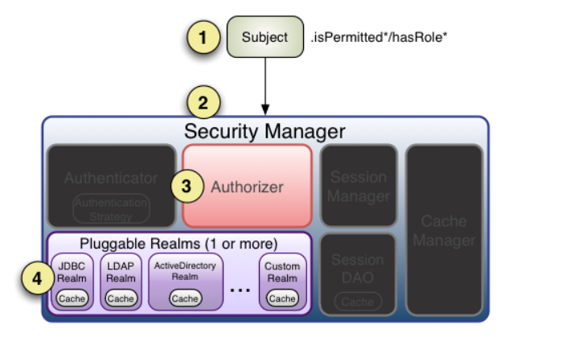

    

### 3种授权方式
**编程式：通过写if/else授权代码完成**  

   
**注解式：通过在执行的Java方法上放置相应的注解完成**  

   
**JSP/GSP标签：在JSP/GSP通过相应的标签完成**  

   
### 基于角色的访问控制（隐式角色）
所谓隐式角色，指的是直接由角色来判断是否具有权限，这种方式配置简单，但是粒度太粗，如果某一天角色对应的权限发生了改变，则需要修改和删除许多代码

1. 添加shiro.ini配置  

   
2. 编写测试类  

   
Shiro提供了hasRole和/hasAllRoles来判断是否拥有某个角色，但是没有提供hasAnyRole来判断是否拥有一些角色中的某一个，如果需要判断，则需要使用checkRole方法，与其它方法不同的是，它验证失败会抛出异常
    
### 基于资源的访问控制（显式角色）
1. 添加shiro.ini配置

   
2. 编写测试类

   
### Permission（字符串通配符权限）
* ":"：表示资源/操作/实例的分割
* ","：表示资源的分割
* "*"：表示任意资源/操作/实例
    
1. 单个资源单个权限
```java
subject().checkPermissions("system:user:update"); // 验证用户是否拥有资源system:user的update权限
```
    
2. 单个资源的多个权限
```java
role=system:user:update,system:user:delete // ini配置
subject().checkPermissions("system:user:update", "system:user:delete"); //检查用户是否拥有资源
system:user的update和delete权限
```

还可以简写为

```java
role="system:user:update,delete"
subject().checkPermissions("system:user:update,delete");
```
::: tip
注：通过subject().checkPermissions("system:user:update,delete")来验证role=system:user:update,system:user:delete的delete权限是可以的，但是反过来规则不成立
:::

3. 单个资源的全部权限
**ini配置**  
```
role="system:user:create,update,delete,view"
role=system:user:*
role53=system:user // 不推荐
```

**权限检查**  
```java
subject().checkPermissions("system:user:create,delete,update:view");
subject().checkPermissions("system:user:*");
subject().checkPermissions("system:user");
```
::: tip
注：通过“system:user:*”验证“system:user:create,delete,update:view”可以，但是反过来是不成立的
:::

4. 所有资源全部权限  
**ini配置**
```java
role=*:view
```
**权限检查**
```
subject().checkPermissions("user:view");
```

### 授权流程

   
1. 首先调用Subject.isPermitted*/hasRole*接口，其会委托给SecurityManager管理，而 SecurityManager 接着会委托给 Authorizer
2. Authorizer 是真正的授权者，如果我们调用如 isPermitted(“user:view”)，其首先会通过 PermissionResolver把字符串转换成相应的Permission 实例
3. 在进行授权之前，其会调用相应的 Realm 获取 Subject 相应的角色/权限用于匹配传入的角色/权限
4. Authorizer 会判断 Realm 的角色/权限是否和传入的匹配，如果有多个 Realm，会委托给 ModularRealmAuthorizer进行循环判断，如果匹配如 isPermitted*/hasRole* 会返回 true，否则返回 false 表示授权失败

