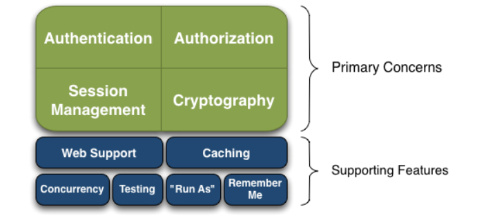
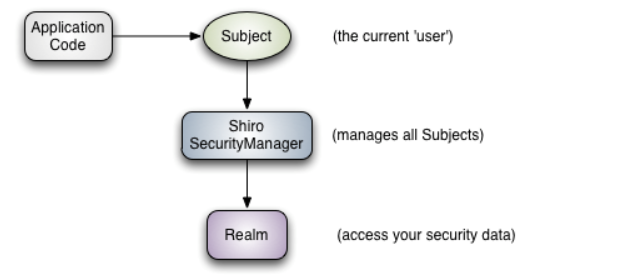
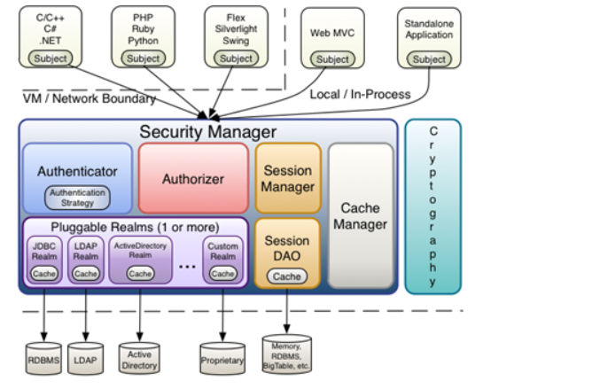

    
>Apache Shiro是一个Java的安全框架，可以帮助我们完成认证、授权、加密、会话管理、与Web集成、缓存等功能

### Shiro的基本功能点

* Authentication：身份认证/登录，验证用户是否具有相应的身份
* uthorization：授权，即权限验证，验证某个已认证的用户是否拥有某个权限
* Session Manager：会话管理，即用户登录后就是一次会话，在没有退出之前，它的所有信息都在会话中
* Cryptography：加密，保护数据的安全性
* Web Support：Web支持，可以非常容易的集成到Web环境
* Caching：缓存
* Concurrency：shiro 支持多线程应用的并发验证，即如在一个线程中开启另一个线程，能把权限自动传播过去
* Testing：提供测试支持
* Run As：允许一个用户假装为另一个用户（如果他们允许）的身份进行访问
* Remember Me：记住我，这个是非常常见的功能，即一次登录后，下次再来的话不用登录了

### Shiro的三大组件

* Subject：主体，代表了当前"用户"，Subject可以是与当前应用交互的任何东西，如网络爬虫、机器人等，所有Subject都绑定到SecurityManager，与Subject的交互都会委托给SecurityManager，可以把Subject看成一个门面，SecurityManager才是真正的执行者
* SecurityManager：安全管理器，所有与安全有关的操作都会与SecurityManager交互，且它管理着所有的Subject，它是Shiro的核心，负责与其它组件交互
* Realm：域，Shiro从Realm中获取安全数据，就是说SecurityManager要验证用户身份，就需要从Realm中获取相应的用户进行比较以确定用户身份是否合法，也需要从Realm得到用户相应的角色/权限进行验证用户是否能进行相应的操作
             
### Shiro内部架构
   
    
* Subject：主体，可以看到主体是可以与任何应用交互的"用户"
* SecurityManager：Shiro的心脏，所有具体的交互都通过SecurityManager进行控制，它管理着所有的Subject、且负责认证和授权及会话和缓存的管理
* Authenticator：认证器，负责主体认证的，这是一个扩展点，如果用户觉得默认的不好，可以自定义实现
* Authrizer：授权器，或者访问控制器，用来决定主体是否有权限进行相应的操作
* Realm：可以有1个或多个Realm，用于获取安全实体，可以是JDBC实现，也可以是LDAP实现，还可以是内存实现
* SessionManager：Session管理
* SessionDAO：用于会话的CRUD
* CacheManager：缓存控制器，来管理用户、角色、权限等缓存
* Cryptography：密码模块，用于加密/解密

