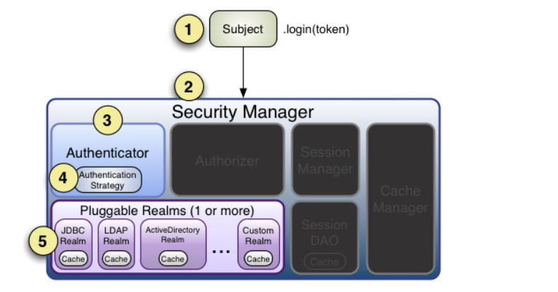

### 身份验证
1. 导入相关jar包  

   
2. 添加shiro.ini配置文件  

   
3. 编写HelloWorldTest测试类  

   
### 身份认证流程

   
1. 首先调用Subject.login(token)，其会自动委托给SecurityManager，调用之前必须通过SecurityUtils.setSecurityManager()设置
2. SecurityManager负责真正的身份验证逻辑，它会委托给Authenticator进行身份验证
3. Authenticator才是真正的身份验证者，Shiro API中核心得身份认证入口点，此处可自定义自己的实现
4. Authenticator可能会委托给相应的AuthenticationStrategy进行多Realm身份验证，默认ModularRealmAuthenticator进行多Realm验证
5. Authenticator会把相应的token传入Realm，从Realm获取身份验证信息，如果没有返回/抛出异常则表明验证失败
    
### 单Realm配置
基本DefaultSecurityMaager的单Realm配置（Shiro新版本推荐的Realm配置，但不支持多Realm配置，或是我还未发现，此处有待后续深入学习考证）
        
1. 编写自定义Realm   

   
2. 编写测试类  

   
**基于IniSecurityManager的单Realm配置（已经过时的Realm配置方法，但是现在Shiro学习资料基本都是用此方法）**    
1. 编写自定义Realm  

   
2. 添加shiro.ini配置文件  

    
3. 编写测试类  

    
### 多Realm配置
目前只找到基于IniSecurityManager的多Realm配置方法，只需在shiro.ini添加多个realm配置即可

   
### JDBCRealm
1. 导入数据库连接jar包  
2. 创建数据库表，jdbcRealm默认的查询语句表名和字段名都已确定，如果使用jdbcRealm的默认配置，则表名和字段名都要一一对应，我们也可以通过Shiro提供的方法自定义自己的查询语句  

   
3. 添加shiro.ini配置文件

   
4. 编写测试类，与单Realm配置一样

