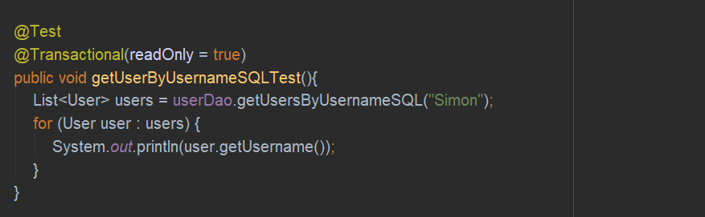

### HQL查询
HQL：Hibernate Query Language  
语法：将原来sql语句中的表与字段名称换成对象与属性的名称就行了  
**DAO接口**  

**DAO实现类**  

**测试方法**  

### SQL查询
**DAO接口**  

**DAO实现类**  

**测试方法**  

### QBC查询
QBC：Query By Criteria  
**DAO接口**  

**DAO实现类**  

**测试方法**  

