### Repository接口
Repository接口是Spring Data Jpa为我们提供的所有接口的顶层接口  

Repository提供了两种查询方式的支持  
1. 基于方法名称命名规则查询
2. 基于@Query注解查询

**方法名称命名规则查询**  
规则：findBy（关键字） + 属性名称（属性名称首字母大写） + 查询条件（首字母大写）

**基础查询**  
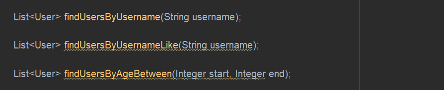
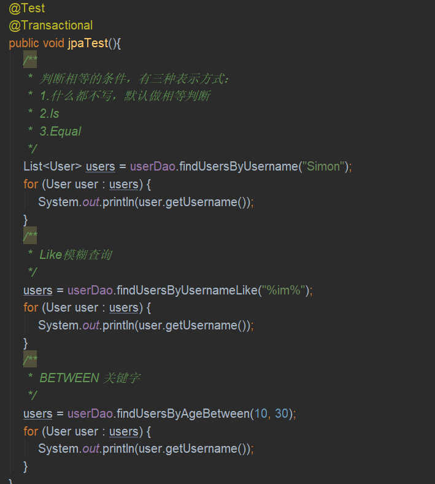

**@Query查询JPQL语句**  

**@Query查询SQL语句**  

**@Query更新SQL语句**  

### CrudRepository接口

**基础查询**  
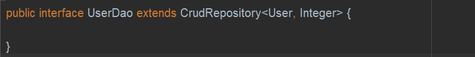
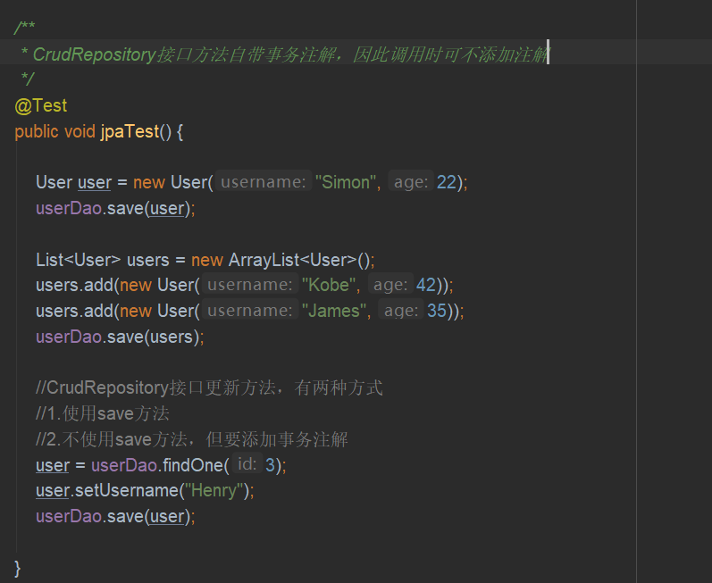

### PagingAndSortingRepository接口
**分页查询**  

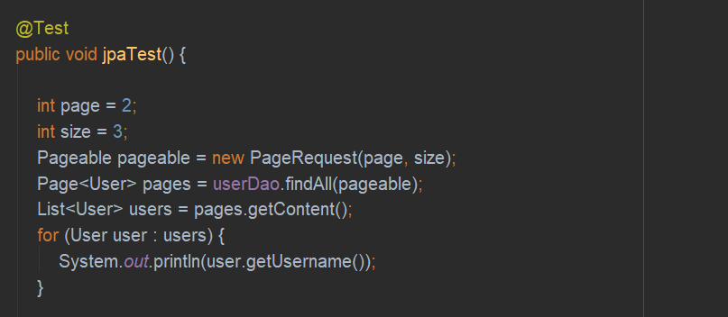

**排序处理**  
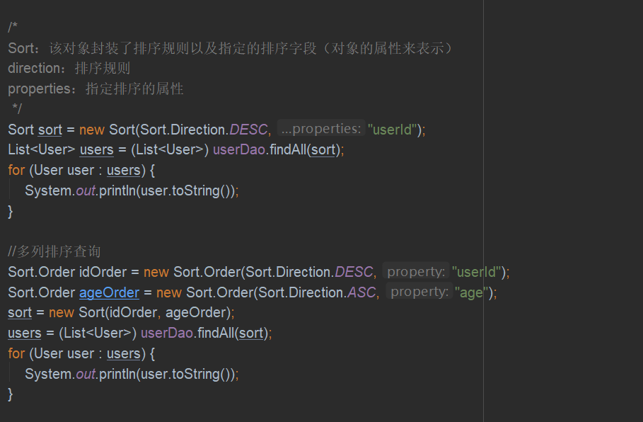

### JPARepository接口
JPARepository接口是我们开发时使用最多的接口，其特点是可以帮助我们将其它接口的方法的返回值做适配处理，可以使我们在开发时更方便的使用这些方法

JPARepository接口继承了PagingAndSorting接口，而PagingAndSortingRepository接口继承了CrudRepository接口

### JpaSpecificationExecutor接口
完成多条件查询，并且支持分页和排序

**单条件查询**  
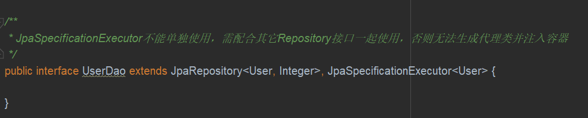
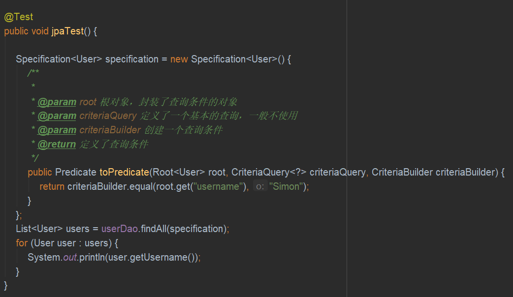

**多条件查询方式一**  
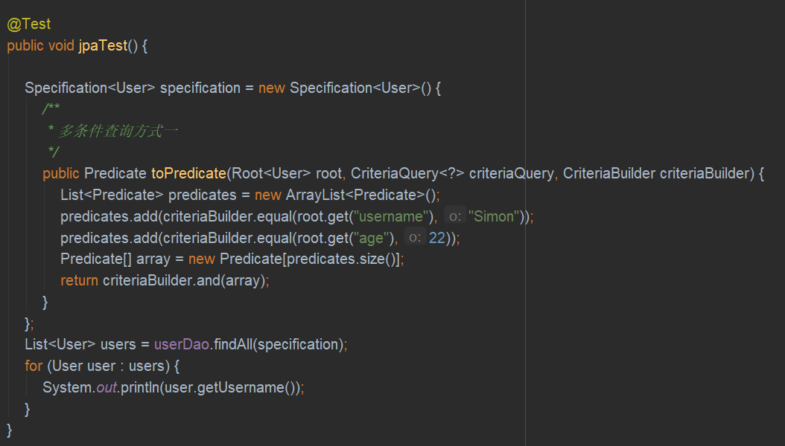

**多条件查询方式二**  
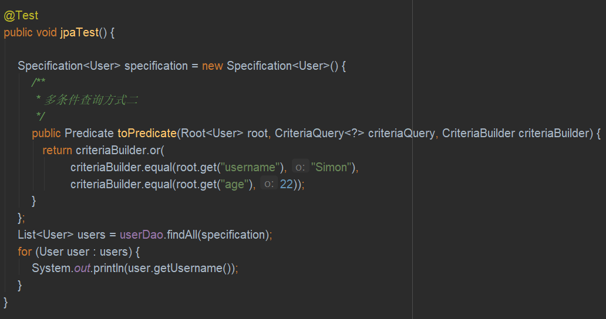

**分页查询**  
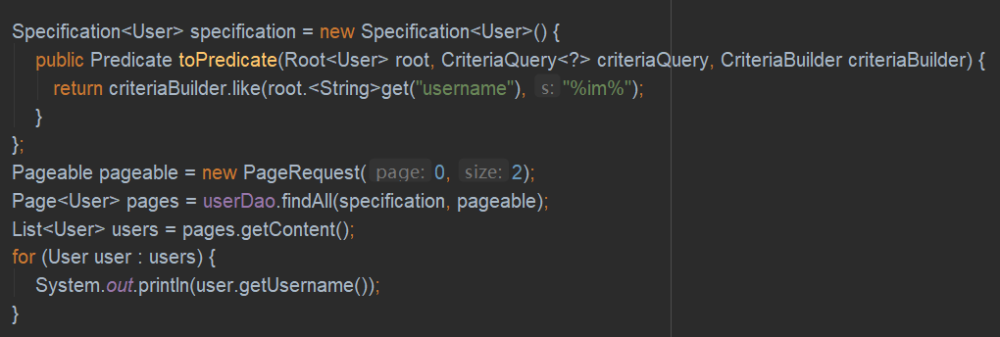

**排序处理**  
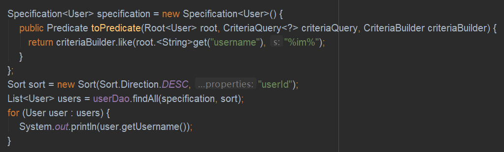

**分页+排序**  
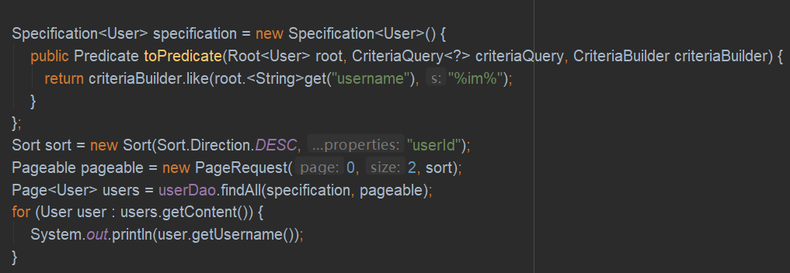

### 自定义Repository接口
**基本查询**  
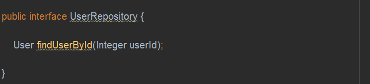
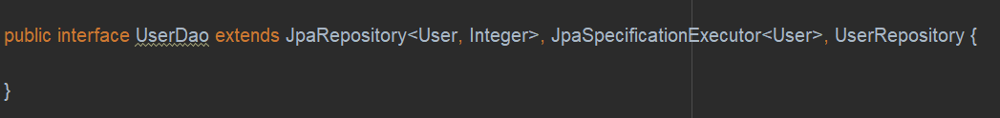
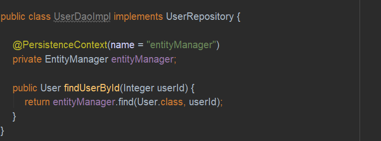
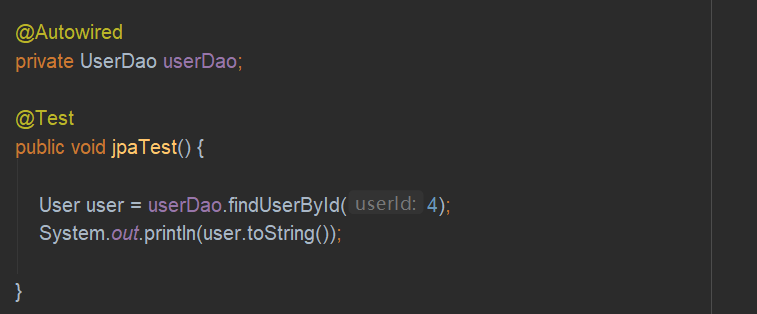

**一对一关联查询**  
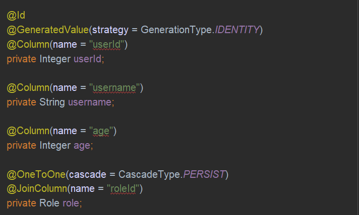
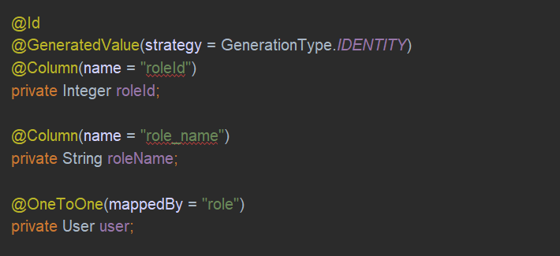
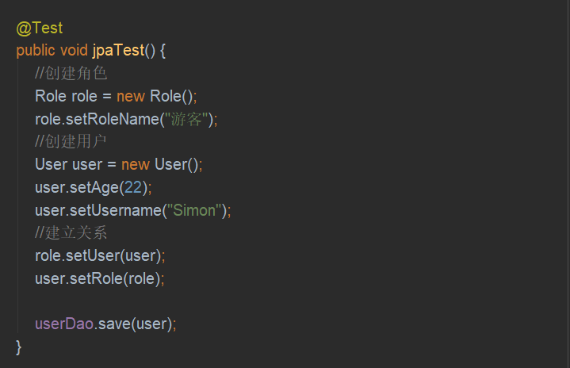

**一对多关联查询**  
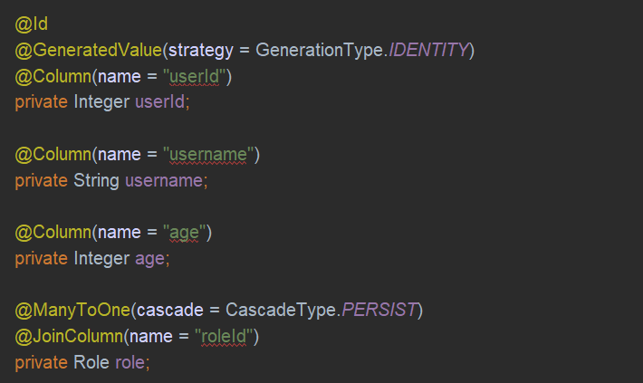
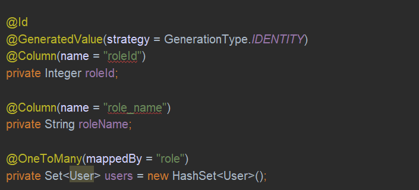

**多对多关联查询**
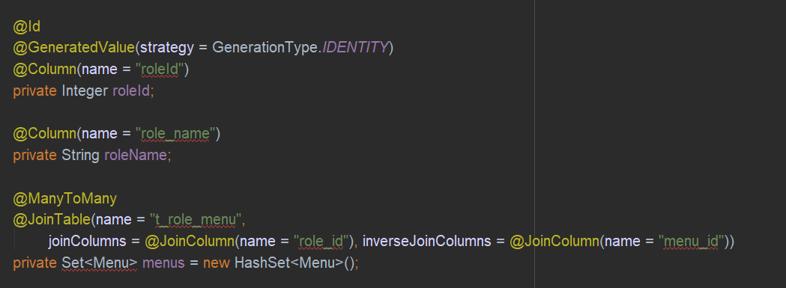
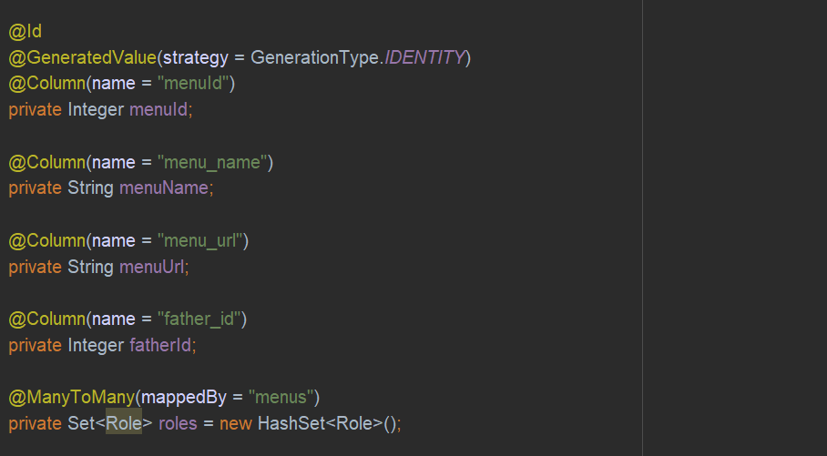
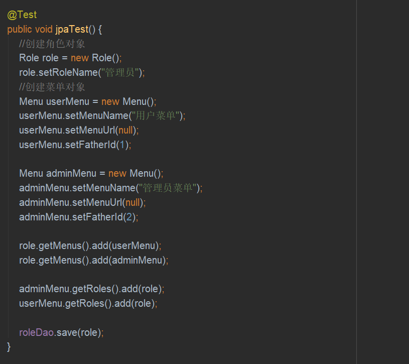