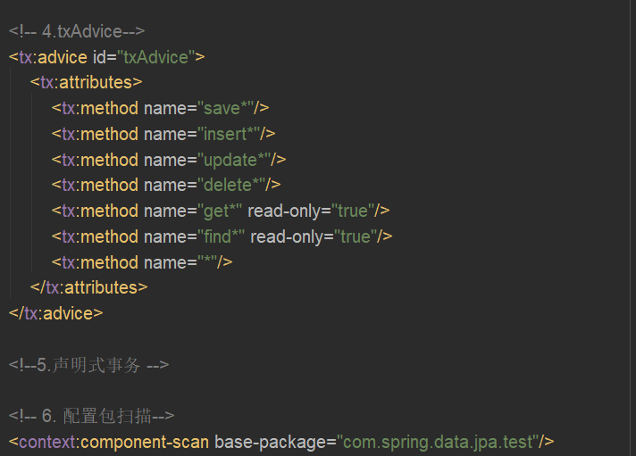

>Spring Data Jpa技术特点：我们只需要定义接口并集成Spring Data Jpa中所提供的接口就可以了，不需要编写接口实现类
 
### Spring整合Spring Data Jpa
**配置文件**  

**DAO接口**  

### Spring Data Jpa接口继承结构

1. JpaRespository、PagingAndSortingRepository、CrudRepository三个接口都添加了@NoRepositoryBean注解，只要添加这个注解，Spring在扫描到有这个注解的接口的时候就不用生成实现类，就不用创建bean对象
2. 我们自定义的IEmployeeRepository接口没有添加这个注解，那么Spring在扫描到这个接口的时候，就会给这个接口创建对象，但是这个接口却没有实现类，那SpringDataJpa就会利用动态代理技术给这个接口自动生成一个实现类，然后进行动态编译、类加载、反射来创建对象，最后保存到Spring容器中，这样就不用自己手动写Dao层实现类也可以获得Dao层接口的对象，然后使用@Autowired进行自动注入了
3. 其实SpringDataJPA内部已经写了一个实现类实现了JPARepository接口，已经实现了JpaRespository、PagingAndSortingRepository、CrudRepository这三个接口中的所有抽象方法，SpringDataJPA自动帮我们生成的实现类会自动：实现IEmployeeRepository接口和继承SimpleJapRepository类，最终我们得到（注入）的那个对象其实本质是SimpleJapRepository类的子类对象
4. 因为SpringDataJPA自动帮我们生成的类继承了SimpleJPARepository类，并且实现了IEmployeeRepository接口，所以创建对象之后就可以调用直接JpaRespository、PagingAndSortingRepository、CrudRepository这三个接口中的所有方法了，因为SimpleJPARepository类已经帮我们将所有抽象方法都实现了

