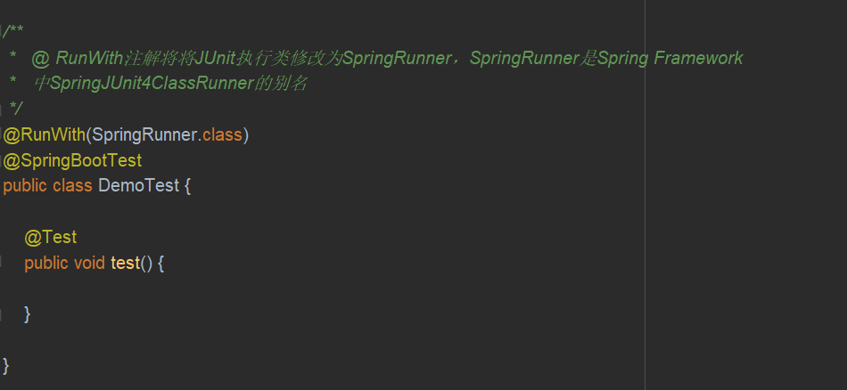
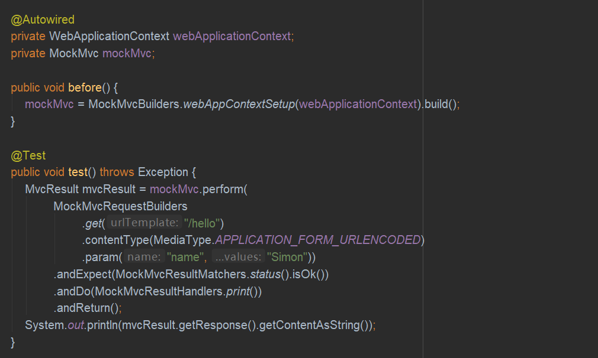

### REST简介
REST是一种Web软件架构风格，它是一种风格，而不是一种标准，匹配或兼容这种架构风格的网络服务成为REST服务。REST服务简洁并且有层次，REST通常基于HTTP、URI和XML以及HTML这些现有的广泛流行的协议和标准。在REST中，资源是由URI来指定的，对资源的增删改查操作可以通过HTTP协议提供的GET、POST、PUT、DELETE等方法来实现。使用REST可以更高效地利用缓存来提高响应速度，同时REST中的通信会话状态由客户端来维护，这可以让不同的服务器处理一系列请求中的不同请求，进而提高服务器的扩展性。在前后端分离项目中，一个设计良好的Web软件架构必然要满足REST风格

### 开发者工具与单元测试
**devtools**  
Spring Boot中提供了一组开发工具spring-boot-devtools，可以提高开发者的工作效率，开发者可以将该模块包含在任何项目中，spring-boot-devtools最方便的地方莫过于热部署了。我们只需添加spring-boot-devtools的相关依赖便可使用了

Spring Boot中使用的自动重启技术设计两个类加载器，一个是baseclassloader，用来加载不会变化的类，例如项目引用第三方的jar；另一个是restartclassloader，用来加载开发者自己写的会变化的类。当项目需要重启时，restartclassloader将被一个新创建的类加载器代替，而baseclassloader则继续使用原来的，这种启动方式要比冷启动块很多，因为baseclassloader已经存在并且已经加载好了

spring-boot-devtools还支持静态文件更新重新、禁用重新和指定文件更新才重启，这些功能可根据实际需要添加至自己的项目中

**单元测试**  

@SpringBootTest注解除了提供Spring TextContext中的常规测试功能之外，还提供了其它特性：提供默认的ContextLoader、自动搜索@SpringBootConfiguration、自定义环境属性、为不同的webEnvironment，模式提供支持，这里的webEnvironment模式主要有4种：
* MOCK，这种模式是当classpath下存在servletAPIS时，就会创建WebApplicationContex并提供一个mockservlet环境；当classpath下存在Spring WebFlux时，则创建ReactiveWebApplicationContext；若都不存在，则创建一个常规的ApplicationContext
* RANDOM_PORT，这种模式将提供一个真实的Servlet环境，使用内嵌的容器，但是端口随机
* DEFINED_PORT，这种模式将提供一个真实的Servlet环境，使用内嵌的容器，但是使用定义好的端口
* NONE，这种模式则加载一个普通的ApplicationContext，不提供任何Servlet环境，这种一般不适用于Web测试
在Spring测试中，开发者一般使用@ContextConfiguration(classes=)或者 @ContextConfiguration(location=)来指定要加载的Spring配置，而在SpringBoot中则不需要这么麻烦，SpringBoot中的@*Test将回去包含测试类的包下查找带有@SpringBootApplication或者@SpringBootConfiguration注解的主配置类@Test注解则用来做junit，junit中的@After、@AfterClass、@Before、@BeforeClass、@Ignore等注解一样可以在这里使用

**Controller测试**  

