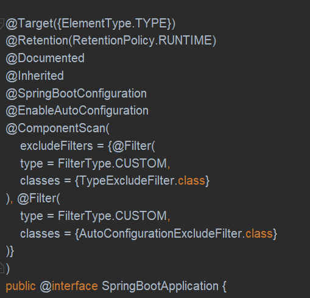
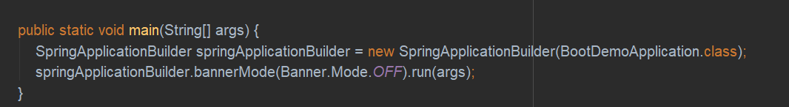
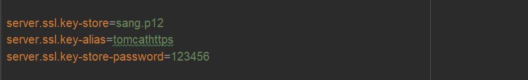
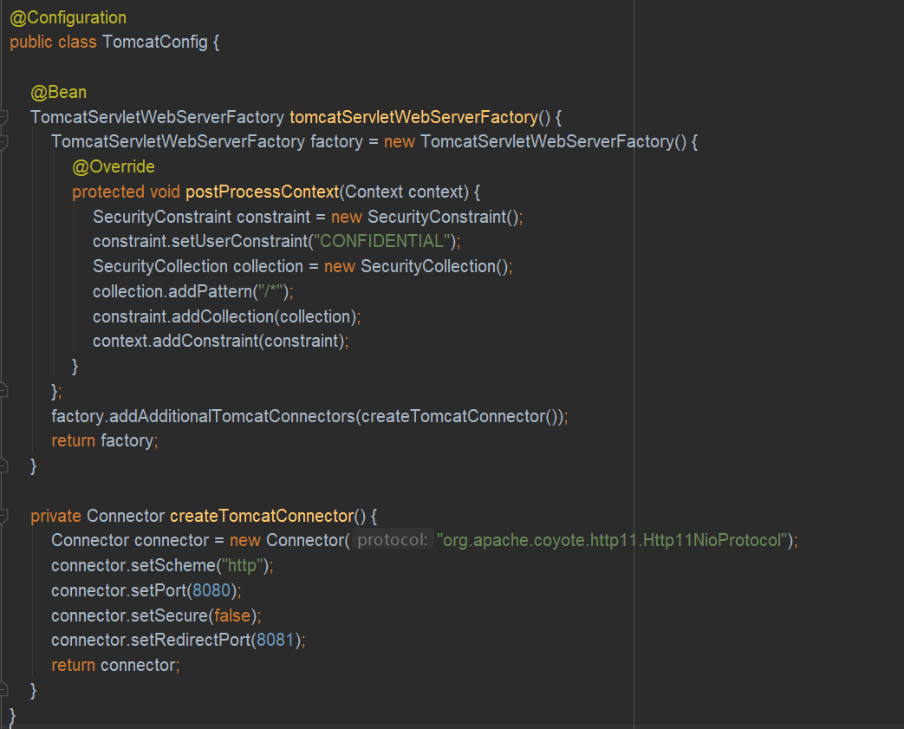

### @SpringBootApplication

    
@SpringBootApplication注解是一个组合注解，主要由3个注解组成：
* @SpringBootConfiguration：表明这是一个配置类，开发者可以在这个类中配置Bean
* @EnableAutoConfiguration：表示开启自动化配置
* @ComponentScan：完成包扫描，默认扫描当前类的同级的包

### banner定制
使用网站生成想要的banner图案，将内容放置在resource下的banner.txt文档中，就可使用自己定制的banner图案也可通过指定的方法启动项目，关闭banner

### Web容器配置
**Tomcat常规配置**   
直接在application.properties中添加配置内容便可对tomcat容器进行一些常规配置，以下为常用的一些配置  
内容：  
* server.port  web容器的端口号
* error.path  项目出错时的错误页面
* session.timeout  session的失效时间，不写时间单位的话默认为秒
* context-path  项目名称，不配置是默认为/
* uri-encoding  Tomcat请求编码
* max-threads Tomcat最大线程数
* basedir  存放Tomcat运行日志和临时文件的目录，不配置则默认使用系统的临时目录

**HTTPS配置**  
若希望自己的项目只允许HTTPS请求访问，只需生成证书并放置于自己的项目之下，并在配置文件中添加相应配置即可

Spring Boot不支持同时在配置中启动HTTP和HTTPS，这时候可以配置请求重定向，将HTTP请求重定向至HTTPS请求

Jetty和Undertow配置  
若想将Tomcat服务器替换为Jetty或Undertow服务器，只需将对应的Maven依赖添加至POM文件即可

### Properties配置
SpringBoot项目中的application.properties可以出现在以下4个位置，并且加载优先级从1到4逐级递减
* 项目根目录的config文件夹中
* 项目根目录下
* classpath下的config文件夹中
* classpath下
若要使用其它的配置文件名，可通过@PropertySource注解指定类所要读取的配置文件，也可在application.properties文件中通过spring.profiles.active属性来指定读取的配置文件

### 类型安全配置属性
Spring提供了@Value注解以及EnvironmentAware接口来将Spring Environment中的数据注入到属性上，Spring Boot对此进一步提出了类型安全配置属性，这样即使在数据量非常庞大的情况下，也可以更加方便的将配置文件中的数据注入Bean中。只需使用@ConfigurationProperties(prefix = "")注解即可

@ConfigurationProperties注解中prefix的属性值表示加载的属性值的前缀
如果配置文件是一个yaml文件，那么可以将数据注入到一个集合中

Spring Boot属性命名十分宽松，如果Bean中的属性是aB，那么配置文件中可以是a_b、a-b、aB或者AB

### 代码示例
[SpringBoot基础配置代码示例](https://gitee.com/CK_Simon/boot-demo/tree/master/chapter)

