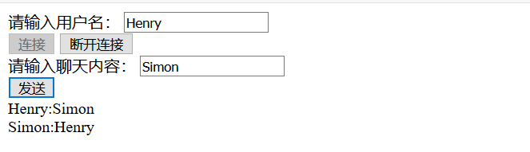
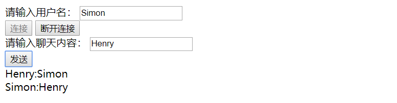
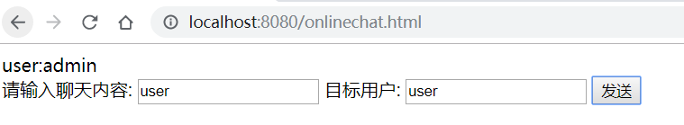
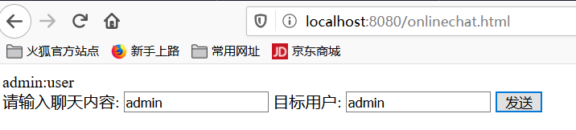

### 为什么需要WebSocket
在HTTP协议中，所有的请求都是由客户端发起的，由服务器进行响应，服务端无法向客户端推送消息，但是在一些需要即时通信的应用中，又不可避免的需要向客户端推送消息，传统的解决方式有如下几种：
1. **轮询**  
客户端在固定时间间隔不断向服务端发送请求，服务端根据是否有最新数据来返回数据内容或空白内容。这种方式实现方便，但客户端每次都要新建HTTP请求，服务端又要处理大量的无用请求，在高并发场景下会严重拖慢服务端的运行效率
2. **长轮询**  
在长轮询中，服务端不是每次都会立即响应客户端的请求，只有在服务端有最新数据的时候才会立即响应客户端的请求，否则客户端会持有这个请求而不返回，知道有新数据时才返回。这种方式可以在一定程度上节省网络资源和服务器资源，但是长轮询并不能一直持续，而且当客户端想要发送新的请求时，还需要断开当前的长轮询
3. **Applet和Flash**  
开发者可以使用Applet和Flash来模拟双全工通信，通过在网页中创建1个像素点大小的Applet或Flash，嵌在网页中，在其中使用Socket进行双向通信。这种方式要求浏览器必须能运行Applet或Flash，而这两个技术也已是明日黄花，即将下架

### WebSocket简介
WebSocket是一个在单个TCP连接上进行双全工通信的的协议，已被W3C定为标准。使用WebSocket可以使得客户端与服务器之间的数据交换变得更加简单，他允许服务端主动向客户端推送数据。在WebSocket协议中，浏览器与服务器之间只需完成一次握手，两者之间就可以之间创建持久性的连接，并进行双向数据传输

WebSocket使用了HTTP/1.1的协议升级特性，一个WebSocket请求首先使用非正常的HTTP请求以特定的模式访问一个URL，这个URL有两种格式，对应HTTP协议中的HTTP和HTTPS，在请求头中有一个Connection:Upgrade字段，表示客户端想要对协议进行升级，另外还有一个Upgrade:websocket字段，表示客户端想要将请求协议升级为WebSocket协议，这两个字段共同告诉服务器客户端想要将连接升级为WebSocket这样一个双全工协议，如果服务端同意协议升级，那么在握手完成之后，文本消息或者其它二进制消息就可以同时再两个方向上进行发送，而不需要关闭和重建连接。此时的客户端和服务端关系是对等的，它们可以互相主动向对方发送消息

**WebSocket主要特点**  
* WebSocket使用时需要先创建连接，这使得WebSocket成为一种有状态的协议，在之后的通信过程中可以省略部分状态信息
* WebSocket连接在端口80（ws）或者443（wss）上创建，与HTTP使用的端口相同，这样，基本上所有的防火墙都不会组织WebSocket连接
* WebSocket使用HTTP协议进行握手，因此它可以自然而然地集成到网络浏览器和HTTP服务器中，不需要额外的成本
* 心跳消息（ping和pong）将被反复的发送，进而保持WebSocket连接一直处于活跃状态
* 使用该协议，当消息启动或者到达的时候，服务端与客户端都可以知道
* WebSocket连接关闭时将发送一个特殊的关闭消息
* WebSocket支持跨域，可以避免AJAX的限制
* HTTP协议要求浏览器将并发连接数限制为每个主机名两个连接，但是当我们使用WebSocket连接时，当握手完成后，该限制就不存在了，因为此时的连接就不再是HTTP连接了
* WebSocket协议支持扩展，用户可以扩展该协议，实现部分自定义的子协议
* 更好的二进制支持以及更好的压缩效果

### Spring Boot整合WebSocket--消息群发
1. 添加依赖
```
<!-- Web Socket相关依赖 -->
<dependency>
    <groupId>org.springframework.boot</groupId>
    <artifactId>spring-boot-starter-websocket</artifactId>
</dependency>
<!-- 以下均是前端库相关依赖 -->
<dependency>
    <groupId>org.webjars</groupId>
    <artifactId>webjars-locator-core</artifactId>
</dependency>
<dependency>
    <groupId>org.webjars</groupId>
    <artifactId>sockjs-client</artifactId>
    <version>1.1.2</version>
</dependency>
<dependency>
    <groupId>org.webjars</groupId>
    <artifactId>stomp-websocket</artifactId>
    <version>2.3.3-1</version>
</dependency>
<dependency>
    <groupId>org.webjars</groupId>
    <artifactId>jquery</artifactId>
    <version>3.4.1</version>
</dependency>
```
2. 配置WebSocket
``` java
@Configuration
@EnableWebSocketMessageBroker //开启WebSocket消息代理
public class WebSocketConfig implements WebSocketMessageBrokerConfigurer {
    @Override
    public void configureMessageBroker(MessageBrokerRegistry registry) {
        //设置消息代理前缀，如果消息前缀是"topic"，就会将消息转发给消息代理（broker），
        //再由消息代理将消息广播给当前连接的客户端
        registry.enableSimpleBroker("/topic");
        //配置一个或多个前缀，通过这些前缀过滤出需要被注解方法处理的消息
        registry.setApplicationDestinationPrefixes("/app");
    }
    @Override
    public void registerStompEndpoints(StompEndpointRegistry registry) {
        //定义一个前缀为"/chat"的的endpoint，并开启sockjs支持，sockjs可以解决浏览器对
        //WebSocket的兼容性问题
        registry.addEndpoint("/chat").withSockJS();
    }
}
```
3. 定义Controller
```java
@Controller
public class GreetingController {
    //@MessageMapping("/hello")注解的方法将用来接收"/app/hello"路径发送来的消息，在注解
    //方法对消息进行处理后，再将消息转发到@SendTo定义的路径上，而@SendTo路径是一个
    // 前缀为"/topic"的路径，因此该消息将被转交给消息代理broker，再由broker进行广播
    @MessageMapping("/hello")
    @SendTo("/topic/greeting")
    public Message greeting(Message message) throws Exception {
        System.out.println(message.getContent());
        return message;
    }
}

public class Message {
    private String name;
    private String content;
    //getter和setter
}
```
4. 前端页面
```html
<!DOCTYPE html>
<html lang="en">
<head>
    <meta charset="UTF-8">
    <title>群聊</title>
    <script src="/webjars/jquery/jquery.min.js"></script>
    <script src="/webjars/sockjs-client/sockjs.min.js"></script>
    <script src="/webjars/stomp-websocket/stomp.min.js"></script>
    <script src="/app.js"></script>
</head>
<body>
    <div>
        <label for="name">请输入用户名：</label>
        <input type="text" id="name" placeholder="用户名">
    </div>
    <div>
        <button id="connect" type="button">连接</button>
        <button id="disconnect" type="button" disabled="disabled">断开连接</button>
    </div>
    <div id="chat" style="display:none;"></div>
    <div>
        <label for="content">请输入聊天内容：</label>
        <input type="text" id="content" placeholder="聊天内容">
    </div>
    <button id="send" type="button">发送</button>
    <div id="greeting">
        <div id="conversation" style="display: none">群聊进行中...</div>
    </div>
</body>
</html>
```
```js
var stompClient = null;
function setConnected(connected) {
    $("#connect").prop("disabled", connected);
    $("#disconnect").prop("disabled", !connected);
    if (connected) {
        $("#conversation").show();
        $("#chat").show();
    } else {
        $("#conversation").hide();
        $("#chat").hide()
    }
    $("#greeting").html("");
}
//建立一个WebSocket连接
function connect() {
    if (!$("#name").val()) {
        return;
    }
    var socket = new SockJS("/chat");
    stompClient = Stomp.over(socket);
    stompClient.connect({}, function (frame) {
        setConnected(true);
        stompClient.subscribe("/topic/greeting", function (greeting) {
            showGreeting(JSON.parse(greeting.body));
        });
    });
}
function disconnect() {
    if (stompClient !== null) {
        stompClient.disconnect();
    }
    setConnected(false);
}
function sendName() {
    stompClient.send("/app/hello", {},
        JSON.stringify({"name":$("#name").val(), "content":$("#content").val()}));
}
function showGreeting(message) {
    $("#greeting").append("<div>" + message.name + ":" + message.content + "</div>");
}
$(function () {
    $("#connect").click(function () {
        connect();
    })
    $("#disconnect").click(function () {
        disconnect();
    })
    $("#send").click(function () {
        sendName();
    })
});
```
5. 测试  
使用两个不同的浏览器进行登录和发送消息



### SpringBoot整合WebSocket--消息点对点发送
1. 添加依赖
```
<dependency>
    <groupId>org.springframework.boot</groupId>
    <artifactId>spring-boot-starter-security</artifactId>
</dependency>
```

2. 配置Spring Security
```java
@Configuration
public class WebSecurityConfig extends WebSecurityConfigurerAdapter {
    @Bean
    PasswordEncoder passwordEncoder() {
        return new BCryptPasswordEncoder();
    }
    @Override
    protected void configure(AuthenticationManagerBuilder auth) throws Exception {
        auth.inMemoryAuthentication().withUser("admin")
                // 123的加密结果
                .password("$2a$10$KW1j.wvEvRMAH6l9J4VDw.VzADBpOyV0MvyXUHYGBgIUTnGHjpPKi")
                .roles("admin")
                .and()
                .withUser("user")
                .password("$2a$10$KW1j.wvEvRMAH6l9J4VDw.VzADBpOyV0MvyXUHYGBgIUTnGHjpPKi")
                .roles("user");
    }
    @Override
    protected void configure(HttpSecurity http) throws Exception {
        http.authorizeRequests()
                .anyRequest().authenticated()
                .and()
                .formLogin().permitAll();
    }
}
```

3. 改造WebSocket配置  
添加一个broker前缀
```java
registry.enableSimpleBroker("/topic", "/queue");
```

4. 配置Controller和实体类
```java
@Controller
public class GreetingController {
    @Autowired
    private SimpMessagingTemplate simpMessagingTemplate;
    @MessageMapping("/chat")
    public void chat(Principal principal, Chat chat) {
        String from = principal.getName();
        chat.setFrom(from);
        simpMessagingTemplate.convertAndSendToUser(chat.getTo(), "/queue/chat", chat);
    }

}

public class Chat {

    private String to;
    private String from;
    private String content;
    //getter和setter
}

```

5. 前端页面和js配置
```HTML
<!DOCTYPE html>
<html lang="en">
<head>
    <meta charset="UTF-8">
    <title>单聊</title>
    <script src="/webjars/jquery/jquery.min.js"></script>
    <script src="/webjars/sockjs-client/sockjs.min.js"></script>
    <script src="/webjars/stomp-websocket/stomp.min.js"></script>
    <script src="/chat.js"></script>
</head>
<body>
    <div id="chat">
        <div id="chatsContent">
        </div>
        <div>
            请输入聊天内容:
            <input type="text" id="content" placeholder="聊天内容">
            目标用户:
            <input type="text" id="to" placeholder="目标用户">
            <button id="send" type="button">发送</button>
        </div>
    </div>
</body>
</html>
```

```JS
var stompClient = null;
function content() {
    var socket = new SockJS("/chat");
    stompClient = Stomp.over(socket);
    stompClient.connect({}, function (frame) {
        stompClient.subscribe("/user/queue/chat", function (chat) {
            showGreetings(JSON.parse(chat.body));
        });
    });
}
function sendMsg() {
    stompClient.send("/app/chat", {},
        JSON.stringify({"content":$("#content").val(), "to":$("#to").val()}))
}
function showGreetings(message) {
    $("#chatsContent").append("<div>" + message.from + ":" + message.content + "</div>");
}
$(function () {
    content();
    $("#send").click(function () {
        sendMsg();
    })
})
```

6.测试  
使用两个不同的浏览器登录，并向对方发送消息

