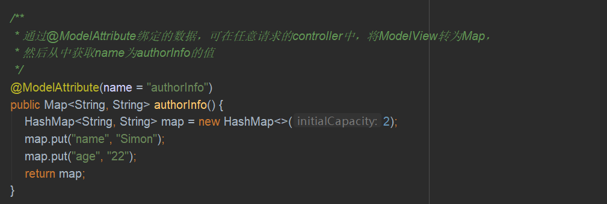

### 返回JSON数据
Spring Boot中可使用@RestController注解，这个注解由@Controller和@ResponseBody组合而成。使用这种方式，那么对于字段忽略、日期格式化等常见需求都可以通过注解解决。Spring Boot中的JSON转化器由MappingJackson2HttpMessageConverter实现，我们也可以根据需求自定义转换器

### 静态资源访问
Spring Boot的静态资源位置一共有5个，优先级依次降低：
* classpath:/META-INF/resources/
* classpath:/resources/
* classpath:/static/
* classpath:/public/
* /

### 文件上传
Java中的文件上传一共涉及两个组件，一个是CommonsMultipartResolver，另一个是StandardServletMultipartResolver，其中CommonsMultipartResolver使用commons-fileupload来处理multipart请求，而StandardServletMultipartResolver基于Servlet3.0来处理multipart请求的，因此若使用StandardServletMultipartResolver，则不需要添加额外的jar包。Tomcat7.0就开始支持Servlet3.0了，而Spring Boot2.0就内嵌的Tomcat就已经是8.5的了，因此可以直接使用StandardServletMultipartResolver。而在Spring Boot提供的文件上传自动化配置类MultipartAutoConfiguration中，默认也是采用StandardServletMultipartResolver

**单文件上传示例**  

文件上传常用配置
* spring.servlet.multipart.enabled=true  是否开启文件上传功能，默认为true
* spring.servlet.multipart.file-size-threshold=0  文件写入磁盘的阈值，默认为0
* spring.servlet.multipart.location=D:\\temp  上传文件的临时保存位置
* spring.servlet.multipart.max-file-size=1MB  上传单个文件的最大值，默认为1MB
* spring.servlet.multipart.max-request-size=10MB  多文件上传的最大值，默认为10MB
* spring.servlet.multipart.resolve-lazily=false  是否延迟解析，默认为false

**多文件上传示例**  

### @ControllerAdvice
顾名思义，@ControllerAdvice就是@Controller的增强版，@ControllerAdvice一般用来处理全局数据，一般搭配@ExceptionHandler、@ModelAttribute以及@InitBinder使用

**全局异常处理**  
@ControllerAdvice使用最常见的场景就是全局异常处理。只需在系统中定义一个类，添加@ControllerAdvice注解即可。当系统启动时，该类就会被扫描到Spring容器中，然后定义该类的方法，需要方法上添加@ExceptionHandler注解，并添加异常捕获类型，便可使用该方法处理该类型的异常。方法的参数可以有异常实例、HttpServletResponse以及HttpServletRequest、Model等，返回值可以是一段JSON、一个ModelAndView、一个逻辑视图名等

**全局异常处理代码示例**  

**添加全局数据**  
@ControllerAdvice是一个全局数据处理组件，使用@ModelAttribute注解，则可在全局获取该变量

**添加全局数据代码示例**  

请求参数预处理
@ControllerAdvice结合InitBindler还能实现请求参数预处理，即将表单中的数据绑定到实体类上进行一些额外的处理，避免参数混淆（规范命名比啥都重要）

### 自定义错误页
Spring Boot返回错误页面的流程默认是在error目录下查找4xx、5xx的文件作为错误视图，找不到时会使用error作为默认的错误视图名，如果名为error的视图也找不到，那么就会使用Spring Boot提供的错误页面

**简单配置**  
如果不需要向用户展示详细的错误信息，那么可以把错误信息定义为静态页面，直接在/resource/static目录下创建error目录，然后在error目录中创建错误展示页面。错误展示页面的命名规则有两种：一种是4xx.html、5xx.html；另一种是直接用响应码命名文件，例如404.html、500.html。第二章命名方式划分得更细，当出错时，不同的错误会展示不同得错误页面

如果使用静态HTML页面的话，则无法向用户展示具体的错误信息，若使用视图模板技术，则可以向用户展示更多的错误信息，动态页面模板默认处于/resource/template目录下

若用户定义了多个错误页面，则响应码.html页面的优先级高于4xx.html、5xx.html页面的优先级；动态页面的优先级高于静态静态页面的优先级，若/resource/static和/resource/template下同时定义了4xx.html页面，则优先展示/resource/template下的4xx.html页面

**自定义Error数据**  
Spring Boot返回的Error信息一共有5条，分别是timestamp、status、error、message以及path，开发人员也可自定义自己的错误信息，只需继承DefaultErrorAttributes并添加至Spring容器即可

**自定义Error数据代码示例**  

**自定义Error视图**  
自定义Error视图的实现过程与自定义Error数据类似，只需提供自己的ErrorViewResolver，并在resource中添加对应的视图即可

**自定义Error视图代码示例**  

**完全自定义**  
自定义Error数据和自定义Error视图都是对BasicErrorController类中的某个环节进行修补，如果开发者没有提供自己的ErrorController，则Spring Boot提供BasicErrorController作为默认的ErrorController。我们也可提供自定义的ErrorController，提供自定义ErrorController有两种方式：一种是实现ErrorController接口，一种是直接继承BasicErrorController类。ErrorController只提供了一个待实现的方法，而BasicErrorController已经实现了很多功能，因此大多数情况下都选择第二种方式

**完全自定义代码示例**  

### CORS支持
CORS是由W3C制定的一种跨域资源共享技术标准，其目的就是为了解决前端的跨域请求。Spring Boot支持跨域有两种方式，一种是细粒度的，在对应的方法上添加@CrossOrigin注解，另一种是粗粒度的全局配置，使用方法来配置

**跨域支持方式一**  

**跨域支持方式二**  

### 注册拦截器
注册拦截器主要分为两个步骤，第一步是编写拦截器类，实现HandleInterceptor接口，实现相关方法，然后定义配置类进行拦截器的相关配置

**编写拦截器类**  

**配置拦截器**  

### 路径映射
一般情况下，使用了页面模板后，用户需要通过控制器才能访问一些页面。有一些页面需要在控制器中加载数据，然后渲染，才能显示出来；还有一些页面在控制器中不需要加载数据，只是完成简单的跳转，对于这种页面，可以直接配置路径映射，提供访问速度

**路径映射代码示例**

### 配置AOP
AOP常见概念：
* Joinpoint（连接点）：类里面可以被增强的方法即为连接点
* Pointcut（切入点）：对JoinPoint进行拦截的定义即为切入点
* Advice（通知）：拦截到Jointpoint之后要做的事情就是通知
* Aspect（切面）：Pointcut和Advice的结合
* Target（目标对象）：要增强的类成为Target

AOP类型注解：
* @Before：前置通知注解，该方法会在目标方法执行之前执行，通过JoinPoint参数可以获取目标方法的方法名、修饰符等信息
* @After：后置通知注解
* @AfterReturning：返回通知注解，在该方法中可以获取目标方法的返回值。@AfterReturning注解的returning参数值是指返回值的变量名，对应方法的参数。注意，在方法参数中定义了result的类型为Object，表示目标方法的返回值可以是任意类型，若result参数的类型为Long，则该方法只能处理目标方法返回值为Long的情况
* @AfterThrowing：异常通知注解
* @Around：环绕通知注解，环绕通知是所有通知里功能最为强大的通知，可以实现前置通知、后置通知、异常通知以及返回通知的功能。目标方法进入返回通知后，通过调用PrecedingJointPoint对象的preceed方法使目标方法继续执行，开发者可以在此修改目标方法的执行参数、返回值等，并且可以在此处理目标方法的异常

**AOP代码示例**  

**Spring Boot整合Web开发代码示例**  
[SpringBoot整合Web开发代码示例](https://gitee.com/CK_Simon/boot-demo/tree/master/chapter-2)

