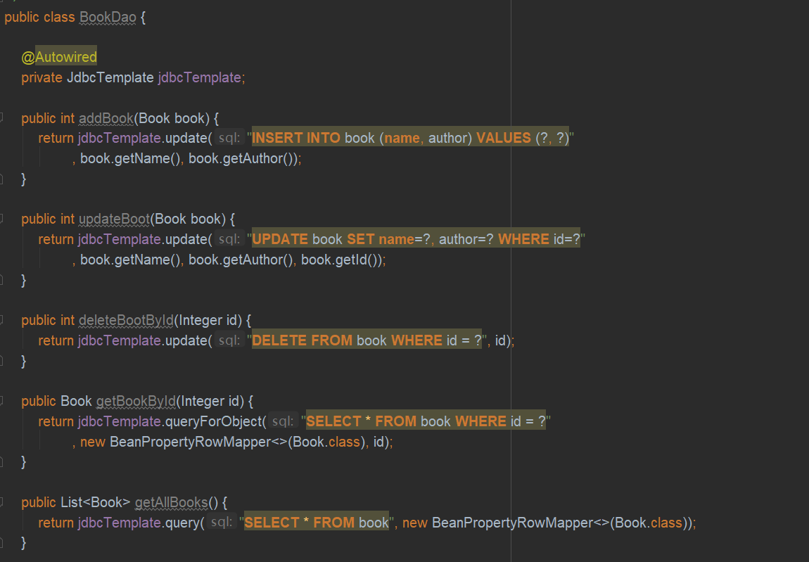
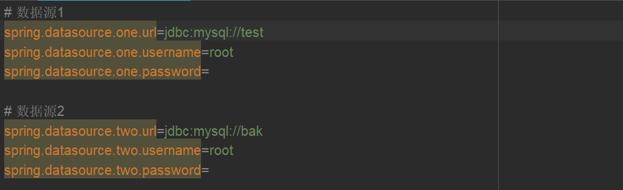
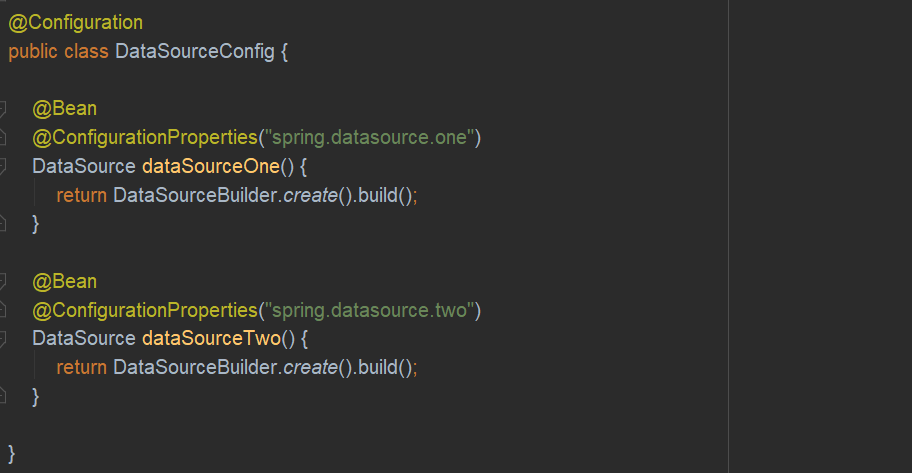
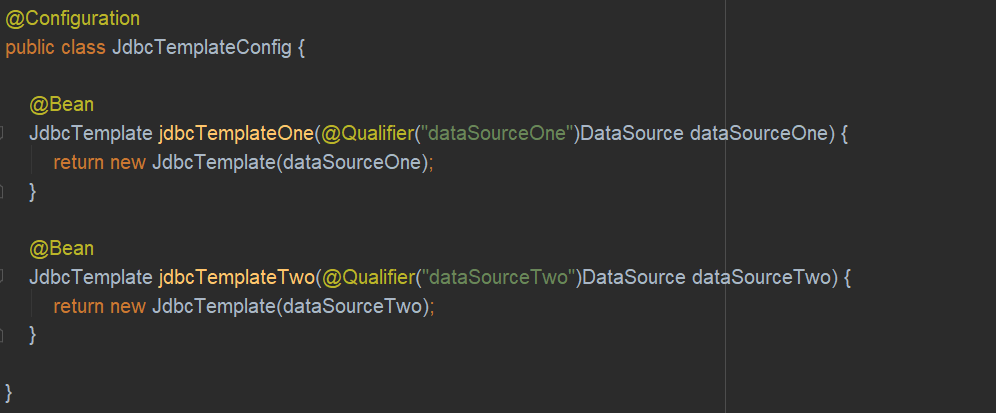
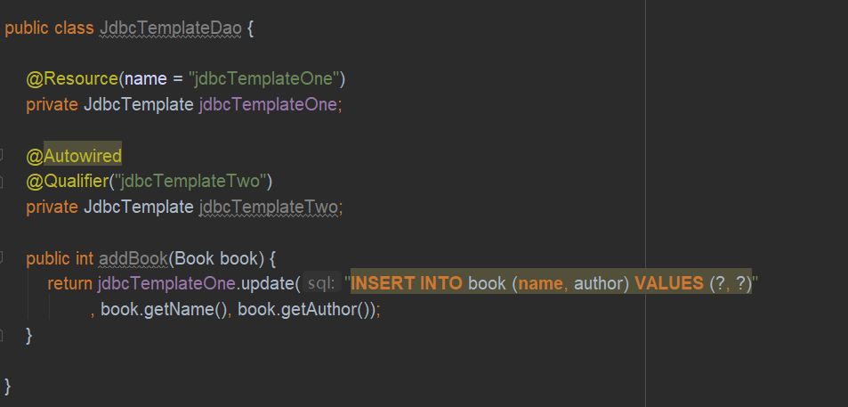
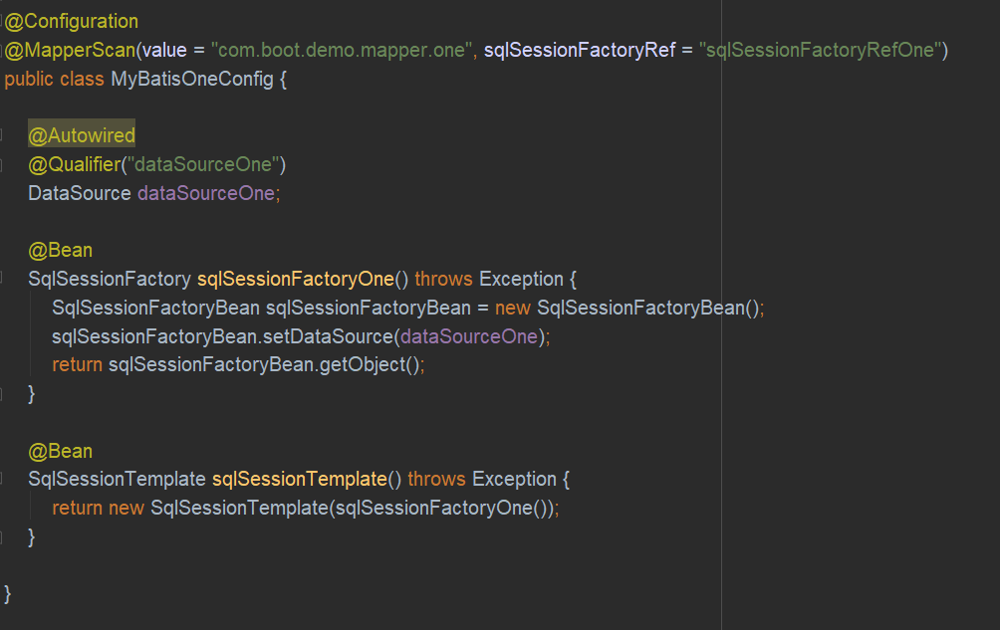
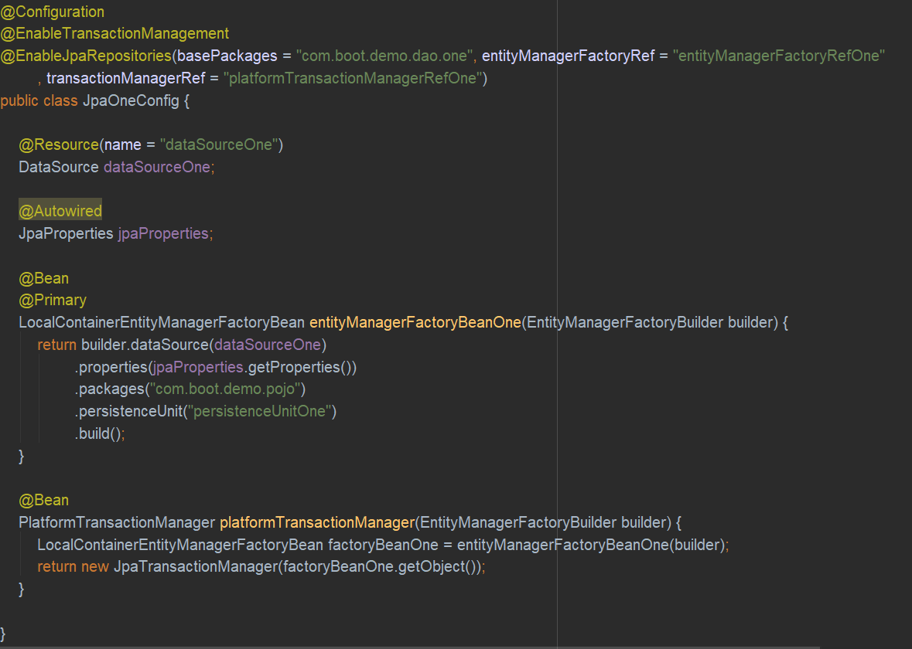

### 整合JdbcTemplate（注：除JdbcTemplate之外，其余MyBatis和Spring Data均有详细教程）
JdbcTemplate是Spring提供的一套JDBC模板框架，利用AOP技术来解决直接使用JDBC时大量重复代码的问题。JdbcTemplate虽然没有MyBatis那么灵活，但是比起直接使用JDBC要方便很多

**整合JdbcTemplate代码示例**  

**Jdbc多数据源配置（使用不同数据源的JdbcTemplate）**  

**MyBatis多数据源配置（不同的Mapper指定不同的数据源）**  

**SpringDataJpa多数据源配置（不同的Repository指定不同的数据源）**

**Spring Boot整合持久层技术代码示例**  
[SpringBoot整合持久层技术代码示例](https://gitee.com/CK_Simon/boot-demo/tree/master/chapter-3)

