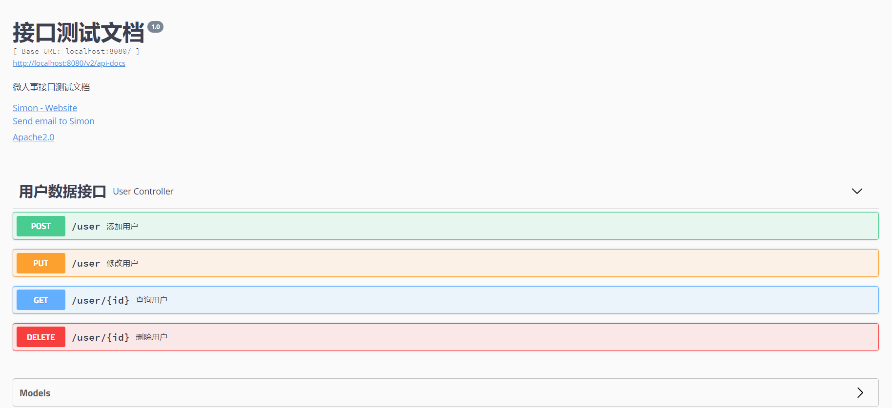

### Swagger2简介
在前后端分离开发中，为了减少与其它团队的沟通成本，一般构建一份RESTful API文档来描述所有的接口信息，但是这种做法有很大的弊端：
* 接口众多，编写RESTful API接口文档工作量巨大
* 维护不方便，一旦接口发生变化，就要修改文档
* 接口测试不方便，一般只能借助第三方工具来测试

Swagger2是一个开源软件框架，可以帮助开发人员设计、构建、记录和使用RESTful Web服务，它将代码和文档融为一体，可以完美解决上面描述的问题，是开发人员将大部分精力集中到业务中，而不是繁杂琐碎的文档中

### 整合Spring Boot
1. 添加依赖
```
<dependency>
    <groupId>org.springframework.boot</groupId>
    <artifactId>spring-boot-starter-web</artifactId>
</dependency>
<dependency>
    <groupId>io.springfox</groupId>
    <artifactId>springfox-swagger2</artifactId>
    <version>2.9.2</version>
</dependency>
<dependency>
    <groupId>io.springfox</groupId>
    <artifactId>springfox-swagger-ui</artifactId>
    <version>2.9.2</version>
</dependency>
```

2. 配置Swagger2
```java
@Configuration
@EnableSwagger2  //开启Swagger2
public class SwaggerConfig {
    @Bean
    Docket docket() {
        return new Docket(DocumentationType.SWAGGER_2)
                .select()
                // 要扫描的Controller的位置
                .apis(RequestHandlerSelectors.basePackage("com.boot.demo.controller"))
                .paths(PathSelectors.any())
                .build().apiInfo(new ApiInfoBuilder()
                // 构建文档的基本信息
                .description("微人事接口测试文档")
                .contact(new Contact("Simon"
                        , "https://gitee.com/CK_Simon/boot-demo/tree/master/chapter-10"
                        , "XX@qq.com"))
                .version("1.0")
                .title("接口测试文档")
                .license("Apache2.0")
                .licenseUrl("http://www.apache.org/license/LICENSE-2.0")
                .build());
    }
}
```

3. 实体类
```java
@ApiModel(value = "用户实体类", description = "用户信息描述类")  //描述类信息
public class User {
    @ApiModelProperty(value = "用户名") // 描述参数信息
    private String username;
    @ApiModelProperty(value = "用户地址")
    private String address;
    // getter和setter
}
```

4. Controller接口
```java
@RestController
@Api(tags = "用户数据接口") // 描述Controller信息
public class UserController {
    @ApiOperation(value = "查询用户", notes = "根据id查询用户") // 描述方法的基本信息
    // 用以描述方法的参数
    @ApiImplicitParam(paramType = "path", name = "id", value = "用户id", required = true)
    @GetMapping("/user/{id}")
    public String getUserById(@PathVariable Integer id) {
        return "/user/" + id;
    }

    // 对响应结果的描述
    @ApiResponses({
            @ApiResponse(code = 200, message = "删除成功"),
            @ApiResponse(code = 500, message = "删除失败")
    })
    @ApiOperation(value = "删除用户", notes = "通过id删除用户")
    @DeleteMapping("/user/{id}")
    public Integer deleteUserById(@PathVariable Integer id) {
        return id;
    }

    @ApiOperation(value = "添加用户", notes = "添加一个用户，传入用户名和地址")
    @ApiImplicitParams({
            @ApiImplicitParam(paramType = "query", name = "username", value = "用户名"
                , required = true, defaultValue = "Simon"),
            @ApiImplicitParam(paramType = "query", name = "address", value = "用户地址"
                , required = true, defaultValue = "深圳")
    })
    @PostMapping("/user")
    public String addUser(@RequestParam String username, @RequestParam String address) {
        return username + ":" + address;
    }

    @ApiOperation(value = "修改用户", notes = "修改用户，传入用户信息")
    @PutMapping("/user")
    public String updateUser(@RequestBody User user) {
        return user.toString();
    }

    @GetMapping("/ignore") // 不对该接口生成文档
    @ApiIgnore
    public void ignoreMethod() {
    }
}
```

### 效果图


### Spring Boot整合Swagger2代码示例
[SpringBoot整合Swagger2代码示例](https://gitee.com/CK_Simon/boot-demo/tree/master/chapter-10)