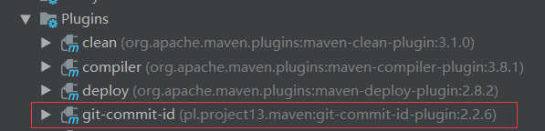

>当一个Spring Boot项目运行时，开发者需要对Spring Boot项目进行实时监控，获取项目的运行情况，在项目出错时能够实现自动报警等。Spring Boot提供了actuator来帮助开发者获取应用程序的实时运行数据。开发者可以选择使用HTTP端点或JMX来管理和监控应用程序，获取应用程序的运行数据，包括健康状况、应用信息、内存使用情况等

### 端点配置
**开启端点**  
在Spring Boot中开启应用监控十分简单，只需导入spring-boot-starter-actuator相关依赖即可。开发者可以使用actuator中的端点对应用进行监控或者与应用交互，Spring Boot默认包含许多端点

Spring Boot默认包含的端点
| 端点      | 端点描述                                                                     | 是否开启 |
| ----------- | -------------------------------------------------------------------------------- | -------- |
| autidevents | 展示当前应用程序的审计事件信息                                                | Yes      |
| beans       | 展示所有Spring Bean的信息                                                    | Yes      |
| conditions  | 展示一个自动配置类的使用报告，该报告展示所有自动配置类及它们被使用和未使用的原因 | Yes      |
| configprops | 展示所有@ConfigurationProperties的列表                                       | Yes      |
| env         | 展示系统运行环境信息                                                         | Yes      |
| flyway      | 展示数据库迁移路径                                                           | Yes      |
| health      | 展示应用程序的健康信息                                                       | Yes      |
| httptrace   | 展示trace信息（默认展示最新的100条http请求）                                  | Yes      |
| info        | 展示应用的定制信息，这些定制信息以info开头                                    | Yes      |
| loggers     | 展示并修改日志的应用配置                                                     | Yes      |
| liquibase   | 展示任何Liquibase数据库迁移路径                                              | Yes      |
| metrics     | 展示应用程序度量信息                                                         | Yes      |
| mappings    | 展示所有@RequestMapping路径的集合列表                                        | Yes      |
| scheduledtasks| 展示应用的所有定时任务                                                     | Yes      |
| shutdown    | 远程关闭应用接口                                                             | No       |
| sessions    | 展示并操作Spring Session会话                                                 | Yes      |
| threaddump  | 展示线程活动的快照                                                           | Yes      |

Web应用包含另外的端点
| 端点      | 端点描述                                                                     | 是否开启 |
| ----------- | -------------------------------------------------------------------------------- | -------- |
| headdump   | 返回一个Gzip压缩的hprof堆转储文件              | Yes      |
| jolokia    | 展示通过HTTP暴露的JMX beans                   | Yes      |
| logfile    | 返回日志文件内容                              | Yes      |
| prometheus | 展示一个可以被prometheus服务器抓取的metrics数据| Yes      |

这些端点大部分都是默认开启的，只有shutdown端点默认未开启，如果需要开启，可以在application.properties中通过如下配置开启：
```
management.endpoint.shutdown.enabled=true
```

如果开发者不想暴露这么多端点，那么可以关闭默认的配置，然后手动指定需要开启哪些端点，如下配置表示关闭所有端点，只开启info端点：
```
management.endpoints.enabled-by-default=false
management.endpoint.info.enabled=true
```

**暴露端点**  
由于有的端点包含敏感信息，因此端点启用和端点暴露是两回事

端点的默认暴露情况
| 端点      | 端点描述                                                                     | 是否开启 |
| ----------- | -------------------------------------------------------------------------------- | -------- |
| autidevents | Yes              | No      |
| beans       | Yes              | No      |
| conditions  | Yes              | No      |
| configprops | Yes              | No      |
| env         | Yes              | No      |
| flyway      | Yes              | No      |
| health      | Yes              | Yes     |
| httptrace   | Yes              | No      |
| info        | Yes              | Yes     |
| loggers     | Yes              | No      |
| liquibase   | Yes              | No      |
| metrics     | Yes              | No      |
| mappings    | Yes              | No      |
| scheduledtasks| Yes            | No      |
| shutdown    | Yes              | No      |
| sessions    | Yes              | No      |
| threaddump  | Yes              | No      |
| headdump    | N/A              | No      |
| jolokia     | N/A              | No      |
| logfile     | N/A              | No      |
| prometheus  | N/A              | No      |

在Web应用中，默认只有health和info两个端点暴露，开发者可以在配置文件中自定义需要暴露哪些端点
```
# 暴露mappings和metrics两个端点
management.endpoints.web.exposure.include=mappings, metrics

# 暴露所有端点
management.endpoints.web.exposure.include=*
```

YAML配置文件中暴露所有端点
```
management:
  endpoints:
    web:
      exposure:
        include: "*"
```

此时启动项目，并非所有的端点都在启动日志中展示出来，因为部分端点需要导入相关依赖才能启动，比如session端点需要导入Spring Session相关依赖。对于已经展示出来的端点，开发者可以直接访问接口 http://localhost:8080/actuator/端点名 来查看相关信息

**端点保护**  
如果这些端点需要对外提供服务，那么最好将这些端点保护起来，若classpath中存在Spring Security，则默认使用Spring Security进行保护
```java
@Configuration
public class ActuatorSecurity extends WebSecurityConfigurerAdapter {
    @Override
    protected void configure(HttpSecurity http) throws Exception {
        // 对于所有得端点都需要ADMIN用户才能访问，并添加httpBasic验证
        http.requestMatcher(EndpointRequest.toAnyEndpoint())
                .authorizeRequests()
                .anyRequest().hasRole("ADMIN")
                .and()
                .httpBasic();
    }
}
```

**端点响应缓存**  
对于一些不带参数得端点请求会自动进行缓存，开发者可通过如下方式配置缓存时间
```
# 端点缓存时间为100S，如果要配置其它端点，将beans改为端点名称即可
management.endpoint.beans.cache.time-to-live=100ms
```

::: warning
如果端点添加了Spring Security保护，此时Principal会被视为端点得输入，此时端点响应将不被缓存
:::

**路径映射**  
默认情况下，所有的端点都暴露在"/actuator"路径下，开发者可以对端点路径进行定制
```
# 将/actuator改为/
management.endpoints.web.base-path=/
# 将health改为healthy
management.endpoints.web.path-mapping.health=healthy
```

**CORS支持**  
所有端点都默认没有开启跨域，开发者通过如下配置快速开启CORS支持
```
# 允许端点处理来自http://localhost:8081的请求，允许的请求方法为GET或POST
management.endpoints.web.cors.allowed-origins=http://localhost:8081
management.endpoints.web.cors.allowed-methods=GET, POST
```

### 健康信息
**展示健康信息详情**  
开发者可以通过查看健康信息来获取应用的运行数据，进而提早发现应用问题，提早解决，避免造成损失。默认情况下，开发者只能获取status信息，这是因为detail信息默认不显示，开发者可以通过management.health.show-detail属性来配置detail信息的显示策略，该属性的取值一共有3种：
* never：即不显示detail信息，默认即此
* when-authorized：details信息只展示给认证用户，即用户登录后可以查看details信息，未登录则不能查看，另外还可以通过management.endpoint.health.roles属性配置要求的角色，如果不配置，那么任何用户角色登录后都可查看details信息，配置了则只有指定的用户角色登录后才可查看details信息
* always：将details展示给所有用户

**健康指示器**  
Spring Boot会根据classpath中依赖的添加情况来自动添加一些HealthIndicators  
| 名字                       | 描述                                     |
| ---------------------------- | ------------------------------------------ |
| CassandraHealthIndicator     | 检查Cassandra数据库状况             |
| DiskSpaceHealthIndicator     | 低磁盘空间检查                      |
| DataSourceHealthIndicator    | 检查是否可以从DataSource获取一个Connection |
| ElasticsearchHealthIndicator | 检查Elasticsearch集群状况            |
| InfluxDbHealthIndicator      | 检查InfluxDb状况                       |
| JmsHealthIndicator           | 检查Jms消息代理状况                |
| MailHealthIndicator          | 检查邮件服务器状况                |
| MongoHealthIndicator         | 检查MongoDB数据库状况               |
| Neo4jHealthIndicator         | 检查Neo4j服务器状况                 |
| RabbitHealthIndicator        | 检查Rabbit服务器状况                |
| RedisHealthIndicator         | 检查Redis服务器状况                 |
| SolrHealthIndicator          | 检查Solr服务器状况                  |

如果项目中存在相关的依赖，那么列表中对应的HealthIndicator将会被自动配置，例如在pom.xml中添加了Redis依赖，此时访问health端点就将返回Redis的相关信息。若开发者不需要这么多的HealthIndicator，则可以通过如下配置关闭所有的HealthIndicator自动配置：
```
management.health.defaults.enabled=false
```

**自定义HealthInfo**  
除了Spring Boot自动收集的这些HealthInfo信息之外，开发者也可以自定义HealthInfo，只需要实现HealthIndicator接口即可：
```java
@Component
public class MyHealthInfo implements HeadIndicator {
  @Override
  public Health health() {
    // checkNetwork是一个检查网络连接的方法，up和down分别对应UP和DOWN两种常见状态
    if (checkNetwork()) {
      return Health.up().withDetail("message", "网络连接正常").build();
    }
    return Health.down().withDetail("message", "网络连接异常").build();
  }
}
```
::: tip
默认的响应状态一共有4种，定义在OrderedHealthAggregator，分别是DOWN、OUT_OF_SERVICE、UP、UNKNOWN，如果开发者想增加响应状态，可以自定义类继承自HealthAggregator，或者在application.properties种通过management.health.status.order属性进行配置
:::

如果开发者想要增加响应状态FATAL，在application.properties种增加如下配置：
```
management.health.status.order=FATAL,DOWN,OUT_OF_SERVICE,UP,UNKNOWN
```
配置完成后，就可以在health方法中返回自定义的状态了
```java
@Component
public class MyHealthInfo implements HeadIndicator {
  @Override
  public Health health() {
    if (checkNetwork()) {
      return Health.status("FATAL").withDetail("message", "网络连接正常").build();
    }
  }
}
```

此时虽然返回的status为FATAL，但是HTTP响应码为200，在默认的4种响应状态中，DOWN、OUT_OF_SERVICE的HTTP响应码为503，UP、UNKNOWN的HTTP响应码为200，如果开发者相对自定义的响应状态指定响应码，添加如下配置即可：
```
management.health.status.http-mapping.FATAL=503
```

### 应用信息
应用信息就是通过/actuator/info接口获取到的信息，主要包含三大类：自定义信息、Git信息以及项目构建信息

**自定义信息**
自定义信息既可以在配置文件中添加，也可以在java代码中添加，在配置文件中添加是指在application.properties中手动定义以info开头的信息
```
info.app.encoding=@project.build.sourceEncoding@
info.app.javaSource=@java.version@
```
::: tip
@...@表示引用maven中的定义
:::

在java代码中添加只需自定义类继承InfoContributor，然后实现该类中的contribute方法即可
```java
@Component
public class MyInfo implements InfoContributor {
  @Override
  public void contribute(Info.Builder builder) {
    Map<String, String> info = new HashMap<>();
    info.put("encoding", "UTF-8");
    info.put("javaSource", "1.8.0");
    builder.withDetail("app", info);
  }
}
```

**Git信息**  
Git信息是指Git提交信息，当classpath下存在着一个git.properties文件时，Spring Boot会自动配置一个GitProperties Bean。开发者可通过Git插件自动生成Git提交信息，然后将这些展示在info端点中

Git提交完成后，在pom.xml中添加如下插件配置
```
<groupId>pl.project13.maven</groupId>
<artifactId>git-commit-id-plugin</artifactId>
```

使用该插件生成Git提交信息，插件添加成功后，在Maven Project中找到该插件，单击git-commit-id:revesion按钮，生成git提交信息
  
Git提交信息生成成功之后，在当前项目的target/classes目录下会看到一个git.properties文件，打开就是Git的提交信息

::: tip
可以在配置文件中添加management.info.git.model=full/simple选择展示全部提交信息还是部分提交信息
:::

**项目构建信息**  
如果classpath下存在META-INF/build-info.properties文件，Spring Boot将自动构建BuildProperties Bean，然后info端点会发布文件中的信息

首先在pom.xml文件中添加插件
```
<plugin>
  <groupId>org.springframework.boot</groupId>
  <artifactId>spring-boot-maven-plugin</artifactId>
  <executions>
    <execution>
      <goals>
        <goal>build-info</goal>
      </goals>
    </execution>
  </executions>
</plugin>
```

插件添加成功后，在Maven Project中找到该插件，单击spring-boot:build-info按钮，生成构建信息。项目构建信息生成成功后，在当前项目目录的target/classes/META-INF下会生成一个build-info.properties文件，此时访问项目的info端点，构建信息将被自动发布

