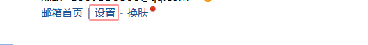
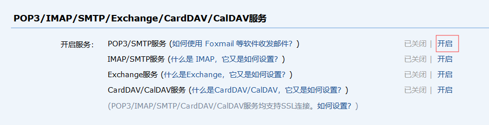

>邮件发送是一个非常常见的功能，注册时的身份认证、重要通知发送等都会用到邮件发送。Sun公司提供了JavaMail用来实现邮件发送，但是配置繁琐，Spring中提供了JavaMailSender用来简化邮件配置，Spring Boot则提供了MailSenderAutoConfiguration对邮件的发送做了进一步的简化

### 发送前的准备
使用QQ邮箱发送邮件，首先要申请开通POP3/SMTP服务或者IMAP/SMTP服务。SMTP（简单邮件传输协议）定义了邮件客户端软件与SMTP服务器之间，以及SMTP服务器与SMTP服务器之间的通信规则。也就是说，我们想把邮件发送到腾讯的SMTP服务器，这个过程就用到了SMTP协议，腾讯再把邮件发送到网易的SMTP服务器，这个过程也用到了SMTP协议，SMTP服务器就是用来接收邮件的。而POP3（邮局协议）定义了邮件客户端与POP3服务器之间的通信规则，邮件服务商会为每一个用户提供专门的邮件存储空间，SMTP服务器收到邮件之后，将邮件保存到相应用户的邮件存储空间中，如果用户要读取文件，就需要通过邮件服务商的POP3邮件服务器来完成。至于IMAP协议，则是对POP3协议的扩展，功能更强，作用类似

**QQ邮箱开通服务步骤**  



### 环境搭建
1. 导入相关jar包
```
<dependency>
    <groupId>org.springframework.boot</groupId>
    <artifactId>spring-boot-starter-mail</artifactId>
</dependency>
```
2. application.properties文件配置
```
spring.mail.host=smtp.qq.com
spring.mail.port=465
spring.mail.username=邮箱地址
spring.mail.password=邮箱授权码
spring.mail.default-encoding=UTF-8
spring.mail.properties.mail.smtp.socketFactory.class=javax.net.ssl.SSLSocketFactory
spring.mail.properties.mail.debug=true
```

### 发送简单邮件
1. 发送邮件
```java
@Service
public class MailService {
    @Autowired
    private JavaMailSender javaMailSender;
    public void sendSimpleMail(String from, String to, String cc, 
                            String subject, String text) {
        SimpleMailMessage simpleMailMessage = new SimpleMailMessage();
        simpleMailMessage.setFrom(from);  //发件人
        simpleMailMessage.setTo(to);  // 收件人
        simpleMailMessage.setCc(cc);  // 抄送
        simpleMailMessage.setSubject(subject);  // 标题
        simpleMailMessage.setText(text);  // 正文
        javaMailSender.send(simpleMailMessage);
    }
}
```

2. 测试方法
```java
@RunWith(SpringRunner.class)
@SpringBootTest(classes = BootDemoApplication.class)
public class test {
    @Resource
    private MailService mailService;
    @Test
    public void sendSimpleEmail() {
        mailService.sendSimpleMail("发件人邮箱@qq.com", "收件人邮箱@163.com"
                , "抄送邮箱@qq.com", "测试邮件主题", "测试邮件正文");
    }
}
```

### 发送带附件的邮件
1. 发送邮件
```java
public void sendAttachFileMail(String from, String to, String cc, String subject, 
                        String text, File file) {
    try {
        MimeMessage mimeMessage = javaMailSender.createMimeMessage();
        MimeMessageHelper mimeMessageHelper = new MimeMessageHelper(mimeMessage, true);
        mimeMessageHelper.setFrom(from);
        mimeMessageHelper.setTo(to);
        mimeMessageHelper.setCc(cc);
        mimeMessageHelper.setSubject(subject);
        mimeMessageHelper.setText(text);
        mimeMessageHelper.addAttachment(file.getName(), file);
        javaMailSender.send(mimeMessage);
    } catch (Exception e) {
        e.printStackTrace();
    }
}
```

2. 测试方法
```java
@Test
public void sendAttachFileEmail() {
    mailService.sendAttachFileMail("发件人邮箱@qq.com", "收件人邮箱@163.com",
            "抄送邮箱@qq.com", "测试邮件主题", "测试邮件正文", new File("E:\\附件.txt"));
}
```

### 发送带有图片资源的邮件
1. 发送邮件
```java
public void sendMailWithImg(String from, String to, String subject, String text, 
                        String[] srcPath, String[] resIds) {
    if (srcPath.length != resIds.length) {
        System.out.println("发送失败");
        return;
    }
    try {
        MimeMessage mimeMessage = javaMailSender.createMimeMessage();
        MimeMessageHelper mimeMessageHelper = new MimeMessageHelper(mimeMessage, true);
        mimeMessageHelper.setFrom(from);
        mimeMessageHelper.setTo(to);
        mimeMessageHelper.setSubject(subject);
        mimeMessageHelper.setText(text, true);
        for (int i=0; i<srcPath.length; i++) {
            FileSystemResource resource = new FileSystemResource(new File(srcPath[i]));
            mimeMessageHelper.addInline(resIds[i], resource);
        }
        javaMailSender.send(mimeMessage);
    } catch (Exception e) {
        e.printStackTrace();
    }
}
```

2. 测试方法
```java
@Test
public void sendMailWithImg() {
    mailService.sendMailWithImg("发件人邮箱@qq.com", "收件人邮箱@163.com", "测试邮件主题",
        "<div>这是一封带有图片资源的邮件：" +
        "这是图片1：<div></div>" +
        "这是图片2：<div></div>" +
        "</div>",
        new String[]{"E:\\p1.png", "E:\\p2.png"},
        new String[]{"p01", "p02"});
}
```

### 使用FreeMaker构建邮件模板
1. 添加依赖
```
<dependency>
    <groupId>org.springframework.boot</groupId>
    <artifactId>spring-boot-starter-freemaker</artifactId>
</dependency>
```

2. 发送邮件
```java
public void sendHtmlMail(String from, String to, String subject, String text) {
    try {
        MimeMessage mimeMessage = javaMailSender.createMimeMessage();
        MimeMessageHelper mimeMessageHelper = new MimeMessageHelper(mimeMessage, true);
        mimeMessageHelper.setFrom(from);
        mimeMessageHelper.setTo(to);
        mimeMessageHelper.setSubject(subject);
        mimeMessageHelper.setText(text, true);
        javaMailSender.send(mimeMessage);
    } catch (Exception e) {
        e.printStackTrace();
    }
}
```

3. FreeMaker模板
```HTML
<div>邮箱激活</div>
<div>您的注册信息是：
    <table border="1">
        <tr>
            <td>用户名</td>
            <td>${username}</td>
        </tr>
        <tr>
            <td>用户性别</td>
            <td>${gender}</td>
        </tr>
    </table>
</div>
<div>
    <a href="www.baidu.com">点击连接激活邮箱</a>
</div>
```

4. 实体类
```java
public class User {
    private String username;
    private String gender;
    //getter和setter
}
```

5. 测试方法
```java
@Test
public void sendHtmlMail() {
    try {
        Configuration configuration = new Configuration(Configuration.VERSION_2_3_0);
        ClassLoader loader = BootDemoApplication.class.getClassLoader();
        configuration.setClassLoaderForTemplateLoading(loader, "ftl");
        Template template = configuration.getTemplate("mailtemplate.ftl");
        StringWriter writer = new StringWriter();
        User user = new User();
        user.setUsername("Simon");
        user.setGender("男");
        template.process(user, writer);
        mailService.sendHtmlMail("发件人邮箱@qq.com", "收件人邮箱@163.com",
            "测试邮件主题", writer.toString());
    } catch (Exception e) {
        e.printStackTrace();
    }
}
```

### 使用Thymeleaf构建邮件模板
1. 添加依赖
```
<dependency>
    <groupId>org.springframework.boot</groupId>
    <artifactId>spring-boot-starter-thymeleaf</artifactId>
</dependency>
```

2. Thymeleaf模板
```HTML
<!DOCTYPE html>
<html lang="en" xmlns:th="http://www.thymeleaf.org">
<head>
    <meta charset="UTF-8">
    <title>邮件</title>
</head>
<body>
    <div>邮箱激活</div>
    <div>您的注册信息是：
        <table border="1">
            <tr>
                <td>用户名</td>
                <td th:text="${username}"></td>
            </tr>
            <tr>
                <td>性别</td>
                <td th:text="${gender}"></td>
            </tr>
        </table>
    </div>
    <div>
        <a href="www.baidu.com">点击激活邮箱</a>
    </div>
</body>
</html>
```

3. 测试方法
```java
@Autowired
private TemplateEngine templateEngine;
@Test
public void sendHtmlMailThymeleaf() {
    Context context = new Context();
    context.setVariable("username", "Simon");
    context.setVariable("gender", "男");
    String mail = templateEngine.process("mailtemplate.html", context);
    mailService.sendHtmlMail("发件人邮箱@qq.com", "收件人邮箱@163.com",
        "测试邮件主题", mail);
}
```

### 邮件发送代码示例
[邮件发送代码示例](https://gitee.com/CK_Simon/boot-demo/tree/master/chapter-7)