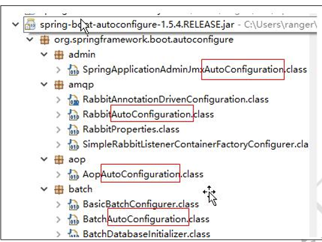
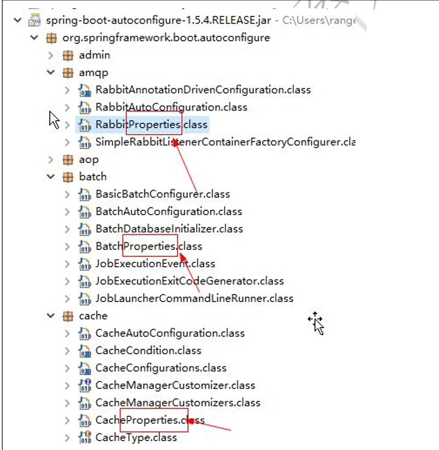
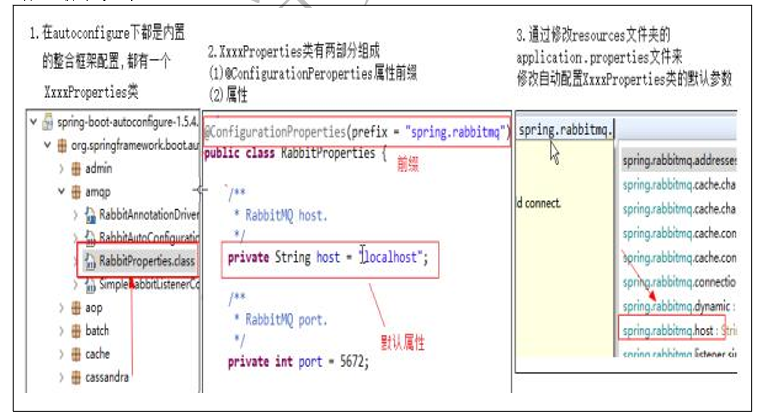

### SpringBoot配置流程
SpringBoot框架是一个将整合框架的整合代码都写好了的框架，所以我们要知道它的工作原理才能找到各种整合框架可以配置的属性，以及属性对应的属性名
    
**配置流程说明**  
1. SpringBoot的autoconfigure相关jar包中编写了所有内置支持框架的自动整合代码
2. 所以支持的框架根据功能来划分包，每个包都有一个XxxAutoConfiguration配置类，都是一个基于纯注解的配置类，是各种框架整合的框架代码

        
3. 如果配置的框架有默认的配置参数，都放在一个名为XxxProperties的类里

   
4. 通过项目resource目录下的application.properties文件可以修改每个整合框架的默认属性，从而实现快速整合的目的
        
**配置流程**  
1. 配置一个内置整合框架的参数，现在autoconfigure相关jar包中找到对应的模块
2. 如果该框架有可以配置的参数，那么对应的整合模块中一定有一个XxxProperties类，在里面可以找到能够设置的参数
3. 在resource源目录下的application.properties文件里面可以修改XxxProperties类中的默认属性

   
**配置文件**  
SpringBoot的参数配置文件支持两种格式，分别为application.properties和application.yml
* application.properties是键值对风格
* application.yml是层级键值对风格

**多配置文件支持**  
1. 在跟配置文件application.properties里添加子配置文件的名字
   * spring.profiles.active=database,mvc,freemarker
2. 创建响应的子配置文件
   * application-databaseproperties 
   * application-mvc.properties 
   * application-freemarker.properties
::: tip
注意：最后key的字段与值之间的冒号（:）后面一定要有一个空格
:::
        
